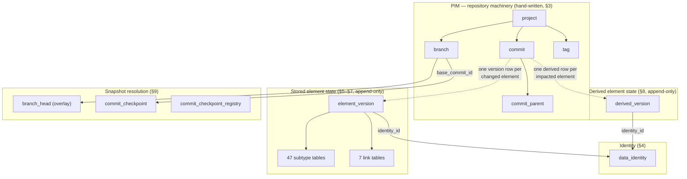

# The SysML2.NET PostgreSQL Schema — An Architectural Guide

> **Who this is for.** You know SQL. You want to understand *why* this schema looks the way it
> does — every table, every index, every function, and the reasoning chain that led there.
> This document is the long-form companion to `SysML2.NET.CodeGenerator/SQLSCHEMA.md` (the
> compact reference). Where SQLSCHEMA.md states decisions, this guide *derives* them.
>
> **The artifacts it explains:**
>
> | File | Role |
> |---|---|
> | `SysML2.NET.CodeGenerator/Sql/schema.golden.sql` | Hand-written, annotated reference design |
> | `SysML2.NET.CodeGenerator/Sql/schema2.generated.sql` | Actual generator output (checked in for review) |
> | `SysML2.NET.CodeGenerator/Sql/schema.smoke.sql` | 30-assertion functional test |
> | `SysML2.NET.CodeGenerator/Templates/Uml/core-sql-schema-2.hbs` | The Handlebars template that emits the schema |
>
> Section numbers like **§5** refer to the numbered banners inside the schema files themselves.
>
> Een Nederlandse vertaling van deze gids: `SysML2.NET.CodeGenerator/SQLSCHEMA-GUIDE.nl.md`.

---

## Table of contents

1. [The problem being solved](#1-the-problem-being-solved)
2. [The two worlds: element data and PIM data](#2-the-two-worlds-element-data-and-pim-data)
3. [The census: why 77% of the metamodel is not stored](#3-the-census-why-77-of-the-metamodel-is-not-stored)
4. [The two axioms everything follows from](#4-the-two-axioms-everything-follows-from)
5. [Rejected alternatives, and why](#5-rejected-alternatives-and-why)
6. [Layer A — the PIM: projects, commits, branches, tags (§3)](#6-layer-a--the-pim-projects-commits-branches-tags-3)
7. [Identity: `data_identity` and the referential-integrity philosophy (§4)](#7-identity-data_identity-and-the-referential-integrity-philosophy-4)
8. [Layer B — stored element state (§5, §6, §7)](#8-layer-b--stored-element-state-5-6-7)
9. [Layer C — derived element state (§8)](#9-layer-c--derived-element-state-8)
10. [Layer D — snapshot resolution (§9)](#10-layer-d--snapshot-resolution-9)
11. [The read path (§10)](#11-the-read-path-10)
12. [The metamodel catalogs and the Query service (§2, §11)](#12-the-metamodel-catalogs-and-the-query-service-2-11)
13. [Partitioning and physical tuning (§12)](#13-partitioning-and-physical-tuning-12)
14. [The performance audit: war stories with numbers](#14-the-performance-audit-war-stories-with-numbers)
15. [What the service layer still owes the schema](#15-what-the-service-layer-still-owes-the-schema)
16. [Worked examples — following data through the schema](#16-worked-examples--following-data-through-the-schema)
17. [Code generation: what is emitted from the UML model and how](#17-code-generation-what-is-emitted-from-the-uml-model-and-how)
18. [Multi-user and concurrency](#18-multi-user-and-concurrency)
19. [Glossary](#19-glossary)

---

## 1. The problem being solved

This schema is the persistence layer for a **SysML v2 model repository** that implements the
OMG *Systems Modeling API and Services* specification, version 1.0. That one sentence carries
three hard requirements, and each one shapes the schema more than any ordinary CRUD concern:

**Requirement 1 — it stores *models*, not records.** A SysML v2 model is a graph of typed
elements (`PartUsage`, `Membership`, `Specialization`, …) drawn from a metamodel of 175
metaclasses. Elements reference each other densely — ownership trees, type hierarchies,
namespace imports. A "row" here is one element of a systems-engineering model that may contain
a million of them.

**Requirement 2 — it is a *version control system*.** The OMG API is deliberately Git-shaped:
projects contain commits, commits form a directed acyclic graph (merges have multiple parents),
branches are movable pointers into that DAG, tags are frozen ones. Every API read happens *at*
a commit: `GET /projects/{p}/commits/{c}/elements/{e}`. Commits are immutable and indestructible
by specification. This rules out the classic "current-state tables + audit log" shape — history
is not an audit concern here, it *is* the data model.

**Requirement 3 — it must answer with *derived* properties.** This is the requirement that most
people underestimate, and it is the single biggest driver of this design. The SysML v2 metamodel
defines most of its properties as **derived**: computed from other elements by traversal rules
written in OCL. An element's `qualifiedName` is computed by walking its ownership chain to the
root namespace. A type's `feature` set is computed by folding memberships across its whole
specialization hierarchy. The OMG API (Clause 2, "Derived Property Conformance") lets a server
claim one of three levels:

- *no conformance* — never return derived properties;
- *passthrough* — store whatever derived values clients send and echo them back, never compute;
- **full conformance** — every response contains correctly computed, up-to-date derived values,
  and derived properties are usable in query filters.

This schema targets **full conformance with commit-time precomputation**: derived values are
computed once, when a commit is written, and reads just return bytes. Section 9 explains why
that choice (rather than compute-on-read) and what it costs.

Finally, the scale profile the schema is engineered for (confirmed with the project owner):

- **~1 million elements** per project,
- **100–500 concurrently live branches** per project, created and deleted routinely,
- **tens of thousands of commits** per project (years of daily editing),
- **tens to hundreds of projects** sharing one PostgreSQL instance,
- read traffic dominated by *branch-head* element reads and query filters; occasional
  historical reads.

Keep those numbers in mind throughout. Several designs that are perfectly fine at 100k elements
with 5 branches die at this profile, and section 14 shows the measurements.

---

## 2. The two worlds: element data and PIM data

The OMG specification splits its data model into two levels, and the schema mirrors the split.

**The PIM (Platform-Independent Model)** is the *repository machinery*: `Project`, `Commit`,
`Branch`, `Tag`, `DataVersion`, `DataIdentity`, `Query`. These types are defined in Clause 7 of
the API spec, not in the SysML metamodel. There are 16 of them, they are stable (they change
when OMG revises the API, roughly never), and their semantics are subtle (commit DAGs, merge
invariants). They are **hand-written** in the schema (§3) — code-generating 16 stable tables
would add machinery without adding value, and the subtle parts (the monotonicity trigger, the
deletion procedure) need human-written comments anyway.

**Element data** is the actual model content: the 175 metaclasses of KerML + SysML v2. This part
is **generated** from the same UML XMI files (`Resources/KerML_only_xmi.uml`,
`Resources/SysML_only_xmi.uml`) that generate the rest of SysML2.NET — the DTOs, POCOs, JSON
serializers, and so on. When OMG revises the language (they do, regularly), you re-run the
generator and get a schema that matches the new metamodel exactly, with no hand-maintenance of
167 table definitions. Section 17 covers the generation pipeline.

The boundary between the worlds is a single concept: the **DataVersion**. In the spec, a
`DataVersion` wraps an element payload in the context of a commit — "element X had these
contents at commit C". In the schema, that concept is the `element_version` row. The PIM tables
organize *which* versions exist; the element tables record *what* each version contained.



---

## 3. The census: why 77% of the metamodel is not stored

Before a single table was designed, the metamodel was counted. This step mattered more than any
other, because the numbers destroy the intuition you would otherwise design from.

The metamodel, as realized in this repository's generated code, contains:

| Measure | Count |
|---|---|
| Metaclasses | 175 (167 concrete, 8 abstract) |
| Flattened properties across all concrete classes (own + inherited) | 12,963 |
| …of which **stored** (`{ get; set; }` in the DTOs) | 2,698 |
| …of which **derived** (`{ get; internal set; }`) | 9,582 |
| …explicit-interface redefinition aliases (no storage) | 683 |
| Distinct *declarations* behind the 2,698 stored properties | **97, across 49 metaclasses** |
| Distinct stored property *names* | ~80 |
| Widest stored footprint of any single metaclass | **24 columns** (`FlowUsage` and kin) |
| Multi-valued stored reference properties, distinct | **6** (`ownedRelationship`, `ownedRelatedElement`, `source`, `target`, `client`, `supplier`) plus 1 multi-valued string (`aliasIds`) |
| Enumerations | 7, with 19 literals total |

Read those numbers again, because they are the whole game:

**First: the stored surface is tiny.** Twelve thousand flattened properties sounds enormous —
until you notice that only ~2,700 are stored, and those collapse to 97 declarations because
inheritance does the multiplying. `Element` declares 7 stored properties and every one of the
167 concrete classes inherits them; that is 1,169 of the 2,698 right there. The metamodel's
stored core is genuinely small: a handful of booleans, names, one enum here and there, and a
modest set of single-valued references on the relationship metaclasses.

**Second: the derived surface is enormous, and it is not decorative.** 9,582 flattened derived
properties, ~325 distinct names. These are not conveniences — they are the API's primary
vocabulary. `owner`, `qualifiedName`, `ownedElement`, `feature`, `membership`, `documentation` —
every one of them derived, every one of them expected in every API payload under full
conformance. And crucially, the important ones are **recursive**:

- `qualifiedName` walks the ownership chain to the root, consulting sibling names along the way;
- `Type::feature` and `inheritedMembership` fold across the *entire specialization closure* of
  a type (a breadth-first search over `Specialization` edges);
- `Namespace::importedMembership` is a recursive walk over imports, where `Import::isRecursive`
  makes it unbounded;
- `isLibraryElement` walks ownership to check for a library root.

None of these are computable in a single SQL `SELECT`. They need recursive CTEs or materialized
closures — or precomputation, which is the road taken.

**Third: the storage type conflicts are real and force structure.** The metamodel reuses
property names with *different types*: `LiteralBoolean::value` is a Boolean,
`LiteralInteger::value` an Integer, `LiteralRational::value` a Real, `LiteralString::value` a
String — four incompatible SQL types under one name. Likewise `kind` is a *different enum* on
each of `RequirementConstraintMembership`, `StateSubactionMembership`,
`TransitionFeatureMembership`, and `TriggerInvocationExpression`. Any design with one shared
`value` column is dead on arrival. This single fact eliminates "one wide table" (section 5).

**Fourth: inheritance is a DAG, not a tree.** 34 metaclasses have multiple direct supertypes
(up to 3: `FlowUsage` is simultaneously a `ConnectorAsUsage`, a `Flow`, and an `ActionUsage`,
which makes it both a *Feature* and a *Relationship*). Any design that assumes a linear
"join up the parent chain" is also dead on arrival. Deepest chain: 11 levels.

Everything in sections 5–9 is a consequence of these four facts.

### Two traps discovered while counting

The census also surfaced two facts about the UML source that a naive generator gets wrong, and
they are worth recording because they will bite anyone who touches the generator later:

**Trap 1 — association-owned ends.** In UML, a reference property that participates in an
association can be owned by the *association*, not by the class. `Membership::memberElement`,
`Specialization::general`, `FeatureTyping::type` — the load-bearing reference properties of the
entire metamodel — do **not** appear in `IClass.OwnedAttribute`. A generator that reads
`OwnedAttribute` silently produces a `membership_version` table *without the member element column*
(this actually happened during development; 22 of the 47 subtype tables came out wrong). The
correct definition of "declared by class C" is: *flattened properties of C, minus the union of
flattened properties of C's direct generalizations*. See
`SysML2.NET.CodeGenerator/Extensions/SqlSchemaExtensions.cs`, `QueryStoredOwnProperties`.

**Trap 2 — two kinds of redefinition.** UML property redefinition covers two very different
situations. *Same-name redefinition* (`CollectExpression::operator` redefines
`OperatorExpression::operator`) is a constraint restatement — the redefining property is the
same storage slot, and the DTOs give it no independent field. There are exactly 9 of these.
*New-name redefinition* (`Membership::memberElement` redefines `Relationship::target`) is a
**new API property with its own storage** — the DTOs store both `memberElement` *and* the
inherited `target` list, and API payloads carry both. The storage rule that matches the rest of
SysML2.NET is: only same-name redefinitions are storage-free; they resolve transitively to the
root property's column. (This is the same discriminator that
`SysML2.NET.CodeGenerator/HandleBarHelpers/PropertyHelper.cs` uses for the DTO generator.)

---

## 4. The two axioms everything follows from

If you remember nothing else from this document, remember these two statements. Every
structural decision in the schema is a corollary of one of them.

### Axiom 1 — References name identities, never versions

A SysML element's `@id` is stable across its entire life. When a `FeatureTyping` says "this
feature is typed by element `4ace3d89-…`", it means *whatever that element is at whatever commit
you are looking from* — not "version 17 of that element". Version-independence is the point:
you can retype, rename, and edit the target element for years, and the reference stays valid.

The schema consequence: **every element-to-element reference column is a foreign key to
`data_identity(id)` — never to `element_version`.** There is no FK anywhere in the schema from
one element version to another element version.

This also defines what referential integrity can and cannot mean here. The FK guarantees the
target *identity exists in the database*. It cannot guarantee the target *exists at the commit
you are reading* — an element can legitimately reference something that was deleted on this
branch (that's a dangling reference *in the model*, which is a model-validation concern the
service reports, not a database-integrity violation). Trying to make the database enforce
per-commit reference validity would require FKs into a virtual, computed set — impossible, and
also wrong, because the spec explicitly permits models to be in intermediate states across
commits.

### Axiom 2 — A derived value is a function of (identity, commit), not of (version)

This is subtler and more consequential. Consider:

```
Package "Old"            <- element P, version p1
  └── PartUsage "wheel"  <- element W, version w1, qualifiedName = "Old::wheel"
```

Now commit a rename of the package to `"New"`. The commit's change set contains **one** element:
P (new version p2). W is untouched — no new version, `w1` remains its current stored state on
every branch. And yet W's `qualifiedName` is now `"New::wheel"`.

So: W's derived state changed *without W changing*. A derived value is not a property of a
version — the same version `w1` has `qualifiedName = "Old::wheel"` at commit 1 and
`"New::wheel"` at commit 2. It is a property of the **(identity, snapshot)** pair. The OMG spec
says this in as many words (Clause 2): *"the values of derived properties of a given Element
may be affected by commits that do not directly change that Element."*

The schema consequence: derived state **cannot live on `element_version`**. If it did, the
rename would force writing a new `element_version` row for W (and every other descendant) whose
*stored* half is byte-identical to the old one — you would be versioning elements that did not
change, corrupting the very meaning of "change set", and multiplying stored-state storage by
the impact radius of every rename.

Instead the schema has **two parallel append-only streams**:

- `element_version` — keyed by version; a row exists per *(element, commit-that-changed-it)*;
  immutable; the system of record for stored state.
- `derived_version` — keyed by *(identity, commit)*; a row exists per *(element,
  commit-that-changed-its-derived-state)*; immutable; the read model for derived state.

At the rename commit, the write is: **one** new `element_version` row (for P) and **N + 1**
new `derived_version` rows (for P and every element whose derived values the rename affected —
its "impact radius"). W's stored state is untouched; W's derived state has a new row.

The 30-assertion smoke test (`SysML2.NET.CodeGenerator/Sql/schema.smoke.sql`) makes this exact
scenario its first and central assertion pair (PASS 2a/2b): after the rename, W's
`qualifiedName` resolves to `"New::wheel"` *while W still resolves to its original version row*.
If you ever refactor this schema, keep that test passing — it is the design's load-bearing wall.

---

## 5. Rejected alternatives, and why

Four plausible architectures were considered and rejected. Understanding why they fail
clarifies why the chosen one looks the way it does.

### 5.1 One wide table ("God table")

*One `element` table with a column for every stored property across all metaclasses.*

With ~80 distinct stored names this is superficially tempting — 80 columns is not insane. It
dies on the type-collision fact from the census: `value` must simultaneously be `boolean`,
`integer`, `double precision`, and `text`; `kind` must be four different enum types. You end up
either with typed column families (`value_bool`, `value_int`, …, `kind_req`, `kind_state`, …)
— at which point you have reinvented subtype tables inside one table, badly, with every row
mostly NULL and every CHECK constraint conditional on `class_kind` — or with everything as
`text` and casts everywhere, surrendering type safety in the layer whose entire purpose is to
provide it.

### 5.2 Table-per-metaclass (full TPT, the "COMET shape")

*One table per concrete metaclass (167), plus one link table per multi-valued property
(~230), joined up the inheritance chain for reads.*

This is the shape of the earlier `core-sql-schema.hbs` skeleton this project inherited (a port
from the CDP4-COMET server, which uses it successfully for a different metamodel). It fails
here for three reasons:

1. **The inheritance DAG breaks the join chain.** TPT reads reconstruct an instance by joining
   parent tables up the chain. With 34 multiply-inheriting metaclasses there is no chain — a
   `FlowUsage` read would join up *two* branches of an inheritance diamond. Doable, but every
   query generator now has to understand the DAG.
2. **Scale of machinery vs. scale of content.** 167 + ~230 tables to hold 97 property
   declarations. The overwhelming majority of those tables would contain *only* the `iid`
   column (most metaclasses declare no stored properties of their own — they exist for their
   derived semantics). Deepest reads become 11-way joins.
3. **The COMET shape assumes single-version storage.** Its FKs point at element rows and its
   `revisionNumber` is a monotonic integer — both incompatible with a commit DAG and
   version-independent references (Axioms 1 and 2). This is not a criticism of COMET; its
   problem domain has linear revisions and reference-to-current semantics. This one does not.

### 5.3 Pure generic EAV

*Two tables: `element_version(…, value_data jsonb)` and
`element_reference(version_id, property_id, ordinal, target_identity)`.*

Fastest to generate, and the reference table is genuinely attractive for graph traversal (one
index serves every "who references X?" question). Rejected because it flattens the type system
into data: no per-property FK semantics, no per-property NOT NULL/enum enforcement, no
column statistics for the planner (every property lookup has the same generic selectivity),
and CHECK-level guarantees ("`isParallel` is a boolean") become application discipline. The
chosen design keeps a *narrow* EAV-ish surface where it is justified (the 7 link tables, the
property catalog) without giving up typed columns for the scalar core.

### 5.4 Document store (jsonb-only)

*Store each element version as one jsonb document; index with GIN.*

This handles reads beautifully — and in fact the chosen design *contains* this design as its
read path (`stored_json`/`derived_json`). Rejected as the *system of record* because
referential integrity, typed constraints, reverse-reference indexes, and per-column statistics
all vanish; every integrity property of the model would live in application code. The lesson
taken instead: **normalize for writing and integrity, denormalize for reading** — keep both,
in the same rows, written in the same transaction.

### 5.5 What was chosen

**Element core + sparse subtype tables + typed link tables + a second derived stream:**

- one `element_version` core table carrying identity/commit bookkeeping plus `Element`'s own 7
  stored properties (every element has them; splitting them out would be a join for nothing);
- **47 subtype tables**, one per metaclass that *declares* stored scalar properties, keyed by
  `(project_id, version_id)` — an instance of a metaclass has rows in exactly the subtype
  tables of its storage-declaring ancestors (a set, not a chain — the DAG is handled by
  membership, not by joins);
- **7 link tables** for the 6 multi-valued reference properties + `aliasIds`, all ordered
  (`ordinal` in the PK — every one of these is `isOrdered` in the metamodel);
- `derived_version` as the second stream (Axiom 2);
- `stored_json` on the version row and `derived_json` on the derived row as the deliberate,
  transactionally-consistent read denormalization.

The count of 47 is not a design parameter — it falls out of the census (49 storage-declaring
metaclasses, minus `Element` which is folded into the core table, minus `Dependency` whose only
stored properties are the two multi-valued ones that become link tables).

---

## 6. Layer A — the PIM: projects, commits, branches, tags (§3)

### 6.1 The commit DAG

First, the term itself. **DAG** stands for *Directed Acyclic Graph* — a directed graph without
cycles — and it is the shape a commit history takes on as soon as branches and merges are
allowed. Without branches, history would be a simple **chain**, every commit having exactly
one parent:

```
c1 ← c2 ← c3 ← c4        (chain: linear history)
```

Branches let history *split* (two commits sharing a parent), and merges let it *converge*
again (one commit with **two or more parents**):

```
        c2 ← c3          (branch "main")
      ↙         ↖
c1                 c5    (merge: c5 has TWO parents, c3 and c4)
      ↖         ↙
        c4               (feature branch)
```

*Directed*: every arrow points from child to parent ("c5 grew out of c3 and c4"). *Acyclic*:
following parent arrows can never lead back to where you started — a commit cannot be its own
ancestor, since a parent already existed when its child was created. Resolving "what did the
model look like at c5?" means walking this graph *backwards* from c5 (the recursive
`ancestry` CTE of §9) and picking, per element, the newest version found along the way —
exactly Git's model, which the OMG spec adopted deliberately.

```sql
CREATE TABLE sysml2.commit (
    id               uuid        NOT NULL,
    project_id       uuid        NOT NULL REFERENCES sysml2.project (id) ON DELETE CASCADE,
    created          timestamptz NOT NULL DEFAULT now(),
    description      text        NULL,
    model_version_id smallint    NOT NULL REFERENCES sysml2.model_version (id),  -- see 6.4
    PRIMARY KEY (id)
);

CREATE TABLE sysml2.commit_parent (
    commit_id         uuid     NOT NULL REFERENCES sysml2.commit (id) ON DELETE CASCADE,
    parent_commit_id  uuid     NOT NULL REFERENCES sysml2.commit (id),
    ordinal           smallint NOT NULL,
    PRIMARY KEY (commit_id, parent_commit_id)
);
```

The spec is explicit that `Commit.previousCommit` is a **set** — a merge commit has two or more
parents. Hence the separate `commit_parent` edge table rather than a `previous_commit_id`
column. `ordinal` preserves parent order ("first parent" matters for merge semantics, exactly
as in Git). The commit's PK is the bare uuid because commits are referenced from everywhere
(branches, versions, checkpoints) and are project-scoped via their own `project_id`.

Two spec invariants are worth internalizing because the *resolvers depend on them*:

**Immutability.** *"Commits are immutable… Commits are not destructible"* (Clause 7.1.2). The
schema enforces this literally: `trg_commit_immutable` rejects every UPDATE of a `commit` row
(smoke PASS 14a/14b). The teeth matter because the two `commit_parent` triggers below prove
their invariants at edge-INSERT time and never re-check them — a retroactive UPDATE of
`created` or `model_version_id` would silently invalidate already-accepted edges, and the fold
would return wrong snapshots rather than errors. Freezing `created` also upgrades "acyclic"
from a modeling assumption to a mechanical guarantee: a cycle would need at least one parent
edge going backwards in time, which the monotonicity trigger rejects — so the commit graph is
a DAG by construction. DELETE is deliberately not blocked (project deletion cascades through
`commit`). `element_version` rows are equally append-only: nothing ever UPDATEs them.
Append-only is not an optimization here; it is the spec's own semantics.

**Monotonicity.** *"Version histories must monotonically increase in time: for Commit C, the
value of C.created must be strictly newer than the value of D.created for any commit D in
C.previousCommit."* The schema *enforces* this with a trigger:

```sql
CREATE TRIGGER trg_commit_parent_monotonic
    AFTER INSERT ON sysml2.commit_parent
    FOR EACH ROW
    EXECUTE FUNCTION sysml2.assert_commit_monotonic();
```

Why enforce rather than trust? Because the snapshot resolver (section 10) selects, for each
element, the version from the **newest ancestor commit** — "newest by `created`". If a commit
were ever inserted with a timestamp older than its parent, the resolver would silently return
the *wrong snapshot* — no error, just wrong data. Silent-wrong-answer classes of bug get
triggers; noisy ones can be left to the service layer. (Smoke assertion PASS 6 proves the
trigger fires.)

Note what monotonicity does *not* give you: an ordering between **siblings**. Two commits on
parallel branches may legally share a timestamp. Section 10.4 explains the tiebreaker that
handles this.

**The four merge invariants at a glance.** An *invariant* is a rule that must hold at all
times, no matter what — and these four (Clause 7.1.2) are not formalities: the snapshot
resolver's correctness depends on them directly. Consolidated, with where each one lives:

1. **Monotonicity** — a commit is strictly newer than every parent, along every path. This is
   what makes "newest ancestor wins" a sound resolution rule. Enforced in the schema by
   `trg_commit_parent_monotonic` (smoke PASS 6), because a violation would produce silently
   wrong snapshots rather than errors. With `created` frozen by `trg_commit_immutable`
   (smoke PASS 14a/14b), this check doubles as the schema's **acyclicity guarantee** for the
   commit DAG.
2. **Conflict restatement** — a merge must restate the resolution of every conflict in its
   OWN change set. Combined with invariant 1, the merge is the newest commit in its ancestry,
   so its restatement automatically wins over both parents (smoke PASS 8a). Monotonicity does
   not order the *siblings* themselves — which is why a merge that illegally skips
   restatement falls to the deterministic `id DESC` tiebreaker (§10.4, audit R13, smoke
   PASS 10a/10b). Restating is a service-layer obligation (§15, item 7).
3. **Deletions must delete something** — a tombstone (`DataVersion` with null payload) is
   only valid if at least one parent had that element alive in its snapshot. Service-layer
   validation; the schema stores the tombstone either way.
4. **One version per element per commit** — `DataVersion.identity` is unique within
   `Commit.change`. Enforced by `ux_element_version_identity_commit` (§8.1).

To these four spec invariants this schema adds a fifth of its own, for multi-version support
(section 6.4): **release compatibility** — a commit is never in an older metamodel release
than a parent, and a merge requires all parents in the merge's own release. Enforced by
`trg_commit_parent_version` (smoke PASS 11c–11e).

In one sentence: the commit DAG is the *shape* of history (splitting and converging), and the
merge invariants are the *rules of the game* that guarantee reading that history back — the
fold of §9 — has exactly one well-defined, deterministic answer.

### 6.2 How deltas become snapshots — the spec's own algorithm

The spec defines `Commit.change` (the delta: the DataVersions written by this commit) as stored
and `Commit.versionedData` (the full model snapshot at this commit) as **derived**, with an OCL
algorithm that is worth reading because the schema's resolver is its direct translation:

```
let updatedNotDeleted = change->select(payload <> null) in
let updatedIdentities = change.identity in
let retainedWithDuplicates =
    previousCommits.versionedData->select(oldData |
        updatedIdentities->excludes(oldData.identity)) in
let retained = <pick one per identity from retainedWithDuplicates> in
versionedData = updatedNotDeleted->union(retained)
```

In words: a commit's snapshot is *its own changes, plus everything from its parents' snapshots
that it did not override*. Recursion over `previousCommit` bottoms out at the root. Deletions
are DataVersions whose `payload` is null — which the schema stores as `tombstone = true` on the
version row.

This algorithm is correct and hopeless to run per read at scale — it is a fold over the entire
commit history. The whole of §9 (section 10 of this guide) exists to make it cheap.

### 6.3 Branches, tags, and stored queries

```sql
CREATE TABLE sysml2.branch (
    id              uuid        NOT NULL,
    project_id      uuid        NOT NULL REFERENCES sysml2.project (id) ON DELETE CASCADE,
    name            text        NULL,
    description     text        NULL,
    head_commit_id  uuid        NOT NULL REFERENCES sysml2.commit (id),
    base_commit_id  uuid        NULL REFERENCES sysml2.commit (id),   -- see section 10.2
    created         timestamptz NOT NULL DEFAULT now(),
    deleted         timestamptz NULL,
    PRIMARY KEY (id)
);

CREATE UNIQUE INDEX ux_branch_project_name_live
    ON sysml2.branch (project_id, name) WHERE deleted IS NULL;
```

Per the spec's mutability table: branches are mutable and destructible (the *only* mutable
thing in the versioning core — `head_commit_id` moves on every commit); tags are immutable but
destructible; commits are neither. `deleted` is a nullable timestamp rather than a hard delete
because the spec models CommitReference deletion as a recorded event — `Branch.deleted` and
`Tag.deleted` are properties of the spec's own records.

That recorded event is also the schema's audit answer to destructible refs, so the deletion
protocol is worth stating normatively. **The API's DELETE on a branch is a soft delete plus a
cache purge**: set `deleted = now()` on the ref row (the audit story survives — name, lifetime,
final head; and since commits are indestructible, the branch's commits stay in the DAG forever,
merely unattributed if the ref were lost), and physically delete only its `branch_head` overlay
rows (a rebuildable cache, the only part whose size matters). Hard `DELETE FROM branch` — which
cascades the overlay — is the *administrative purge* path, not the API path. Names are unique
**among live refs only** (the partial unique indexes above, same for `tag` and `query`): a plain
UNIQUE would block re-creating a name after its soft delete, silently pushing implementations
toward the audit-hostile hard delete under routine branch churn. Smoke PASS 27a–27c prove the
protocol: audit record retained, overlay purged, retired names reusable, duplicate *live* names
still rejected. One honest limit: no spec record carries an actor — *who* created or deleted a
ref (or committed) is not auditable at this layer at all; a deployment that needs who-did-what
needs a service-side audit trail regardless.

The last Clause-7 record with persistence is the **stored Query** (`query`): a saved
select/where/orderBy definition the API exposes full CRUD for (`GET/POST/PUT/DELETE
/queries`). Mutable and destructible — the PUT and DELETE routes say so. The definition is
stored as the spec's own JSON shape in `query_json`; nothing in the database interprets it —
the service's Query translator (§16.4) compiles it against the *executing commit's* release
descriptors at execution time, which keeps the stored form release-agnostic across metamodel
upgrades. The live-only partial unique index doubles as the project-scoped listing index.
Smoke PASS 23a–23c cover the lifecycle; PASS 24a executes a translated definition end to end.

`base_commit_id` is a performance structure, not a spec concept — it anchors the branch-head
*overlay* and is explained fully in section 10.2.

Also in this layer: `tag` (same shape as branch, frozen), `project_usage` (cross-project
imports: "project A uses project B at commit C", with the spec constraint
`usedProject = usedProjectCommit.owningProject` left to the service), and `project` itself,
whose `default_branch_id` FK is added *after* `branch` exists and made
`DEFERRABLE INITIALLY DEFERRED` — project and its default branch are created in one
transaction, and the circular FK (project → branch → project) can only be satisfied at commit
time.

### 6.4 Model-version stamping — multiple metamodel releases in one database

The OMG metamodel itself has releases (Beta 4 today; later releases will add, drop, and
reshape metaclasses). This schema supports **multiple releases coexisting in one database**,
and the design falls out of one observation: in an append-only store, historical commits are
immutably in the release they were written in. Whatever label a project or a branch carries,
a reader of an old commit must know *that commit's* release to interpret its payloads. The
per-commit stamp is therefore the only correct grain — everything else is derived from it:

- **`model_version`** (§2) registers every release the database has ever stored data for.
  Its id is an *ordinal* — higher is later — handed out once by the checked-in registry
  (`SysML2.NET.CodeGenerator/Generators/UmlHandleBarsGenerators/ClassKindRegistry.cs`) and
  never renumbered.
- **`commit.model_version_id NOT NULL`** is the truth: the release this commit's payloads
  are written in. A *branch* "is" simply the release of its head commit; there is no mutable
  version field on `branch` that could disagree with history.
- **`project.target_model_version_id`** is policy, not truth: the highest release new
  commits may be written in (NULL = unrestricted). An operator raises it to *allow* branches
  to upgrade; the stamp records what each branch actually did.

**Upgrading is a commit, not a migration.** A branch moves to a newer release via a
**conversion commit**: a single-parent commit that bumps the stamp and restates every element
whose shape changed between the releases (the version-diff is an impact-radius variant — the
machinery of `SysML2.NET.CodeGenerator/IMPACT-RADIUS.md` applies). The service must force a
`commit_checkpoint` on every conversion commit so folds rarely cross a release boundary.
Elements whose shape did not change are *not* restated — their old rows remain valid under
the new release, which is what makes conversion O(changed shapes), not O(model).

**The physical schema is the superset across registered releases.** New metaclasses become
new subtype tables; new properties become nullable columns; a renamed or moved property
becomes a *new* column next to the old one (the conversion commit moves the data; the old
column keeps serving old commits). Nothing is ever dropped. Which tables and properties are
valid in which release is NOT recorded in database tables — it ships as static, per-release
generated C# (the model-version *descriptors*, section 12.2).

Three invariants keep mixed-release history sound, enforced by `trg_commit_parent_version`
(smoke PASS 11b–11e): no commit is in an older release than a parent (downgrades are
unsupported — conversion is lossy in reverse); a single-parent commit may bump the release
(that IS the conversion commit); and a merge requires **all parents in the merge's own
release** — convert first, then merge, never both in one commit. Without the last rule a
merge would silently mix payload shapes.

---

## 7. Identity: `data_identity` and the referential-integrity philosophy (§4)

```sql
CREATE TABLE sysml2.data_identity (
    id         uuid     NOT NULL,
    project_id uuid     NOT NULL REFERENCES sysml2.project (id),
    class_kind smallint NOT NULL REFERENCES sysml2.class_kind (id),   -- TYPED identity
    PRIMARY KEY (id),
    UNIQUE (id, class_kind)
);
```

Three columns. This tiny table is the anchor of Axiom 1: every element-reference column in the
entire schema — ~30 single-reference columns on subtype tables, 5 reference link tables,
`element_version.owning_relationship`, `branch_head.identity_id`, and so on — is a foreign key
to `data_identity(id)`.

**The identity is TYPED.** The metaclass of an element is invariant across its versions — an
identity is born a PartUsage and stays one — so unlike everything else about an element, the
type is a property of the *identity* and therefore FK-able. Two consumers:

- `element_version` carries a composite FK `(identity_id, class_kind)` →
  `data_identity (id, class_kind)`, making a version that claims a different metaclass than
  its identity **impossible** (smoke PASS 12a);
- the generated `validate_references_at_commit()` function (below) type-checks every stored
  reference against this column — including cross-project targets, because identities are
  typed regardless of which project they live in.

One maintenance rule follows: a release conversion (§6.4) that retypes an element — its
metaclass was dropped — must update `data_identity.class_kind` in the same transaction
(obligation §15.16).

**What FKs cannot check is now checkable ON DEMAND — in two tiers.** FKs prove a reference
targets an *existing* identity; they can never prove the target is *alive at the commit
being read* (liveness is a function of (identity, commit) — there is no row to FK against),
nor that its metaclass is legal for the referencing property (an FK matches values, not type
sets). Both gaps are covered by generated functions (§14 of the schema files), one
`UNION ALL` arm per stored reference column (42 of them), each reporting `'wrong-type'` (via
the typed identity, checked for cross-project targets too) and `'dangling'` (a same-project
target absent from the commit's snapshot):

- **`validate_references_at_commit`** — the FULL periodic audit over one commit's whole
  snapshot. It materializes the snapshot into an ANALYZE'd, indexed temp table first, so the
  planner knows the true cardinality and can switch to snapshot-driven PK probes on deep
  histories — the pass is bounded at O(snapshot × log history), never O(history), however
  large the append-only tables grow. Measured: 2.5–4.3 s on a 1M snapshot (smoke PASS
  12b/12c).
- **`validate_references_in_commit`** — the INCREMENTAL per-commit tier, O(change set): the
  outgoing references of the versions the commit wrote, PLUS the reverse direction its
  tombstones break — a live, *unchanged* element left referencing a deleted identity, the
  case naive change-set validation misses (driven by the reverse-lookup indexes, per-target
  liveness probed via `resolve_element_at_commit`). Measured: 77–86 ms for a 101-row change
  set against a 1M project — fit for the synchronous commit-validation path (smoke PASS
  13a–13c).

Deliberately *functions*, not constraints: the spec allows transiently dangling references,
and liveness of cross-project targets depends on the used-project commit (`project_usage`) —
service-layer resolution. The working protocol (obligation §15.6): the incremental tier per
commit, the full audit periodically as its backstop.

Three more deliberate choices here:

**The PK is the bare uuid, not `(project_id, id)`.** `ProjectUsage` lets an element in project
A reference an element in project B. A composite PK would make every cross-project reference
un-FK-able. Project scoping of references is a service-layer validation (via `project_usage`),
not an FK. The cost: `data_identity` cannot be partitioned by project like everything else. The
audit (section 14, finding R12) checked whether that matters at 10⁸ rows — it does not: two
uuid columns make a ~7 GB heap with a btree whose upper levels stay resident; every probe is
3–4 cached page reads. Read-mostly FK targets scale fine unpartitioned.

**`element_id` (the KerML property) is `text`, not `uuid`.** Careful distinction: the *API's*
`@id` is a UUID and maps to `data_identity.id`. But KerML's `Element::elementId` is declared
`String`; only standard-*library* elements are normatively required to use name-based (v5)
UUIDs, and user models carry no format constraint at all. A `uuid` column would reject
spec-valid data. So `element_version.element_id` is `text`, and the identity row's `id` is the
uuid the API layer manages.

**Deletion is explicit, never cascaded.** Originally the identity FKs were `ON DELETE CASCADE`
("delete a project → everything goes"). The performance audit killed this, for a mechanical
reason that generalizes: **a cascade executes per-row deletes filtered on the FK column
alone** — `DELETE FROM element_version WHERE identity_id = $1` — and *no index in this schema
leads with a bare identity column* (they all lead with `project_id`, for partition-locality).
Every cascaded identity would therefore sequentially scan the largest tables, once per
identity, a million times per project deletion. The fix is written into the schema as a
documented procedure at the `data_identity` DDL: project deletion is an *ordered, batched,
per-table* `DELETE … WHERE project_id = $1` (each statement prunes to one partition and uses a
PK prefix), finishing with `data_identity` and `project`. The remaining `NO ACTION` FKs act as
a safety net — they *block* out-of-order deletion loudly instead of scanning silently. That
trade (explicit procedure + loud guard, instead of convenient + catastrophic) is the schema's
general FK philosophy. One guard is easy to overlook and is therefore an explicit line in the
procedure: `commit_checkpoint_registry`'s NO ACTION FK to `commit` — nothing cascades registry
rows, so a checkpointed project cannot be deleted until they are. The whole procedure is
executable smoke coverage now: an inbound `project_usage` blocks first (PASS 26a), the registry
FK blocks an out-of-order attempt (PASS 26b), and the documented order completes with the
neighbor project untouched (PASS 26c).

---

## 8. Layer B — stored element state (§5, §6, §7)

### 8.1 The core: `element_version` (§5)

```sql
CREATE TABLE sysml2.element_version (
    project_id           uuid       NOT NULL,
    version_id           uuid       NOT NULL,      -- the spec's DataVersion.id
    identity_id          uuid       NOT NULL,      -- composite typed-identity FK below (§7)
    commit_id            uuid       NOT NULL REFERENCES sysml2.commit (id),
    class_kind           smallint   NOT NULL REFERENCES sysml2.class_kind (id),
    tombstone            boolean    NOT NULL DEFAULT false,

    -- Element's own stored properties, folded in:
    element_id           text       NULL,
    declared_name        text       NULL,
    declared_short_name  text       NULL,
    is_implied_included  boolean    NULL,
    owning_relationship  uuid       NULL REFERENCES sysml2.data_identity (id),

    stored_json          jsonb      NULL,

    PRIMARY KEY (project_id, version_id),
    FOREIGN KEY (identity_id, class_kind)
        REFERENCES sysml2.data_identity (id, class_kind),   -- typed identity (§7)
    CONSTRAINT element_version_tombstone_empty
        CHECK (NOT tombstone OR (stored_json IS NULL AND element_id IS NULL)),
    CONSTRAINT element_version_payload_present
        CHECK (tombstone OR (stored_json IS NOT NULL AND element_id IS NOT NULL
                             AND is_implied_included IS NOT NULL))
) PARTITION BY HASH (project_id);

CREATE UNIQUE INDEX ux_element_version_identity_commit
    ON sysml2.element_version (project_id, identity_id, commit_id);
```

Design notes, column by column:

- **`project_id` leads every key.** All element-scoped tables are hash-partitioned by
  `project_id` with the same modulus (section 13), and their PKs lead with it. This makes
  every join between them *partition-local* and lets every project-scoped query prune to one
  partition at plan time. The corollary discipline — **never filter these tables on a bare
  uuid without `project_id`** — turned out to matter enormously; section 14 (finding R2) shows
  what happens when you forget.
- **`version_id` is the row's own identity** (the spec's `DataVersion.id`). It is
  app-generated, and the audit recommends UUIDv7 (time-ordered) so each project's inserts land
  on the rightmost btree leaf instead of splattering across the index (finding R8).
- **`class_kind` is a `smallint`, not a name.** 175 metaclass names are interned in the
  `class_kind` catalog (section 12). On the hottest, largest table in the database, that is a
  2-byte column instead of a ~15-byte text one, times hundreds of millions of rows, times its
  presence in indexes.
- **`tombstone` is the deletion marker** — the direct encoding of the spec's "a DataVersion
  with a null payload is a deletion". Deletions are *rows*, because in an append-only commit
  store a deletion is an event in history, not the absence of data. The two CHECK constraints
  make tombstones and payload rows mutually exclusive shapes: a tombstone must be empty, a
  non-tombstone must be complete. These CHECKs are the cheapest possible insurance against the
  service layer writing half-formed rows.
- **The five Element columns are folded in** rather than living in a separate Element subtype
  table. Rationale: *every* element has them (they are Element's own declarations, and
  everything is an Element), so a separate table would add one join to every single read for
  zero storage benefit. `declared_name` is also the most-filtered stored column, and having it
  on the core table lets query plans avoid the join entirely.
- **`stored_json` is the read-model denormalization** — the element's stored half,
  pre-serialized in exactly the API's JSON shape. The normalized columns and link tables (which
  carry all the FKs and constraints) remain the system of record; `stored_json` exists so that
  serving an element never requires reassembling it from up to six subtype tables and three
  link tables. It is written in the same transaction as the normalized rows, so it cannot
  drift. Cost: roughly doubles `element_version` storage (mitigated by lz4 — section 13). The
  smoke test's PASS 4 verifies the concatenated read path produces a complete payload.
- **`ux_element_version_identity_commit`** enforces the spec invariant *"DataVersion.identity
  is unique among records listed in Commit.change"* — one version of an element per commit —
  and simultaneously serves as the index for "give me element X's row at commit C", which the
  single-element resolver leans on.

### 8.2 The link tables (§6)

The census found exactly six multi-valued stored reference properties in the whole metamodel,
plus one multi-valued string. Each becomes one table; all are ordered:

```sql
CREATE TABLE sysml2.element_owned_relationship (
    project_id      uuid NOT NULL,
    version_id      uuid NOT NULL,
    ordinal         int  NOT NULL,
    target_identity uuid NOT NULL REFERENCES sysml2.data_identity (id),
    PRIMARY KEY (project_id, version_id, ordinal),
    FOREIGN KEY (project_id, version_id)
        REFERENCES sysml2.element_version (project_id, version_id) ON DELETE CASCADE
) PARTITION BY HASH (project_id);

CREATE INDEX ix_element_owned_relationship_target
    ON sysml2.element_owned_relationship (project_id, target_identity);
```

(and likewise `relationship_owned_related_element`, `relationship_source`,
`relationship_target`, `dependency_client`, `dependency_supplier`, and `element_alias_ids`
with a `text` value column instead of a reference.)

- `ordinal` is in the PK because every one of these properties is `isOrdered = true` in the
  metamodel — order is model content, not incidental.
- Rows are keyed by **version**, not identity: the collection is part of the element's stored
  state, so a new version carries its own collection rows. (This is the one place the audit
  flagged real write amplification — a new version of a 100k-child package re-inserts 100k
  rows even if only its name changed. Section 14, finding R7, documents the content-addressed
  fix that is designed but deliberately deferred until benchmarks demand it.)
- The `target_identity` reverse index is what answers "who references element X?" — the
  building block for reverse navigation, dangling-reference validation, and the derived-state
  impact analysis.
- The FK back to `element_version` is a *composite* on `(project_id, version_id)` and is the
  one cascade kept in this layer: deleting a version row (which only the explicit project
  deletion procedure does) takes its collection rows with it, and the composite FK is
  PK-prefixed on both sides so the cascade is index-backed.

### 8.3 The subtype tables (§7)

One table per storage-declaring metaclass — 47 of them, all with the same skeleton:

```sql
CREATE TABLE sysml2.feature_version (
    project_id   uuid    NOT NULL,
    version_id   uuid    NOT NULL,
    direction    sysml2.feature_direction_kind NULL,
    is_composite boolean NOT NULL DEFAULT false,
    is_constant  boolean NOT NULL DEFAULT false,
    is_derived   boolean NOT NULL DEFAULT false,
    is_end       boolean NOT NULL DEFAULT false,
    is_ordered   boolean NOT NULL DEFAULT false,
    is_portion   boolean NOT NULL DEFAULT false,
    is_unique    boolean NOT NULL DEFAULT true,
    is_variable  boolean NOT NULL DEFAULT false,
    PRIMARY KEY (project_id, version_id),
    FOREIGN KEY (project_id, version_id)
        REFERENCES sysml2.element_version (project_id, version_id) ON DELETE CASCADE
) PARTITION BY HASH (project_id);
```

**About the `_version` suffix:** these tables carry the *version-scoped* facet of a metaclass —
`feature_version` holds the Feature-declared columns of one element **version**, keyed by
`(project_id, version_id)` and hanging off `element_version`. The suffix deliberately matches
`element_version` and `derived_version`: the three names together read as one family of
per-version state. (Naming history: an earlier draft used a terse `_v` suffix for these
tables while the flattening views carried a `v_` prefix — `v_part_usage` vs `part_usage_v`,
same letter meaning two different things, an accident waiting to happen. Both were renamed:
the tables to `_version`, the views to `vw_` — see §12.3.)

How an instance maps to tables: a `PartUsage` version has rows in `element_version` +
`type_version` + `feature_version` + `usage_version` + `occurrence_usage_version` — the subtype tables of exactly its
storage-declaring ancestors. A `FlowUsage` version has rows in **six** tables including *both*
`feature_version` and `relationship_version`, because `Connector` is simultaneously a Feature and a
Relationship. This is how the inheritance DAG is represented: **membership in a set of tables**,
not a chain of joins. The per-release generated descriptors (section 12.2) record the set per
metaclass so generic code never has to re-derive it.

Details that carry intent:

- **NOT NULL tracks the metamodel's lower bounds.** A `[1..1]` property is NOT NULL; a `[0..1]`
  property (like `direction`, `member_name`, `portion_kind`) is NULL. This is safe *because*
  the table only has rows for instances whose class actually declares the property — the
  sparse-table design is what makes honest NOT NULLs possible at all (contrast the God-table,
  where everything must be nullable).
- **DEFAULTs come from the XMI.** The generator emits a `DEFAULT` for every property whose UML
  declaration carries one: the Feature booleans default false (`is_unique` true),
  `Membership::visibility DEFAULT 'public'`, and — easy to get wrong by intuition —
  `Import::visibility DEFAULT 'private'` (imports are private by default in KerML, unlike
  memberships; a top-level import *must* be private). These defaults were cross-checked against
  the metamodel knowledge base during review.
- **Reference columns FK to `data_identity`** (Axiom 1) and every one gets a reverse-lookup
  index `ix_{table}_{column}`. Two of those indexes deserve a callout:
  `ix_specialization_version_general` and `ix_specialization_version_specific` index the *specialization
  graph* — the edges that derived properties like `Type::feature` fold over. When the service
  computes the impact radius of "a supertype gained a feature", these two indexes are what make
  "find all transitive specializations" affordable.
- **The four `kind` tables and four `literal_*` tables** are the visible proof of the census's
  type-collision fact: `requirement_constraint_membership_version.kind` is
  `sysml2.requirement_constraint_kind` while `state_subaction_membership_version.kind` is
  `sysml2.state_subaction_kind`; `literal_boolean_version.value` is `boolean` while
  `literal_rational_version.value` is `double precision`. One wide table cannot represent this.
- **Redefinitions have no columns.** `CollectExpression` has no subtype table at all — its only
  stored property is the same-name redefinition of `operator`, which lives in
  `operator_expression_version` (its ancestor's table). The property catalog records this resolution
  so query code doesn't need to know it.

### 8.4 The enum types (§1)

```sql
CREATE TYPE sysml2.visibility_kind AS ENUM ('private', 'protected', 'public');
```

Seven native enum types, one per metamodel enumeration. Native enums (vs. text + CHECK) cost 4
bytes, validate on write, and sort in declaration order. The **labels are lowercase** for a
specific reason: they match the JSON wire format byte-for-byte — the generated serializers
write `Direction.Value.ToString().ToLower()` (see
`SysML2.NET.Serializer.Json/Core/AutoGenSerializer/FeatureSerializer.cs`), so a value can flow
from the API payload into the enum column and back out without case mapping at any layer.

---

## 9. Layer C — derived element state (§8)

```sql
CREATE TABLE sysml2.derived_version (
    project_id         uuid    NOT NULL,
    derived_id         uuid    NOT NULL,
    identity_id        uuid    NOT NULL REFERENCES sysml2.data_identity (id),
    commit_id          uuid    NOT NULL REFERENCES sysml2.commit (id),

    -- promoted hot derived properties (declared by Element => present on all 167 metaclasses)
    owner              uuid    NULL REFERENCES sysml2.data_identity (id),
    owning_namespace   uuid    NULL REFERENCES sysml2.data_identity (id),
    qualified_name     text    NULL,
    name               text    NULL,
    short_name         text    NULL,
    is_library_element boolean NOT NULL DEFAULT false,

    derived_json       jsonb   NOT NULL,   -- everything else: ~325 distinct derived names

    PRIMARY KEY (project_id, derived_id)
) PARTITION BY HASH (project_id);

CREATE UNIQUE INDEX ux_derived_version_identity_commit
    ON sysml2.derived_version (project_id, identity_id, commit_id);
CREATE INDEX ix_derived_version_owner          ON sysml2.derived_version (project_id, owner);
CREATE INDEX ix_derived_version_qualified_name ON sysml2.derived_version (project_id, qualified_name);
CREATE INDEX ix_derived_version_json
    ON sysml2.derived_version USING gin (derived_json jsonb_path_ops);
```

### 9.1 Why precompute at commit time at all?

Three strategies were on the table for full derived-property conformance:

**Compute on read.** Zero write cost, no invalidation logic. But every element read pays the
recursive walks (`qualifiedName` = ownership chain; `feature` = specialization closure), every
*collection* read pays them per element, and — decisive — the Query service must filter and
sort on derived properties (`WHERE qualifiedName LIKE 'Vehicle::%' ORDER BY name`), which
means evaluating recursive CTEs per candidate row or building per-property materializations
anyway. Read-dominated workloads (this one, by profile) pay the computation on the hot path,
repeatedly, for values that change rarely.

**Passthrough.** Store client-sent derived values verbatim. Cheapest to build (and the DTO
layer already round-trips derived values). Rejected as the *target* because derived values
become client-trusted data that can silently drift from the model — acceptable as an interim
conformance level, corrosive as an architecture.

**Precompute at commit.** Writes pay for computing the change set's *impact radius*; reads pay
nothing; queries filter real columns. The existing 366 implemented `Compute*` methods in
`SysML2.NET/Extend/` are the computation engine — the .NET code already knows how to evaluate
every OCL derivation against an in-memory model; the service layer's job is to invoke them for
the affected elements at commit time and write the results here. Given the read-dominated
profile and the query requirement, this is the only strategy where the expensive thing happens
once, off the hot path.

The honest cost: **the impact radius is unbounded in the worst case.** Renaming a namespace one
level below the root invalidates `qualifiedName` for nearly the whole model → ~1M
`derived_version` rows in one commit. This is inherent to the spec's semantics (the derived
values genuinely all changed), not to this design; the schema's job is to make the bulk write
survivable (lz4 compression, GIN pending-list tuning, async-friendly append-only shape) and
the audit budgets it as a bulk operation (section 14, finding R5).

### 9.2 Keying: why `(identity, commit)` and why sparse

The key is Axiom 2 made concrete: `derived_version` rows are written **only for elements whose
derived values actually changed at that commit**. A leaf edit writes one row. The rename writes
the subtree. Nothing rewrites rows for unaffected elements — resolution (section 10) finds each
element's *newest derived row at or before the commit being read*, exactly as it does for
stored versions. The two streams resolve through the same fold, which is what keeps the whole
design coherent: one resolution algorithm, two payload halves.

`derived_id` exists (rather than using `(identity_id, commit_id)` as the PK) so that
`branch_head` and `commit_checkpoint` can point at a derived row with a single uuid, keeping
those hot tables narrow.

### 9.3 The promoted six, and the jsonb tail

Six derived properties get real columns; ~319 live in `derived_json`. The six are not
arbitrary: they are declared by `Element` (so they exist for every one of the 167 metaclasses,
making the columns dense, never wasted), and they are the properties a Query service filters
and sorts on constantly — `owner` (containment queries), `qualifiedName` (path lookup), `name`
(sorting/searching), `owning_namespace`, `short_name`, `is_library_element` (excluding library
content from user queries). Real columns mean real btree indexes and real per-column
statistics.

The tail stays jsonb behind a GIN (`jsonb_path_ops`) index, because the spec's Query service
allows a `PrimitiveConstraint` on *any* property, and pre-building 319 expression indexes for
properties that may never be filtered is worse than one containment index. The audit flags the
honest weaknesses (section 14, R5): GIN insertion is the dominant write amplifier during bulk
derived writes, and the index has no `project_id` component, so a probe on a shared partition
rechecks candidates from co-located projects. The standing guidance: promoted columns first,
GIN as fallback; if production telemetry shows the filtered-property set is actually narrow,
replace the whole-document GIN with targeted expression indexes.

### 9.4 The other two conformance levels

Full conformance is what the schema was *optimized* for — but the schema itself is
**conformance-agnostic**. The Clause 2 level is purely a **write-path policy**: it decides who
authors `derived_version` rows and when. Nothing in the DDL changes between levels.

**Passthrough conformance falls out of the design almost for free.** The client sends payloads
*including* derived values (the SysML2.NET DTO/serializer layer round-trips them). The service
splits the incoming payload: stored half → `element_version` + normalized columns; derived
half → a `derived_version` row at that commit, with the promoted columns simply *extracted*
from the client's payload instead of computed. Reads reproduce exactly what the client sent —
the faithful-reproduction guarantee, byte for byte — and queries on derived properties work
identically, which Clause 2 explicitly requires of passthrough providers. The only difference
from full: derived rows exist **only for change-set elements** (no impact-radius analysis
runs), so an untouched element keeps its last client-sent derived values — stale or wrong as
they may be, which is exactly passthrough semantics. The `(identity, commit)` fold does not
care *who* computed a value; the smoke test itself writes its derived rows passthrough-style
(hand-authored, never computed).

**No conformance is trivially supported**, because derived state was made structurally
optional on purpose: never write `derived_version` rows at all. Every read function
`LEFT JOIN`s `derived_version` and `COALESCE`s `derived_json` to `'{}'`, so responses simply
contain only stored properties; `branch_head.derived_id` and `commit_checkpoint.derived_id`
are nullable by design; the `derived_version` table and its GIN index — the biggest write
amplifier — stay empty. The Query translator must then reject `PrimitiveConstraint`s whose
descriptor entry (section 12.2) routes to derived storage, consistent with the claimed level.

**Moving between levels is a backfill, not a migration.** Because `derived_version` is a
separate append-only stream keyed `(identity, commit)`, full conformance can be adopted later
by computing derived state for the whole model and writing it *at one commit* (e.g. each
branch head); reads at or after that commit pick it up through the normal fold, and history
before it stays as it was. Caveat: checkpoints built before the backfill carry null/stale
`derived_id`s — rebuild them, or tolerate until the next cadence checkpoint. And note the
granularity mismatch: the spec declares conformance per Service Provider, but the schema would
mechanically support a different policy per project (derived rows are project-scoped like
everything else) — useful for a staged rollout, as long as the public conformance claim
reflects the weakest level actually served.

The trade-off in one line: *no conformance* = cheapest, thinnest API; *passthrough* = full
payloads and derived queries at near-zero server cost, but derived values are client-trusted
and can silently drift from the model; *full* = correct by construction, paid for at commit
time with the impact-radius machinery — the only level with real engineering risk.

---

## 10. Layer D — snapshot resolution (§9)

This layer answers one question: **"what does the model look like at commit C / at the head of
branch B?"** — cheaply, at the profile's scale. It is where the schema earns or loses its
performance, and it went through one major redesign (the overlay) plus one empirical fix (the
registry) during the audit. The final structure has four parts.

### 10.1 `commit_checkpoint` — materialized full folds

```sql
CREATE TABLE sysml2.commit_checkpoint (
    project_id  uuid NOT NULL,
    commit_id   uuid NOT NULL REFERENCES sysml2.commit (id) ON DELETE CASCADE,
    identity_id uuid NOT NULL REFERENCES sysml2.data_identity (id),
    version_id  uuid NOT NULL,
    derived_id  uuid NULL,
    PRIMARY KEY (project_id, commit_id, identity_id)
) PARTITION BY HASH (project_id);
```

A checkpoint is the spec's `versionedData` fold, fully evaluated and stored for one commit: one
row per live element, mapping identity → (version, derived row). `build_commit_checkpoint()`
constructs it from the general resolver, idempotently. Checkpoints bound how far any resolver
ever walks, and they are the *bases* that branch overlays diverge from.

Checkpoints are O(model) each — ~1M rows, on the order of 100 MB — which drives the **cadence
policy** (written into the §9 banner, executed by the service layer): checkpoint a commit when
≥200 commits have accumulated since the nearest checkpointed ancestor *on that lineage*, or
when the cumulative change-set size since it exceeds ~25% of the model, and always at
branch-fork bases. Churn-based, not merely count-based — "every N commits" alone would
accumulate terabytes of near-identical checkpoints on a busy project. Retention: a checkpoint
that no branch bases on and that is not needed for the historical ladder gets deleted (registry
row first, then rows — both PK-prefixed, index-backed deletes).

`build_commit_checkpoint` at 200k elements measured 2.5 s; extrapolated ~12–15 s at 1M — which
is why the banner says, in bold effect: **run it asynchronously, never on the commit path.**

### 10.2 `branch_head` — the sparse overlay

The naive materialization — one `(branch, identity) → version` row per element per branch —
was the original design, and the audit's arithmetic executed it: 500 branches × 1M elements =
**500M rows (~85 GB) per project**, branch creation = copying a million rows into a btree that
is already billions of entries deep, branch deletion = a million-row delete with vacuum churn.
For hundreds of routinely created and deleted branches, that is not a tuning problem; it is the
wrong data structure. The measured comparison (section 14): branch create 2,964 ms full-copy
vs **1.8 ms** overlay, at only one-fifth of target scale.

The overlay inverts the representation: a branch stores only its **divergence** from a base
checkpoint.

```sql
CREATE TABLE sysml2.branch_head (
    project_id   uuid    NOT NULL,
    branch_id    uuid    NOT NULL REFERENCES sysml2.branch (id) ON DELETE CASCADE,
    identity_id  uuid    NOT NULL REFERENCES sysml2.data_identity (id),
    version_id   uuid    NOT NULL,
    derived_id   uuid    NULL,
    is_tombstone boolean NOT NULL DEFAULT false,
    PRIMARY KEY (project_id, branch_id, identity_id)
) PARTITION BY HASH (project_id);

CREATE INDEX ix_branch_head_branch ON sysml2.branch_head (branch_id);
```

The semantics, precisely:

- `branch.base_commit_id` names a **checkpointed** commit (service-enforced invariant — which
  is also why the cadence policy checkpoints fork bases).
- The head state of an element on the branch is: **the overlay row if one exists, else the
  base checkpoint's row.**
- A row with `is_tombstone = true` means "deleted on this branch relative to the base" — it
  *masks* the checkpoint row. (It still points at the tombstone `element_version`, and the
  flag denormalizes `element_version.tombstone` so set-reads can exclude masked identities
  without visiting `element_version` at all.)
- `base_commit_id IS NULL` means the overlay *is* the complete head state — the bootstrap mode
  for a brand-new project before its first checkpoint exists.

Life-cycle costs under the overlay:

| Operation | Work |
|---|---|
| Branch create at a checkpointed commit | insert one `branch` row — **zero** overlay rows |
| Branch create at a non-checkpointed commit | base = nearest checkpointed ancestor; write the (checkpoint → fork) delta into the overlay — O(delta) |
| Commit to the branch | upsert the change-set rows into the overlay (`INSERT … ON CONFLICT (project_id, branch_id, identity_id) DO UPDATE`) — O(changeset) |
| Branch delete | cascade deletes the overlay rows only — O(divergence), index-backed via `ix_branch_head_branch` |
| Compaction (service policy) | when an overlay exceeds ~10% of model or ~100k rows: checkpoint the branch head, repoint `base_commit_id`, truncate the overlay |

Checkpoints are naturally **shared**: the hundreds of branches forked near main's head all base
on the same few checkpoints. That sharing is what fixes the storage arithmetic — total snapshot
storage is governed by the checkpoint cadence, not by branch count.

One thing to be explicit about: the thresholds above (and the cadence of §10.1) are not
design commentary — they are **operational contracts that must be actively monitored**, with
alerts firing *before* the limits are reached. Every one of them is queryable from the schema
itself; the concrete signals, probes and alert levels are obligation §15.15.

`ix_branch_head_branch` exists for one precise reason: the `ON DELETE CASCADE` from `branch`
filters on `branch_id` *alone*, and the PK leads with `project_id` — without this index, every
branch deletion sequentially scans every partition (audit finding R3; this is the same
mechanical trap as the identity cascades of section 7, solved oppositely because the
post-overlay table is small enough that the extra index is cheap).

The smoke test's PASS 9a–9f sequence walks the full overlay life cycle: checkpoint build, O(1)
branch creation, read-through to base, tombstone masking, merged set-read, and
overlay-only deletion.

### 10.3 `commit_checkpoint_registry` — a planner lesson

```sql
CREATE TABLE sysml2.commit_checkpoint_registry (
    project_id uuid        NOT NULL,
    commit_id  uuid        NOT NULL REFERENCES sysml2.commit (id),
    created    timestamptz NOT NULL DEFAULT now(),
    PRIMARY KEY (project_id, commit_id)
);
```

One row per checkpoint (not per identity). This table exists because of a measured planner
failure worth understanding in general terms.

The resolvers walk the commit DAG asking, at each step, *"is this commit checkpointed?"*.
Originally that probe was `EXISTS (SELECT 1 FROM commit_checkpoint WHERE project_id = …
AND commit_id = …)` — a PK-prefix probe, obviously index-friendly. Except: all ~200k rows of a
checkpoint share **one** `(project_id, commit_id)` value. The planner's statistics therefore
say `n_distinct(commit_id) ≈ 1`, its selectivity model concludes "any commit_id lookup returns
~all rows", the index scan is costed as returning 200k rows, and it **chooses a sequential
scan** — executed once per recursion step. Measured result: a 500-commit walk filtered 100
million rows (500 × 200k) and touched 1.33M buffers; the "cheap" single-element historical
read took 3.5 seconds.

The structural fix beats any planner coaxing: probe a table whose *shape matches the question*.
"Is this commit checkpointed?" is a question about commits, so the registry has one row per
checkpointed commit, and the probe is a one-row PK lookup no statistics model can
misunderstand. After the fix: the same read measured **1.8–4 ms** (≈1,900× improvement), and
the full-model fold went from 4,012 ms to 185 ms.

The general lesson, worth keeping: *an EXISTS probe into a table keyed by a finer grain than
the question being asked is a statistics trap.* Registries/marker tables are cheap insurance.

### 10.4 The resolvers

Three SQL functions implement the spec's fold. The general one:

```sql
CREATE FUNCTION sysml2.resolve_commit_state(p_project_id uuid, p_commit_id uuid)
RETURNS TABLE (identity_id uuid, version_id uuid, derived_id uuid) ...
```

Its internal CTE pipeline, in plain words:

1. **`checkpoint`** — is the requested commit itself checkpointed? (registry probe)
2. **`ancestry`** — recursive walk over `commit_parent` from the requested commit, marking
   each reached commit `at_checkpoint` via the registry, and **stopping the recursion at
   checkpointed commits** (`WHERE NOT a.at_checkpoint`). The walked window is therefore
   bounded by the cadence policy — ~200 commits, never the whole history.
3. **`folded`** — join the walked commits to `element_version`, take
   `DISTINCT ON (identity_id) … ORDER BY identity_id, created DESC, id DESC`: for each element
   changed *inside the window*, the newest version wins.
4. **`checkpoint_state` / `checkpointed`** — for every element *not* changed in the window,
   take its row from the boundary checkpoint.
5. **`resolved`** — union of 3 and 4, minus tombstones.
6. **`derived_folded`** — the *same* fold, over `derived_version`, with the same window; an
   element whose derived row predates the window falls back to the checkpoint's `derived_id`.
   (This fallback is not decorative — without it, derived state older than the checkpoint
   would silently resolve to NULL.)

Correctness leans on the two commit invariants from section 6.1:

- **"Newest ancestor wins" is sound because of monotonicity** — a commit is strictly newer
  than everything it can reach, so for a merge commit that restates its conflict resolutions
  (which the spec *requires*), the merge's own rows are the newest and win. Smoke PASS 8a–8c
  verify the merge case, including that a deletion on a *non-ancestor* branch correctly does
  not affect the merge's snapshot.
- **The `id DESC` tiebreaker (audit finding R13) handles what monotonicity does not**:
  *sibling* commits may share a timestamp, and if a merge illegally fails to restate a
  conflict, `created DESC` alone would pick between the siblings nondeterministically —
  potentially a different answer per read, per plan, per replica. `id DESC` is arbitrary but
  *stable*: a deterministic wrong-ish answer for an illegal input beats a nondeterministic
  one, because it is testable, cacheable, and consistent across reads. Smoke PASS 10a/10b
  construct the tie and assert the winner twice, through both resolvers.

The single-element variant, `resolve_element_at_commit(project, commit, identity)`, exists
because `GET /projects/{p}/commits/{c}/elements/{e}` would otherwise fold the *entire model*
to answer for one element (audit finding R6). It runs the same ancestry walk but filters both
fold arms to one identity — `ux_element_version_identity_commit` and its derived twin make
each probe an index hit, so the cost is O(walked ancestry): measured 1.8–4 ms at 500 commits
from the checkpoint.

And `build_commit_checkpoint(project, commit)` — `INSERT … SELECT FROM resolve_commit_state`
plus the registry row, in one statement so both become visible atomically, `ON CONFLICT DO
NOTHING` so it is idempotent and safe to re-run.

---

## 11. The read path (§10)

The functions the API layer actually calls. The design goal: **serving an element is a jsonb
concatenation over a handful of PK probes** — no per-read joins across subtype tables, no
recursion, no derived computation.

```sql
-- the hottest query in the system
CREATE FUNCTION sysml2.get_element_at_branch_head(p_branch_id uuid, p_identity_id uuid)
RETURNS jsonb ... AS $$
    SELECT ev.stored_json || COALESCE(dv.derived_json, '{}'::jsonb)
    FROM sysml2.branch b
    LEFT JOIN sysml2.branch_head bh
      ON bh.project_id = b.project_id AND bh.branch_id = b.id AND bh.identity_id = p_identity_id
    LEFT JOIN sysml2.commit_checkpoint cc
      ON cc.project_id = b.project_id AND cc.commit_id = b.base_commit_id
     AND cc.identity_id = p_identity_id AND bh.identity_id IS NULL
    JOIN sysml2.element_version ev
      ON ev.project_id = b.project_id AND ev.version_id = COALESCE(bh.version_id, cc.version_id)
    LEFT JOIN sysml2.derived_version dv
      ON dv.project_id = b.project_id AND dv.derived_id = COALESCE(bh.derived_id, cc.derived_id)
    WHERE b.id = p_branch_id
      AND bh.is_tombstone IS NOT TRUE
      AND NOT ev.tombstone;
$$;
```

Reading it: start from the tiny `branch` table (recovering `project_id` — see below), probe the
overlay; if no overlay row (`bh.identity_id IS NULL` gates the second join), probe the base
checkpoint; whichever won supplies the version and derived pointers; concatenate the two jsonb
halves. A tombstoned overlay row falls out of the WHERE — masking the base. Every access is a
PK probe on one partition.

**The `project_id` discipline, learned the hard way (audit finding R2):** the original version
of this function filtered `branch_head` on `(branch_id, identity_id)` alone. Consequences on
PG16/17: no partition pruning (the predicate lacks the hash key → all 16 leaves visited), and
no PK usage (`branch_id` is the PK's *second* column, and btree skip scan only exists from
PG18). Note that even ON PG18 the rule stands: skip scan softens the index side at best —
partition pruning still requires the `project_id` predicate. The
"hottest query in the system" was, silently, the worst one. The fix — joining through `branch`
to recover `project_id` — makes runtime pruning work through the join parameter. The measured
plan shows 15 of 16 partitions "(never executed)" and 0.061 ms execution. The rule generalizes
to every entry point: **any query against a partitioned table whose only keys are bare uuids is
defective by construction in this schema.**

The other functions: `get_elements_at_branch_head` (set read: base checkpoint minus overlaid
identities via anti-join, `UNION ALL` the live overlay — measured 1.24 s for a 200k merge),
`get_elements_at_commit` and `get_element_at_commit` (historical variants over the resolvers).

---

## 12. The metamodel catalogs and the Query service (§2, §11)

### 12.1 `model_version` and `class_kind` — the append-only registry

```sql
CREATE TABLE sysml2.model_version (
    id                 smallint NOT NULL,   -- ordinal: higher id == later release
    name               text     NOT NULL,   -- human label, e.g. 'sysml-2.0-beta-4'
    source_fingerprint text     NOT NULL,   -- root-package fingerprint of the generator input
    PRIMARY KEY (id), UNIQUE (name)
);

CREATE TABLE sysml2.class_kind (
    id            smallint NOT NULL,
    name          text     NOT NULL,   -- the API @type, e.g. 'PartUsage'
    is_abstract   boolean  NOT NULL,
    introduced_in smallint NOT NULL REFERENCES sysml2.model_version (id),
    removed_in    smallint NULL     REFERENCES sysml2.model_version (id),  -- first release WITHOUT it
    PRIMARY KEY (id), UNIQUE (name)
);
```

`class_kind` interns the 175 metaclass names to a smallint. Its ids are **not positional**:
they come from the checked-in, append-only registry
(`SysML2.NET.CodeGenerator/Generators/UmlHandleBarsGenerators/ClassKindRegistry.cs`), which is
the source of truth the seeds are emitted from — the UML model only *validates* against it.
An id is handed out once, when the metaclass first appears in a registered release, and is
frozen forever; a new release appends its newcomers after the highest existing id
(alphabetical among themselves); a dropped metaclass keeps its row, closed with `removed_in`.
The generator **fails loudly** on any drift — an unregistered class (the error message prints
the exact registry lines to append), a registration the model no longer contains, an
abstractness mismatch, or a `source_fingerprint` that no longer matches the newest registered
release. Silent renumbering — the great trap of the earlier positional design — is
impossible by construction, which is also why the seed `INSERT`s are idempotent
(`ON CONFLICT (id) DO NOTHING`, smoke PASS 11a) and safe to re-apply to a populated database.

**The contract for every consumer:** the canonical identity of a metaclass is still its
**name** (the API `@type`); the smallint is the registry's interning of it. Never
hand-maintain a C# enum mirroring these ids — the generated `ClassKind` enum
(`SysML2.NET/Core/AutoGenEnum/ClassKind.cs`: `enum ClassKind : short`, all 175 members with
explicit values, emitted from the same registry by
`SysML2.NET.CodeGenerator/Generators/UmlHandleBarsGenerators/ClassKindEnumGenerator.cs`) is
stable across releases by construction, and a drift test compares the compiled enum against
the registry so a forgotten regeneration fails the suite. The matching startup assertion in
the service — comparing the compiled constants against the `class_kind` table and refusing
to start on drift — remains future work.

The earlier design also kept a `class_kind_table` catalog (the flattened inheritance DAG:
which subtype tables each concrete metaclass joins). It is gone from the database — nothing
in the schema ever read it, and per-release table participation now belongs to the generated
descriptors of section 12.2.

### 12.2 The model-version descriptors — the API-to-storage bridge

Earlier designs kept a `property_catalog` table here: 12,113 generated rows mapping every
(concrete metaclass, API property) to its storage location. It is deliberately **gone from
the database**, for three reasons that reinforce each other:

- **Nothing in the schema reads it.** Every view, resolver, and index is already specialized
  per metaclass at generation time; the catalog was passive data with zero inbound
  references, purely for an external consumer.
- **The service layer is generated too.** The same generator that emits this schema emits the
  service's data access; static per-metaclass C# (the codebase's standing
  performance-over-reflection rule) answers the routing question without a database
  round-trip.
- **A table describes one release; descriptors describe them all.** With multiple metamodel
  releases in one database (section 6.4), the property→storage routing is *per release*. A
  single catalog table cannot say "in release 1 this lived here, in release 2 there" without
  reinventing the registry — versioned generated code carries exactly that, naturally.

The replacement is the **model-version descriptor**: per registered release, generated C#
that enumerates the release's metaclasses, each metaclass's subtype-table set (what
`class_kind_table` used to record), and each API property's storage routing (what
`property_catalog` used to record) — plus the multiplicity/ordering metadata the Query
translator needs to validate constraint shapes. The descriptors are emitted from the same
XMI + registry inputs as the schema, so they are in lockstep by construction. (Design
sketched here; the descriptor generator lands with the service layer.)

What the descriptor makes implementable is unchanged: the OMG **Query service**. The spec's
query model is:

```
Query { select: [String], where: Constraint, orderBy: [String], scope: [...] }
Constraint = PrimitiveConstraint { property, operator, value, inverse }
           | CompositeConstraint { constraint: [Constraint], operator: and|or }
```

A `PrimitiveConstraint.property` is an API-level *name*. The query translator resolves it
through the descriptor of the commit's release:

| Descriptor entry says | Translator emits |
|---|---|
| `('PartUsage', 'declaredName', 'column', 'element_version', 'declared_name', …)` | `ev.declared_name = $v` |
| `('PartUsage', 'isVariation', 'column', 'usage_version', 'is_variation', …)` | join `usage_version`, `u.is_variation = $v` |
| `('PartUsage', 'qualifiedName', 'derived', 'derived_version', 'qualified_name', …)` | join `derived_version`, `dv.qualified_name = $v` — an indexed column |
| `('PartUsage', 'featuringType', 'derived', 'derived_version', NULL, json_key='featuringType', …)` | `dv.derived_json @> '{"featuringType": …}'` — the GIN fallback |
| `('PartUsage', 'ownedRelationship', 'link_table', 'element_owned_relationship', …)` | `EXISTS (SELECT 1 FROM element_owned_relationship …)` |
| `('CollectExpression', 'operator', 'column', 'operator_expression_version', 'operator', …)` | the redefinition, already resolved to its storage root — the translator never learns UML redefinition rules |

Note that derived properties are first-class query targets — which is exactly what Clause 2's
full conformance demands ("derived properties can be used in Query structures as
PrimitiveConstraint properties … query execution will consider the correctly computed and
up-to-date values"). The commit-time precomputation strategy is what makes this row-source
cheap.

Multiplicity and ordering metadata ride along in the descriptor so the translator can also
validate constraint shapes and so API metadata endpoints can describe properties without
loading the .NET reflection model.

### 12.3 The flattening views (§11)

One generated view per concrete metaclass reconstructs the DTO's row shape:

```sql
CREATE VIEW sysml2.vw_part_usage AS
    SELECT ev.project_id, ev.version_id, ev.identity_id, ev.commit_id,
           ev.element_id, ev.declared_name, ev.declared_short_name,
           ev.is_implied_included, ev.owning_relationship,
           type_version.is_abstract, type_version.is_sufficient,
           feature_version.direction, feature_version.is_composite, /* … */
           usage_version.is_variation,
           occurrence_usage_version.is_individual, occurrence_usage_version.portion_kind
    FROM sysml2.element_version ev
    JOIN sysml2.type_version             USING (project_id, version_id)
    JOIN sysml2.feature_version          USING (project_id, version_id)
    JOIN sysml2.usage_version            USING (project_id, version_id)
    JOIN sysml2.occurrence_usage_version USING (project_id, version_id)
    WHERE ev.class_kind = 120 AND NOT ev.tombstone;   -- 120 = PartUsage's frozen registry id
```

Naming: the `vw_` prefix stands for **view** — chosen over the more common single-letter `v_`
precisely so it can never be misread as *version*, the meaning of the `_version` suffix on
the subtype tables (§8.3). Two unmistakably different spellings for two different concepts.

These are for the Query service and human inspection — the API element read never touches
them (it serves `stored_json`). They are pass-through views: they expose `project_id`, and the
caller's `WHERE project_id = $1` propagates through the equivalence classes of the USING joins
to prune every joined partitioned table. The audit's ops checklist (R10) applies here: verify
hot plans show pruning; watch for generic-plan flips on the 6-join views
(`plan_cache_mode = force_custom_plan` is the lever); prefer PG18 where available (btree skip
scan, AIO, `NOT VALID` FKs on partitioned tables, native `uuidv7()`), else PG17 — which scales
the fast-path lock slots
scale with `max_locks_per_transaction` — a query touching 6 partitioned relations plus indexes
can otherwise spill into the shared lock manager under high QPS.

---

## 13. Partitioning and physical tuning (§12)

**Hash partitioning by `project_id`, 16-way, co-located across all 58 element-scoped tables.**
The profile says tens-to-hundreds of projects per instance: hash-by-project spreads them across
partitions while keeping each project's rows *together* — every project-scoped query prunes to
one partition, and every `(project_id, version_id)` join between element tables is
partition-local. (For a deployment dominated by one giant project, partitioning is neutral —
one partition holds it; the design does not depend on partitioning for single-project
performance, only for multi-tenant spread. The modulus is a deployment knob.)

**Why not one partition per project (LIST)?** The alternative worth taking seriously: LIST
partitioning with a leaf per `project_id`. It would win two real things — project deletion
becomes an O(1) `DETACH`/`DROP PARTITION` instead of the ordered, batched deletion procedure
of §7, and each project gets perfect vacuum/ANALYZE isolation. It loses on three grounds at
the §1 profile. First, **project creation becomes runtime DDL**: a new project means
`CREATE TABLE … PARTITION OF` on all 58 partitioned parents (PostgreSQL cloning every index
and FK onto each new leaf), executed by the service with DDL rights while the concurrent
write workload of §18 holds locks on those same parents — versus a single `INSERT` today.
Second, **the catalog stops being bounded**: hash-16 fixes the schema at 928 leaves and
2,629 cloned FKs forever, already enough to demand `max_locks_per_transaction = 4096`; at
the profile's hundreds of projects, per-project LIST is ~11,600 leaves and ~33,000 FK
clones, and the R10 failure mode (fast-path lock exhaustion on the 6-join views) scales
with leaf count. Third, **the read side gains nothing**: every index leads with
`project_id` and every query carries the predicate (the §12 rule), so a project's rows are
already contiguous within their shared hash leaf — the 0.061 ms pruned probes of §14 would
not get faster. The trade only inverts for a deployment with few (order tens) large,
long-lived projects and *frequent* project offboarding — there, drop-partition archival
starts to pay for the DDL machinery it requires.

**Version policy.** The floor is PostgreSQL **16** — a deployability choice, not a technical
one: nothing in the schema needs anything newer, and pinning the floor to the latest major
would exclude most real enterprise installations for zero functional gain. All verification
in this repository ran on **17** (which also scales the fast-path lock slots with
`max_locks_per_transaction`, relevant with 928 leaf partitions). **Prefer 18 where
available**: it brings four concrete wins for exactly this schema — btree skip scan (softens
the R2 failure mode, though the `project_id` rule stands: pruning still needs the predicate),
`NOT VALID` + `VALIDATE` FKs on partitioned tables (the clean R11 bulk-import path),
native `uuidv7()` (the R8 recommendation, now database-side), and asynchronous I/O (speeds up
precisely the O(model) operations: checkpoint builds, set reads, vacuum on the big leaves).

The schema exploits 18 automatically where it can, and the rest is deployment guidance:

- **Self-activating `uuidv7()` defaults** (implemented, §12): a version-guarded `DO` block
  sets `DEFAULT uuidv7()` on every server-minted key (`version_id`, `derived_id`, and the
  PIM record ids) when `server_version_num >= 180000` — a verified no-op on the 16/17 floor.
  `Guid.CreateVersion7()` in the service remains the primary id source (the service needs
  ids before insert); the defaults are the safety net that keeps ad-hoc and tooling inserts
  time-ordered. `data_identity.id` is deliberately excluded — the spec-visible `@id` must be
  supplied, never silently minted.
- **AIO tuning**: the default `io_method = worker` already helps the O(model) operations;
  on Linux consider `io_method = io_uring` and raising `io_workers` for checkpoint-build and
  bulk-import windows.
- **Bulk import on 18**: prefer the honest path — create the import target's FKs `NOT VALID`,
  load, then `VALIDATE CONSTRAINT` (non-blocking-ish) — over the
  `session_replication_role = replica` trust-me hack of R11.
- **Parallel GIN builds**: rebuilding `ix_derived_version_json` after a bulk derived write
  (the R5 path) parallelizes on 18 — budget maintenance windows accordingly.
- **`pg_upgrade` keeps planner statistics** on 18 — with 928 leaf partitions that removes
  the post-upgrade ANALYZE storm entirely.

Physical decisions that came out of the audit:

- **`max_locks_per_transaction = 4096` is a deployment requirement, not a suggestion.**
  58 partitioned tables × 16 leaves = 928 relations, and PostgreSQL clones every FK onto every
  leaf (2,600+ constraints). Whole-schema DDL — install, migration, `pg_dump --schema-only` —
  takes a lock per object and dies at the default 64 with `ERROR: out of shared memory`. Found
  empirically: the schema does not even install without it. Hot-path queries are unaffected
  (they prune to a handful of relations).
- **Differentiated autovacuum per write profile.** The partition-creation loop applies
  different storage parameters: `branch_head` leaves (the only upsert-heavy table — overlay
  rows update on every commit and die on compaction) get `fillfactor = 90` for HOT-update
  headroom and dead-tuple-driven vacuum; the append-only leaves (`element_version`,
  `derived_version`, subtype, link) get *insert*-driven vacuum
  (`autovacuum_vacuum_insert_threshold = 100000` — keeping the visibility map current for
  index-only scans) and analyze at 50k rows (the original blanket "analyze every 5000 rows"
  would sample a 60M-row leaf continuously during imports).
- **lz4 for the jsonb columns**, set on the parents *before* the partition loop so leaves
  inherit it (verified in `pg_attribute`). At this write volume, pglz compression cost is
  measurable on every commit; lz4 is strictly better here.
- **UUIDv7 for app-generated keys** (`version_id`, `derived_id`): time-ordered uuids turn each
  project's insert pattern from random-page btree scatter into rightmost-leaf appends. A .NET
  note (`Guid.CreateVersion7()`), not a schema change. `identity_id` stays as supplied — it is
  the spec-visible `@id` (and library elements are normatively v5).
- **Bulk import**: the ~3 FK probes per inserted row against a 10⁸-row `data_identity` are
  real but modest; if measurement demands it, the importer path is
  `SET session_replication_role = replica` plus post-import validation queries. The audit
  explicitly *rejected* two tempting alternatives: `DEFERRABLE` FKs (they defer the identical
  per-row work to commit time and balloon the trigger queue — not a bulk-load tool) and
  `NOT VALID` + `VALIDATE` (unsupported on partitioned tables before PostgreSQL 18).

---

## 14. The performance audit: war stories with numbers

The schema was audited against the scale profile and then *measured* — a shape-faithful
synthetic dataset (200k elements, 2,000 commits, checkpoint at 1,500, 100 overlay branches,
one legacy fully-materialized branch for comparison) on PostgreSQL 17 in Docker. Three of the
findings were outright bugs that survived design review and were caught only by adversarial
audit plus empirical runs — which is the meta-lesson of this section.

**The measured table:**

| Operation | Legacy design | Hardened schema |
|---|---|---|
| Branch create | 2,964 ms (copy 200k rows) | **1.8 ms** (overlay) |
| Branch delete | unindexed → seq scans | 34 ms (overlay); 100 ms even for 200k rows (indexed cascade) |
| Single-element head read | all 16 partitions scanned | **0.061 ms**; 15/16 partitions "(never executed)" |
| Single-element historical read (500 commits from checkpoint) | 3,466 ms | **1.8–4 ms** |
| Full-model fold (500 commits from checkpoint) | 4,012 ms | **185 ms** |
| Branch-head set read (200k merge) | — | 1,242 ms |
| `build_commit_checkpoint` (1,500-commit fold × 200k) | — | 2,488 ms (async budget) |

**The findings, compressed** (full table in `SysML2.NET.CodeGenerator/SQLSCHEMA.md`):

- **R1 (SEV-1)** — materialized `branch_head` was O(branches × elements). Fixed by the overlay
  (section 10.2). This was the only *architectural* rework.
- **R2 (SEV-1, bug)** — the hottest read function filtered on bare uuids → no pruning, no PK.
  Fixed by joining through `branch` (section 11). Nothing in the SQL *looked* wrong; only the
  plan shape revealed it.
- **R3 (SEV-1, bug)** — every `ON DELETE CASCADE` was unindexed on the cascade column. Fixed
  by one index + demoting the big-table cascades to explicit procedures (sections 7, 10.2).
- **R-registry (SEV-1, found only by running)** — the checkpoint-existence probe seq-scanned
  per recursion step because `n_distinct = 1` statistics defeat the index. Fixed structurally
  (section 10.3). *Design review cannot catch this class of problem; only `EXPLAIN (ANALYZE,
  BUFFERS)` on realistic data can.*
- **R4 (SEV-2)** — checkpoint cadence is a designed policy with a storage counterweight, not a
  free knob (section 10.1).
- **R5 (SEV-2)** — the derived-burst worst case × GIN write amplification: budgeted as a bulk
  operation; lz4 landed; GIN strategy documented (section 9.3).
- **R6 (SEV-2)** — single-element historical reads needed their own resolver (section 10.4).
- **R7 (SEV-3, deferred)** — link-table write amplification for huge collections; the
  content-addressed collection design (digest-keyed shared collection rows, reused by pointer
  when unchanged) is specified in SQLSCHEMA.md and waits for benchmark evidence, because it
  reshapes generated tables and touches the generator.
- **R8/R9/R10/R11 (SEV-3)** — UUIDv7, autovacuum differentiation, plan-cache/lock-manager ops
  checklist, bulk-import path (section 13).
- **R12 (refuted)** — `data_identity` unpartitioned at 10⁸ rows is fine (section 7).
- **R13 (SEV-4, silent-bug class)** — fold determinism on sibling-timestamp ties (section
  10.4).

The follow-up gate before production — the full .NET benchmark harness — is **built**:
`SysML2.NET.CodeGenerator.Tests/Generators/UmlHandleBarsGenerators/SqlSchemaBenchmarkTestFixture.cs`
(`TestCategory=Benchmark`) covers all six gate items — three projects with authentic
serializer payloads (content + OwningMemberships) sharing partitions, the commit-history
replay with checkpoint cadence, the branch fleet, the root-rename burst measured
*concurrently with* read latency and wait-event sampling, the UUIDv4-vs-v7 A/B with
`pgstatindex`, and the `pgstattuple`/seq-scan longevity checks — plus a deterministic
plan-shape assertion on the §16.5 inlining guard. Scale is an environment knob
(`SYSML2_BENCH_ELEMENTS`/`_COMMITS`/`_BRANCHES`; the full gate is 1M elements, 20k commits);
SQLSCHEMA.md carries the invocation.

---

## 15. What the service layer still owes the schema

The schema is deliberately not self-driving. These responsibilities live above it, and the
design assumes they exist:

1. **Impact-radius analysis** (the hard one). At commit time, compute which elements' derived
   values the change set invalidates, recompute them (the `SysML2.NET/Extend/*.Compute*`
   methods against the in-memory model), and write the `derived_version` rows. A leaf edit
   invalidates one element; a namespace rename invalidates its subtree (`qualifiedName`,
   `qualified` names of members); adding a supertype feature invalidates the specialization-
   descendant closure (`feature`, `membership`, `inheritedMembership`). The reverse-lookup
   indexes (`ix_*_target`, the specialization indexes) exist precisely to make these closures
   computable. This is where the correctness bugs of the whole system will live — it deserves
   the project's best tests. A full design sketch for this engine — the five propagation
   kinds, the `derived_dependency` catalog, early cutoff, and the differential-testing
   oracle — is `SysML2.NET.CodeGenerator/IMPACT-RADIUS.md`.
2. **Checkpoint cadence, retention, overlay compaction — and the ref-deletion protocol of
   §6.3** (API delete = soft-delete the ref + purge its overlay; hard delete is administrative
   purge only) — the policies of sections 10.1
   and 10.2, executed asynchronously.
3. **The commit transaction discipline**: one transaction writes `commit` + `commit_parent`
   (+ the trigger validates), `element_version` + subtype + link rows, `stored_json`,
   `derived_version` rows, and the `branch_head` overlay upserts, then moves
   `branch.head_commit_id`. Append-only tables make this a pure-insert transaction plus one
   branch-row update.
4. **The base-commit invariant**: never point `branch.base_commit_id` at an uncheckpointed
   commit.
5. **Project deletion** via the ordered explicit procedure (section 7) — never by deleting
   `data_identity` rows first. And check `project_usage` beforehand: identities referenced
   from *other* projects will (correctly, loudly) block the procedure through the NO ACTION
   FKs — remove or migrate the usages first.
6. **Model-level reference validation** (dangling and wrong-type references at a commit) —
   a *validation*, not an FK (Axiom 1). The generated two-tier functions (§7) are its
   ready-made implementation: run `validate_references_in_commit` on every commit (O(change
   set), cheap enough to gate acceptance), schedule `validate_references_at_commit` as the
   periodic full audit, resolve cross-project targets through `project_usage`, and surface
   the findings.
7. **Merge conflict restatement** — the spec requires merges to restate conflicting elements
   in their own change set; the tiebreaker makes violations deterministic, not correct.

The following obligations all stem from one underlying fact: **a single logical user action
usually touches more elements than the user thinks it does.** The canonical example: "add
child B to A" writes a new B, a new Membership, *and a new version of A* (A's
`ownedRelationship` list is stored, ordered state — §8.2). These couplings are invisible at
the API surface but decide whether concurrent editing feels smooth or maddening:

8. **Three-way collection merge, with an ordering policy.** Two users adding children to the
   same container both produce a new version of that container — formally a same-element
   conflict on every rebase (§18.2) and every merge. Additive, disjoint collection changes
   (base `[…]`, mine `[…, M_B]`, theirs `[…, M_C]`) MUST be auto-merged (`[…, M_B, M_C]`)
   under a deterministic ordering policy (e.g. first-committed first), or every popular
   container becomes a conflict magnet. Escalate to a human only for reorder-vs-reorder,
   remove-vs-reference, and other genuinely incompatible combinations — and always run
   model validation on the merged result (see item 12): a structurally clean union can still
   produce duplicate member names.
9. **Ownership-quadruple coherence.** One ownership fact ("B is owned by A via M") is stored
   in FOUR places: A's `ownedRelationship` list, M's `owning_related_element`, M's
   `ownedRelatedElement` list, and B's `owning_relationship` back-pointer — plus the
   endpoint mirrors required by the new-name redefinitions (e.g. `memberElement` alongside
   `target`). Every write must keep all of them coherent within the change set; the schema
   can FK-check each pointer individually but cannot cross-check their mutual agreement.
10. **Containment-aware conflict detection.** Naive conflict detection (intersect the two
    change sets by identity) MISSES the delete-vs-descendant-edit case: user 1 tombstones
    package A while user 2 edits a deep descendant D — disjoint identities, real conflict.
    Detection must treat a tombstoned element as conflicting with every change *under* its
    subtree (and with moves into it).
11. **Subtree-delete completeness.** Deleting an element means tombstoning its entire owned
    closure — the element, its memberships, and all transitive children — in ONE change set.
    The schema will happily store a half-deleted tree (Axiom 1: FKs check existence, not
    liveness); only the service can guarantee the closure.
12. **Post-merge semantic validation, including cycle guards.** Two individually valid
    branches can merge into an invalid model: duplicate names in one namespace, and — worse —
    cycles that no single branch contains (user 1: B specializes C; user 2: C specializes B;
    or two moves that nest A under B and B under A). Ownership cycles additionally break the
    derived-computation walks (`qualifiedName` would never terminate), so the impact-radius
    engine needs explicit cycle guards, and merge commits must be validated before
    acceptance.
13. **Merge impact radius runs on the MERGED state.** Recomputing derived values for a merge
    by unioning the two branches' derived results is wrong: cross-branch interactions (one
    branch adds a Specialization, the other adds a feature to its target) produce derived
    changes that neither branch ever saw. Compute against the merged snapshot.
14. **Treat the `class_kind` mapping as registry data — never hand-maintain it.** Load the
    name↔id map from the `class_kind` table at startup (or use the generated `ClassKind`
    enum, emitted from the same registry). The ids are frozen by the append-only registry
    (§12.1), so re-applying seeds is safe and upgrades never renumber — but the registry
    discipline itself (append newcomers, close dropped classes with `removed_in`, never
    renumber) is a maintenance obligation on whoever regenerates the schema.
15. **Monitor the performance thresholds and alert BEFORE they bite.** The policies of
    §10.1/§10.2 degrade silently when neglected — reads just get slower. Every threshold is
    queryable from the schema, so measuring them is cheap; the obligation is to wire the
    probes into monitoring and notify operators (and, where it explains their experience,
    users) when a trend heads the wrong way. The signal set:

    | Signal | Probe | Alert when | What degrades otherwise |
    |---|---|---|---|
    | Overlay size per branch | `SELECT branch_id, count(*) FROM branch_head GROUP BY 1` vs the base checkpoint's row count | ≥ 50% of the compaction threshold (~10% of model / ~100k rows) | set reads and the anti-join grow; compaction is overdue |
    | Checkpoint distance per branch | commits between `head_commit_id` and `base_commit_id` (walk `commit_parent`) | > 2× the cadence target (~400 commits) | resolver walks and historical reads lengthen |
    | Branches with `base_commit_id IS NULL` | `SELECT count(*) FROM branch WHERE base_commit_id IS NULL AND deleted IS NULL` | > 0 outside project bootstrap | the O(model) full-overlay legacy behavior is silently back |
    | Checkpoint retention backlog | checkpoints referenced by no branch and outside the historical ladder | sustained growth | storage grows by ~0.2 GB per stale 1M-element checkpoint |
    | Impact radius per commit | `derived_version` rows per `commit_id` | > a few % of model size | derived bursts need the R5 bulk path (GIN pending-list tuning) |
    | CAS conflict + auto-merge rate | service metrics: 409s and collection-merge rebases per branch | upward trend | hot-container contention (§18.3.6) is degrading UX |
    | Seq-scan counters on element tables | `pg_stat_user_tables.seq_scan` deltas on the partitioned leaves | climbing above ~0 in steady state | an R2/R3-class planner regression has reappeared — the silent failure mode of §14 |
    | Set-read inlining (paging) | `EXPLAIN` the keyset page query over `get_elements_at_branch_head` (§16.5) | the plan shows `Function Scan on get_elements_at_branch_head` | SQL-function inlining broke — every page silently degrades to materialize-then-limit, O(model) per page |

16. **Release conversion (§6.4).** The schema enforces the release invariants on the commit
    DAG (`trg_commit_parent_version`), but the conversion commit itself is service work: build
    the version-diff between the two releases (which metaclasses/properties changed shape),
    restate exactly the affected elements against the new-release descriptors, force a
    `commit_checkpoint` on the conversion commit, honor `project.target_model_version_id`
    before accepting the upgrade, and refuse cross-release merges with a clear
    "convert first" error rather than surfacing the trigger's exception raw. When the
    conversion retypes an element (its metaclass was dropped by the new release), update
    `data_identity.class_kind` in the same transaction — the typed identity (§7) must keep
    matching the restated versions.

---

## 16. Worked examples — following data through the schema

These mirror the smoke test; running `schema.smoke.sql` and reading its output alongside this
section is the fastest way to internalize the design.

### 16.1 A rename ripples through derived state (Axiom 2 live)

Setup: Package **P** ("Old") owns PartUsage **W** ("wheel"). Commit **c1** creates both.

| Table | Rows after c1 |
|---|---|
| `element_version` | (P, p1, c1, "Old"), (W, w1, c1, "wheel") |
| `derived_version` | (P, c1, qn="Old"), (W, c1, qn="Old::wheel") |

Commit **c2** renames P to "New". The change set is **one element**:

| Table | New rows at c2 |
|---|---|
| `element_version` | (P, p2, c2, "New") — *nothing for W* |
| `derived_version` | (P, c2, qn="New"), **(W, c2, qn="New::wheel")** — W is in the impact radius |

Read W at c2: the stored fold finds w1 (unchanged since c1); the derived fold finds W's c2
row. Payload = `w1.stored_json || derived(c2).derived_json` → `"New::wheel"` with the original
stored content. (PASS 2a/2b.)

### 16.2 A merge, and why "newest wins" is right

History: c1 → c2 (rename P to "New") on main; c1 → c4 (rename P to "Other") on a side branch;
c5 = merge(c2, c4) resolving P to "Merged" *in its own change set*; meanwhile c3 (child of c2,
**not** an ancestor of c5) deleted W.

Resolving c5: ancestry = {c5, c2, c4, c1}. For P, candidates are p1@c1, p2@c2, p_side@c4,
p_merge@c5 — monotonicity makes c5 the newest → "Merged" wins (PASS 8a). For W: only w1@c1 in
the ancestry — the deletion at c3 is invisible because c3 is not an ancestor (PASS 8b). This
is the OCL fold of section 6.2, executed by index.

### 16.3 A branch's life under the overlay

1. `build_commit_checkpoint(project, c2)` → 2 checkpoint rows + 1 registry row (PASS 9a).
2. Create branch b2 with `base_commit_id = c2` → **zero** overlay rows; reading W on b2 serves
   the checkpoint row (PASS 9b/9c).
3. Delete W *on b2 only*: upsert overlay row (b2, W, → tombstone version, `is_tombstone =
   true`). Reading W on b2 now returns nothing — the overlay masks the base (PASS 9d); the set
   read returns 1 element (PASS 9e). Main's view of W is untouched.
4. Delete b2: the cascade removes only the overlay row; the checkpoint — shared with any other
   branch based on c2 — is intact (PASS 9f).

### 16.4 A query translation

*"All PartUsages under `Vehicle` whose `isVariation` is true, ordered by name"* — as a spec
Query: `where = and(PrimitiveConstraint(qualifiedName, like, 'Vehicle::%'),
PrimitiveConstraint(isVariation, =, true))`, `orderBy = [name]`. The translator resolves each
property through the release's descriptor (section 12.2) and emits, over the branch-head state:

```sql
SELECT h.identity_id
FROM sysml2.get_elements_at_branch_head($branch) h          -- or the overlay-merge inline
JOIN sysml2.element_version   ev USING (project_id, version_id)
JOIN sysml2.usage_version           u  USING (project_id, version_id)   -- catalog: isVariation -> usage_version
JOIN sysml2.derived_version   dv ON dv.project_id = ev.project_id AND dv.derived_id = h.derived_id
WHERE ev.class_kind = 94                                          -- catalog: PartUsage
  AND dv.qualified_name LIKE 'Vehicle::%'                         -- catalog: derived, promoted column
  AND u.is_variation
ORDER BY dv.name;
```

Every predicate landed on a real, indexed, statistics-bearing column — the payoff of promoted
derived columns plus the catalog.

### 16.5 Paging a snapshot

The set read is O(model) — ~1.1 s at 1M elements — and §14's verdict stands: **API pagination
is mandatory at 1M**. The service recipe has two rules, one caveat, and one guard.

**Rule 1 — anchor to a commit, never to HEAD.** Resolve branch → commit once, embed the
`commitId` in the page token, and serve every page against that immutable commit (the
multi-user trap this avoids is §18's pitfall 2). Because commits can never change, the page
sequence is torn-free forever with no server-side cursor state — the token *is* the cursor.

**Rule 2 — keyset, never OFFSET.** A page is a range continuation, not a row skip:

```sql
SELECT h.identity_id, h.payload
FROM sysml2.get_elements_at_branch_head($branch) h
WHERE h.identity_id > $last_seen          -- from the page token
ORDER BY h.identity_id
LIMIT $page_size;
```

This is index-priced by construction: both legs of the function's union end in `identity_id`
in their primary keys (`branch_head (project_id, branch_id, identity_id)`,
`commit_checkpoint (project_id, commit_id, identity_id)`), so each page range-scans from the
cursor and stops after `LIMIT` rows — it never re-materializes the model. For *ordered* pages
(spec Query `orderBy`), keyset over a promoted derived column with the identity as
tiebreaker: `WHERE (dv.name, h.identity_id) > ($last_name, $last_id) ORDER BY dv.name,
h.identity_id LIMIT n`. `OFFSET` paging re-scans everything before the page and is never the
right answer here.

**The historical caveat.** `resolve_commit_state` is a plpgsql fold — it resolves the whole
snapshot *before* any page predicate applies, so naively paging a deep historical commit
re-pays the fold per page. Page a historical commit either by caching the resolution for the
token's lifetime, or by running `build_commit_checkpoint` on a commit that will be paged
heavily — after which it pages exactly like the branch-head case, straight off the
checkpoint PK.

**The guard — SQL function inlining.** Everything above rests on one planner mechanism:
`get_elements_at_branch_head` is a single-`SELECT` `LANGUAGE sql STABLE` function, which
PostgreSQL **inlines** into the calling query — the function boundary disappears and the
keyset predicate plus `LIMIT` reach the inner index scans. If inlining ever breaks (an
`OFFSET 0`, `SECURITY DEFINER`, a rewrite to plpgsql, a materialized CTE inside the body),
paging silently degrades to materialize-all-then-limit — O(model) per page — and the
non-inlined function's default ~1000-row estimate corrupts the outer plan on top. This is
precisely why the function takes **no `LIMIT` parameter**: a limit alone is not paging, the
inlined outer query is plan-identical to a parameterized one, and the O(model) consumers
(the query translation of §16.4, bulk exports) want the unlimited shape. The tell is one
`EXPLAIN` on the keyset page query: a healthy plan shows index scans on `branch_head` and
`commit_checkpoint` directly; a broken one shows `Function Scan on
get_elements_at_branch_head`. That check is wired into the monitoring signal set of §15,
obligation 15 — the same family as R10's "Subplans Removed: 15" verification.

---

## 17. Code generation: what is emitted from the UML model and how

The split follows volatility: **hand-written where semantics are subtle and stable
(PIM, versioning, resolvers), generated where the metamodel is large and changes with the
spec** (everything metaclass-shaped).

| Generated section | Source of truth | Emitting helper |
|---|---|---|
| §1 enum types | UML enumerations | `WriteEnumTypes` |
| §2 registry seeds (1 release + 175 class kinds) | ClassKindRegistry (validated against the UML model) | `WriteMetamodelCatalogRows` |
| §6 link tables | multi-valued stored properties | `WriteLinkTables` |
| §7 subtype tables (47) | scalar stored declarations, bounds, XMI defaults | `WriteSubtypeTables` |
| §11 views (167) | storage-ancestor sets | `WriteFlatteningViews` |
| §12 partition list, §13 model version | table inventory, root package | `WritePartitionedTableArray`, `WriteModelVersion` |
| §14 reference validation, two tiers (42 sources; full + incremental) | stored reference columns + allowed target kinds per declared type | `WriteReferenceValidation` |

Pipeline: `SysML2.NET.CodeGenerator/Generators/UmlHandleBarsGenerators/SQLSchemaGenerator.cs`
reads the XMI via uml4net, renders `core-sql-schema-2.hbs` (whose hand-written sections are
kept byte-identical with `schema.golden.sql`), with the census logic in
`SysML2.NET.CodeGenerator/Extensions/SqlSchemaExtensions.cs` (snake_casing, type mapping,
declared-property computation per the two traps of section 3) and the emitters in
`SysML2.NET.CodeGenerator/HandleBarHelpers/SqlSchemaHelpers.cs`. The generator is driven by
`SysML2.NET.CodeGenerator.Tests/Generators/UmlHandleBarsGenerators/SQLSchemaGeneratorTestFixture.cs`.

Verification loop, end to end: run the fixture → apply `schema2.generated.sql` to PostgreSQL 18
(`max_locks_per_transaction=4096`; both schemas are verified on 17 and 18.6, the recipe follows
the prefer-18 version policy of §13) → run `schema.smoke.sql` (59 assertions) → both the golden
and the generated schema must pass identically.

---

## 18. Multi-user and concurrency

The short version: **the schema is deliberately concurrency-friendly for readers, funnels all
writer contention into exactly one row per branch, and delegates five real multi-user
responsibilities to the service layer.** This section makes each of those statements precise —
including the one protocol that is *required but not enforced* by the schema.

### 18.1 What the design solves by construction

**Append-only is the concurrency strategy, not just the versioning strategy.**
`element_version`, `derived_version`, `commit`, `commit_parent`, and `commit_checkpoint` are
never UPDATEd or DELETEd in normal operation. Under PostgreSQL's MVCC that has a strong
consequence: readers never block writers, writers never block readers, and two writers can
only conflict where they write the *same row* — and immutable rows are never the same row. A
user reading a model at commit C reads data that *cannot change*: their view is perfectly
repeatable without locks, indefinitely cacheable, and consistent even if a colleague commits
mid-read.

**All mutable state was squeezed into two places on purpose:** `branch.head_commit_id`
(+ `base_commit_id`) and the `branch_head` overlay rows of that branch. Everything else a
commit writes is a pure insert. The *entire* write-conflict surface of a project is therefore
**one `branch` row per branch**. Committers on *different* branches touch disjoint mutable
rows and cannot conflict at all; committers on the *same* branch conflict on exactly one row —
which is correct, because a branch is by definition a serial history. The database contention
mirrors the domain semantics.

**Single-statement reads are tear-proof by construction.** The read functions of §10 join
`branch → overlay → checkpoint` in *one* SQL statement, and one statement in READ COMMITTED
sees one consistent snapshot — a reader can never observe "new base pointer + old overlay"
halfway through a compaction. This property is load-bearing: if the service ever splits that
read into two round-trips (fetch the branch row, then query the overlay), it silently loses
the guarantee. Keep such reads in one statement, or run them under REPEATABLE READ.

**Checkpoint building coexists with everything.** `build_commit_checkpoint()` reads only
immutable history at a fixed commit and writes with `ON CONFLICT DO NOTHING`: two workers
building the same checkpoint merely waste some work; a checkpoint building while users commit
sees a frozen past that new commits cannot alter. This is why the cadence policy can run fully
asynchronously without coordination.

**Plain READ COMMITTED is sufficient — nowhere is SERIALIZABLE needed.** That is a direct
payoff of append-only + the single-mutable-row funnel, and worth protecting when the service
is built.

### 18.2 The required commit protocol (normative for the service layer)

**Concurrent commits to the same branch are a lost-update bug unless the service uses
compare-and-swap on the head.** The failure: users A and B both read `head = c5`, both build
commits with parent c5, both write; the head moves twice and one user's commit becomes
unreachable from the branch — silently. The schema cannot prevent this, because "the parent I
built against" is application state. The protocol (the Git model; the OMG `createCommit`
taking `previousCommit` implies exactly this):

```sql
BEGIN;
-- Option A (optimistic, recommended): CAS on the head
UPDATE sysml2.branch
   SET head_commit_id = :new_commit
 WHERE id = :branch AND head_commit_id = :expected_parent;
-- rowcount 0  =>  someone committed first: ROLLBACK, return 409, client rebases

-- Option B (pessimistic): SELECT ... FOR UPDATE on the branch row at transaction
-- start, serializing committers per branch. Simpler; blocks instead of failing.

-- then, all conflict-free pure inserts:
--   commit + commit_parent (trigger validates monotonicity),
--   element_version + subtype + link rows + stored_json,
--   derived_version rows (the impact radius),
--   branch_head overlay upserts.
COMMIT;
```

Touching the branch row **first** also gives every writer the same lock ordering — deadlock
prevention for free. **Compaction (§10.2) must take the same branch lock**: repointing
`base_commit_id` and clearing the overlay interleaved with a commit's overlay upserts would
leave the overlay describing divergence from the wrong base.

**Stamp `commit.created` with `clock_timestamp()`, never transaction-start `now()`.** Under
concurrency, a transaction that began *before* the current head's transaction committed
would stamp its commit with a timestamp EARLIER than its parent's and be rejected by
`trg_commit_parent_monotonic`. `clock_timestamp()` taken after reading the expected head is
always strictly later than that head's stamp. (Surfaced by the concurrency suite below.)

**This protocol is verified under real concurrency** by the checked-in pgbench suite
(`SysML2.NET.CodeGenerator/Sql/schema.concurrency.*.sql` — setup, hot-branch race, spread,
reader-under-write-storm, and an invariant verifier C1–C5). Measured on PG18 with 16 racing
clients on ONE branch: ~1,000 attempts/s, exactly one winner per head value, losers write
nothing (83% CAS-conflict rate at full hammer — the §15.15 signal in its worst case), heads
strictly linear, zero deadlocks; the same clients spread over 16 branches: ~2,200 commits/s
at 0% conflicts — contention is branch-local, as designed. Reads stayed at ~1.2 ms (from
0.8 ms idle) while the write storm ran: the MVCC promise of §18.1, measured. (Re-validated
2026-08-26 after the commit-immutability trigger, the `query` table, and the live-only
partial unique indexes: conflict rate identical, spread ceiling and read latencies within
run-to-run variance, C1–C5 all PASS — no regression.)

### 18.3 Drawbacks and open decisions

1. **The derived-compute window stretches the critical section.** Derived values must be
   computed against the exact parent snapshot. Inside the branch lock that is trivially
   correct — but a root-namespace rename computes ~1M values, holding the lock for minutes and
   stalling every committer on that branch. The better pattern is optimistic: compute *before*
   locking, CAS, and on failure recompute the (usually tiny) difference and retry. More code,
   and where the subtle bugs will live. Cross-branch there is no issue: derived rows are keyed
   `(identity, commit)`, and different branches produce different commits.
2. **Pagination at HEAD is a multi-user trap.** If page 1 is served at head = c5 and a
   colleague commits before page 2, "read the head again" returns a torn collection. Resolve
   branch → commit once, embed the `commitId` in the page token, paginate against the
   immutable commit. The schema supports this perfectly — that is what commits are *for* — but
   the service must actually do it. The full recipe — the keyset page shape, ordered cursors,
   the historical-commit caveat, and the inlining guard that keeps pages index-priced — is
   §16.5.
3. **`data_identity`'s bare-uuid PK makes `@id`s instance-global, not project-scoped** — the
   deliberate price for FK-able cross-project references (§7). Consequence: two projects
   cannot contain an element with the same `@id`. Non-event for random v4 ids; real for
   *client-supplied* ids (kpar imports, cross-project cloning, deterministic v5 ids) — the
   second insert fails with a PK violation. The service must mint fresh `@id`s when cloning
   across projects and map the violation to a clear 409 Conflict.
4. **The monotonicity trigger can reject legitimate rapid commits.** `created` must be
   *strictly* newer than every parent; two commits within the same microsecond on one lineage
   (burst automation) are rejected — loudly, by design — so the service needs a
   re-stamp-and-retry, and multi-app-server deployments should let the database assign
   `created` (the `DEFAULT now()`) rather than trusting skewed application clocks.
5. **No row-level security.** Tenant isolation (who may see project X) is entirely
   service-side today — by decision, not omission. PostgreSQL RLS on `project_id` composes
   cleanly with this schema (every element table carries the column) and is the natural
   hardening step if the database is ever exposed to less-trusted components.
6. **Hot containers are natural contention points.** Because a container's child list is
   stored, *every* child addition versions the parent (§15, item 8) — so two users adding
   children to the same package always collide, and popular containers (root packages,
   library folders) collide constantly. The three-way collection merge of §15.8 is what
   keeps this workable; without it, concurrent editing degrades into serial editing on
   exactly the containers people share. (The same coupling is the R7 write-amplification
   hotspot: each new container version rewrites its full collection rows.)
7. **Small print.** The live-only unique index on `(project_id, name)` turns concurrent
   same-name branch creation into a constraint violation (map to 409, fine). GIN pending-list flushes on
   `derived_version` can briefly serialize concurrent derived-heavy commits on a shared
   partition (audit finding R5). `fillfactor = 90` on `branch_head` exists precisely to absorb
   per-commit overlay churn from many concurrently active branches without index bloat.

---

## 19. Glossary

Appendix: every term of art used in this guide, with the shortest clear definition and — where
the guide explains it further — the section to read. Numbers in the *See* column are **guide
sections** (not the schema files' § banners); "—" means the term is used only in passing.

| Term | Definition | See |
|---|---|---|
| **@id / @type** | The two JSON keys on every API record: the element's stable identity (uuid) and its metaclass name. | 7, 12.1 |
| **Anti-join** | "Rows in A with no match in B" (`NOT EXISTS`); how the set read subtracts overlaid identities from the checkpoint. | 11 |
| **Append-only** | Tables that only ever receive INSERTs; simultaneously the history model and the concurrency strategy. | 4, 18.1 |
| **Association-owned end** | A UML reference property owned by the association rather than the class; invisible in `OwnedAttribute` (generator trap 1). | 3 |
| **Autovacuum** | PostgreSQL's background cleanup/statistics daemon; tuned per write profile in the partition loop. | 13 |
| **Base commit** | The checkpointed commit a branch's overlay diverges from (`branch.base_commit_id`). | 10.2 |
| **Branch** | A mutable, named pointer to a head commit — the only mutable object in the versioning core. | 6.3 |
| **btree** | PostgreSQL's default ordered index type; every PK and lookup index here. | — |
| **Cadence** | The churn-based service policy deciding which commits get checkpoints. | 10.1 |
| **CAS (compare-and-swap)** | Atomically updating the branch head only if it still has the expected value; the normative commit protocol. | 18.2 |
| **Census** | The quantitative count of the metamodel (stored vs derived, types, inheritance) that drove every design decision. | 3 |
| **Change set** | The DataVersions one commit writes (`Commit.change`) — the delta. | 6.2 |
| **CHECK constraint** | A row-level validity rule (e.g. the mutually exclusive tombstone/payload shapes). | 8.1 |
| **Checkpoint** | A fully materialized fold of one commit (`commit_checkpoint`); bounds resolver walks and bases overlays. | 10.1 |
| **class_kind (interning)** | The smallint id per metaclass — interning of the canonical NAME, with ids frozen forever by the append-only registry; consumers load the map at runtime or use the registry-generated enum. | 12.1, 15 |
| **ClassKind enum** | The generated C# mirror of the class_kind catalog (`SysML2.NET/Core/AutoGenEnum/ClassKind.cs`): `enum ClassKind : short` with explicit registry-frozen values, emitted by `ClassKindEnumGenerator`; a drift test compares the compiled enum against the registry. | 12.1 |
| **Class-kind registry** | The checked-in, append-only source of truth (`ClassKindRegistry.cs`) that freezes class_kind ids and model_version ordinals across releases; the generator validates the UML model against it and fails on drift. | 12.1 |
| **Commit** | An immutable record of the changes made at a point in time; a node in the commit DAG. | 6.1 |
| **Commit DAG** | The directed acyclic graph commits form once branching and merging are allowed. | 6.1 |
| **CommitReference** | The spec's abstract base of Branch and Tag: a named reference to a commit. | 6.3 |
| **Compaction** | Re-basing an overgrown overlay onto a fresh checkpoint at the branch head. | 10.2 |
| **Conformance (Derived Property)** | The spec's three levels — none / passthrough / full — realized here as write-path policies over one schema. | 1, 9.4 |
| **Conversion commit** | A single-parent commit that bumps the model-version stamp and restates every element whose shape changed between two releases; the only way a branch upgrades. | 6.4 |
| **CTE (recursive)** | A `WITH`-query that references itself; the resolvers' ancestry walk. | 10.4 |
| **Dangling reference** | A model-level reference to an element absent at the commit being read; a validation concern, never an FK violation (Axiom 1). | 4 |
| **data_identity** | The three-column table anchoring stable element identity (uuid, project, immutable class_kind); the FK target of every element reference. | 7 |
| **DataIdentity / DataVersion** | Spec types: the version-independent identity of data / the per-commit payload wrapper (≈ `element_version` row). | 2, 6.2 |
| **Derived property** | A metamodel property computed from other elements (77% of the metamodel); lives in `derived_version`, keyed (identity, commit) — Axiom 2. | 3, 9 |
| **derived_json / stored_json** | The pre-serialized read-model halves of an element's payload; concatenated at read time. | 8.1, 9 |
| **DISTINCT ON** | PostgreSQL's per-group-first-row selection; implements "newest version wins" in the fold. | 10.4 |
| **EAV** | Entity-attribute-value modeling (generic property rows); rejected as system of record, retained narrowly (link tables). | 5.3 |
| **element_version** | The core append-only table of stored element state; one row per (element, commit-that-changed-it). | 8.1 |
| **EXPLAIN (ANALYZE, BUFFERS)** | Plan + measured-execution inspection; the only tool that catches planner-class bugs. | 14 |
| **Fillfactor** | Page free space reserved for in-page (HOT) updates; 90 on `branch_head`. | 13 |
| **Flattened property** | A metaclass's own + inherited properties taken together (12,963 across the metamodel). | 3 |
| **Flattening view (`vw_` prefix)** | One generated view per concrete metaclass (e.g. `vw_part_usage`) reconstructing the DTO row shape; `vw_` stands for *view* — deliberately distinct from the `_version` table suffix. | 12.3 |
| **Fold** | The spec's `versionedData` computation: a commit's own changes plus everything inherited from its parents' snapshots. | 6.2 |
| **Foreign key (FK)** | A referential constraint; for element references always → `data_identity`, never → a version. | 7 |
| **Full conformance** | Derived values computed and current in every response, queryable; the design target. | 9.1, 9.4 |
| **Function inlining (SQL)** | PostgreSQL's expansion of a single-`SELECT` `LANGUAGE sql` function into the calling query, so outer predicates and `LIMIT` reach the inner index scans; what keeps keyset pages index-priced. | 16.5 |
| **GIN index** | An inverted index over jsonb keys/values; serves containment probes on non-promoted derived properties. | 9.3 |
| **Hash partitioning** | Splitting each table into N pieces by `hash(project_id)`; co-located across all element tables. | 13 |
| **HOT update** | A heap-only update that avoids touching indexes; requires fillfactor headroom. | 13 |
| **Identity** | The stable `@id` of an element across its whole life; a `data_identity` row; the only thing references point at (Axiom 1). | 4, 7 |
| **Impact radius** | The set of elements whose derived values a change set invalidates; determines which `derived_version` rows a commit writes. | 9.2, 15 |
| **Index-only scan** | Answering a query from the index alone; needs a current visibility map (hence insert-driven vacuum). | 13 |
| **Invariant** | A rule that must hold at all times; the four merge invariants underwrite the resolver. | 6.1 |
| **jsonb** | PostgreSQL's binary JSON column type. | — |
| **KerML** | Kernel Modeling Language — the foundation layer of SysML v2. | 1 |
| **Keyset pagination** | Paging with a `WHERE key > last-seen … ORDER BY key LIMIT n` cursor instead of `OFFSET`, anchored to an immutable commit carried in the page token. | 16.5, 18 |
| **Link table** | An ordered `(version, ordinal, target)` table for a multi-valued stored property; 7 exist. | 8.2 |
| **LIST partitioning (per project)** | The rejected alternative of one leaf per `project_id`: O(1) project drop, but runtime DDL on every project create and an unbounded catalog. | 13 |
| **lz4** | Fast compression for TOASTed values; applied to both jsonb columns. | 13 |
| **max_locks_per_transaction** | Lock-table sizing; ≥ 4096 is a deployment requirement for whole-schema DDL. | 13 |
| **Merge (commit)** | A commit with two or more parents, converging branches. | 6.1 |
| **Merge invariants** | The four Clause 7.1.2 rules (monotonicity, restatement, deletion validity, uniqueness) the resolver depends on, plus this schema's own fifth: release compatibility. | 6.1, 6.4 |
| **Metaclass / metamodel** | A type in the modeling language (175 of them) / the set of all of them. | 1, 3 |
| **Model version** | A registered metamodel release (`model_version` table); every commit is stamped with the release its payloads are written in — the stamp, not the branch or project, is the truth. | 6.4, 12.1 |
| **Model-version descriptor** | Per-release generated C# that carries what the dropped catalog tables used to: each release's metaclasses, subtype-table sets, and property→storage routing for the Query translator. | 12.2 |
| **Monotonicity** | A commit is strictly newer than every parent; trigger-enforced because violations corrupt snapshots silently. | 6.1 |
| **MVCC** | Multi-version concurrency control: readers see consistent snapshots, never blocking writers. | 18.1 |
| **n_distinct** | The planner's distinct-values statistic; its collapse to 1 on checkpoint rows caused the registry redesign. | 10.3 |
| **OCL** | Object Constraint Language — the spec's formal derivation/constraint formulas. | 3, 6.2 |
| **Overlay** | The sparse `branch_head` contents: only the identities on which a branch diverges from its base checkpoint. | 10.2 |
| **Ownership chain** | The containment path from an element up to its root namespace (the `qualifiedName` walk). | 3 |
| **Ownership quadruple** | The four stored places that together record one ownership fact (parent's `ownedRelationship`, membership's `owning_related_element` + `ownedRelatedElement`, child's `owning_relationship`); the service must write them coherently — the schema cannot cross-check them. | 15 |
| **Partition pruning** | The planner skipping irrelevant partitions; requires a `project_id` predicate — the R2 lesson. | 11, 13 |
| **Passthrough** | Storing and faithfully reproducing client-sent derived values without computing; supported by the same schema. | 9.4 |
| **PIM** | Platform-Independent Model: the spec's repository machinery (Project, Commit, Branch, …); hand-written layer. | 2, 6 |
| **Promoted column** | One of the six derived properties given a real indexed column (`owner`, `qualified_name`, `name`, `short_name`, `owning_namespace`, `is_library_element`). | 9.3 |
| **Property catalog** | The former database table mapping every API property name to its physical storage; dropped in favor of the per-release model-version descriptors. | 12.2 |
| **Query (stored)** | The spec's saved select/where/orderBy record (`query` table); definition kept as the spec's own JSON, compiled by the service's translator against the executing commit's release at execution time. | 6.3, 16.4 |
| **READ COMMITTED** | PostgreSQL's default isolation level — sufficient everywhere here, by design. | 18.1 |
| **Redefinition (same-name / new-name)** | Same-name redefinitions are storage-free (resolve to the root's column); new-name redefinitions get their own storage (generator trap 2). | 3 |
| **Reference validation (generated, two-tier)** | `validate_references_in_commit()` per commit (O(change set), including the reverse direction tombstones break) + `validate_references_at_commit()` as the periodic full audit (O(snapshot × log history)); wrong-type via the typed identity, dangling via the snapshot; functions by design, never constraints. | 7 |
| **Registry** | `commit_checkpoint_registry` — one row per checkpoint, so existence probes hit a table whose grain matches the question. | 10.3 |
| **Resolver** | A SQL function that resolves an indirect reference ("commit C", "head of branch B") into the concrete snapshot: per element the mapping identity → (version_id, derived_id), by executing the fold bounded by checkpoints. Three exist: `resolve_commit_state`, `resolve_element_at_commit`, and the branch-head read path as their pre-materialized form. | 10.4 |
| **RLS** | Row-level security; absent by decision, the natural hardening step if needed. | 18.3 |
| **Sequential scan** | Reading a whole table; the silent failure mode behind findings R2/R3/registry. | 14 |
| **Sibling commits** | Commits on parallel branches sharing a parent; legally may share a timestamp — hence the tiebreaker. | 6.1, 10.4 |
| **Skip scan** | A btree scan on a non-leading index column; only from PG18, and even there partition pruning still needs `project_id` — the rule stands. | 11 |
| **Snapshot** | The full model state at one commit (`versionedData`); resolved via checkpoint + fold. | 6.2, 10 |
| **Soft delete (`deleted`)** | The spec's recorded-event deletion of a ref (`Branch.deleted`/`Tag.deleted`): stamp the row, purge only the overlay cache; names stay unique among live refs via partial unique indexes. Hard delete is administrative purge. | 6.3 |
| **Specialization closure** | The transitive supertype/subtype set of a type; what `Type::feature` folds over. | 3 |
| **Stored property** | A non-derived metamodel property persisted in columns/link tables (2,698 flattened; 97 declarations). | 3 |
| **Storage-declaring metaclass** | A metaclass declaring ≥ 1 stored scalar of its own → gets a subtype table (47 of them). | 8.3 |
| **Subtype table** | The per-storage-declaring-metaclass table keyed `(project_id, version_id)`; DAG handled by membership, not joins. | 8.3 |
| **Superset schema** | The physical-schema policy for multi-version support: tables and columns are the union across all registered releases; nothing is ever dropped, renames become new columns. | 6.4 |
| **System of record** | The authoritative normalized columns/link tables, as opposed to the jsonb read model. | 5.4, 8.1 |
| **Tag** | An immutable, destructible named reference to a commit. | 6.3 |
| **Three-way collection merge** | Merging two changed versions of an ordered collection against their common base; additive disjoint changes auto-resolve, reorders/removals escalate to a human. | 15, 18.3 |
| **Tiebreaker (`id DESC`)** | The deterministic ordering applied when sibling commits share a timestamp. | 10.4 |
| **Tombstone** | A version row marking deletion at a commit (`payload = null` in spec terms). | 8.1 |
| **TPT (table-per-type)** | One table per class, joined along inheritance; rejected — the DAG breaks the chain. | 5.2 |
| **Typed identity** | `data_identity.class_kind`: the element's immutable metaclass on the identity row, making type FK-able where versions never are — enforced on every version by a composite FK. | 7 |
| **Upsert (`ON CONFLICT`)** | Insert-or-update in one statement; how commits maintain the overlay. | 10.2, 18.2 |
| **UUID v4 / v5 / v7** | Random / name-based / time-ordered uuids; v7 recommended for app-generated keys (self-activated as `DEFAULT uuidv7()` on PG18), v5 normative for library elementIds. | 7, 13 |
| **Version** | One element's stored state as of one commit; an `element_version` row; immutable. | 4, 8.1 |
| **WAL** | PostgreSQL's write-ahead log — the durability cost of every write. | 14 |
| **XMI** | XML Metadata Interchange — the UML files that are the metamodel's source of truth for generation. | 2, 17 |

---

*Companion documents: `SysML2.NET.CodeGenerator/SQLSCHEMA.md` (compact reference, ranked audit
table, benchmark gate); the §-numbered banners inside
`SysML2.NET.CodeGenerator/Sql/schema.golden.sql` (per-object rationale in place);
`SysML2.NET.CodeGenerator/Sql/schema.smoke.sql` (the executable form of sections 4, 10 and 16).*
