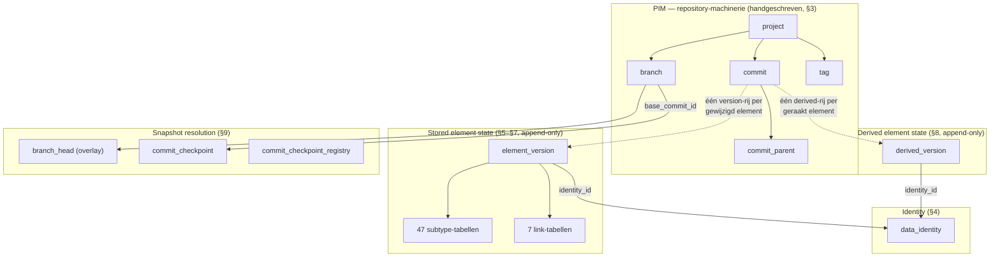

# Het SysML2.NET PostgreSQL-schema — een architectuurgids

> **Voor wie dit is.** Je kent SQL. Je wilt begrijpen *waarom* dit schema eruitziet zoals het
> eruitziet — elke tabel, elke index, elke functie, en de redeneerketen die erheen leidde.
> Dit document is de uitgebreide tegenhanger van `SysML2.NET.CodeGenerator/SQLSCHEMA.md` (de
> compacte referentie). Waar SQLSCHEMA.md beslissingen *vaststelt*, worden ze in deze gids
> *afgeleid*.
>
> **Terminologie:** conceptuele termen (derived properties, stored state, fold, checkpoint,
> overlay, impact radius, …) blijven in het Engels — ze zijn het vocabulaire van de
> specificatie, de code en de schemabestanden; alleen de lopende tekst is Nederlands.
>
> **De artefacten die hier worden uitgelegd:**
>
> | Bestand | Rol |
> |---|---|
> | `SysML2.NET.CodeGenerator/Sql/schema.golden.sql` | Handgeschreven, geannoteerd referentieontwerp |
> | `SysML2.NET.CodeGenerator/Sql/schema2.generated.sql` | Daadwerkelijke generator-output (ingecheckt ter review) |
> | `SysML2.NET.CodeGenerator/Sql/schema.smoke.sql` | Functionele test met 19 assertions |
> | `SysML2.NET.CodeGenerator/Templates/Uml/core-sql-schema-2.hbs` | De Handlebars-template die het schema genereert |
>
> Sectienummers zoals **§5** verwijzen naar de genummerde banners in de schemabestanden zelf.

---

## Inhoudsopgave

1. [Het probleem dat wordt opgelost](#1-het-probleem-dat-wordt-opgelost)
2. [De twee werelden: element data en PIM-data](#2-de-twee-werelden-element-data-en-pim-data)
3. [De census: waarom 77% van het metamodel geen stored data is](#3-de-census-waarom-77-van-het-metamodel-geen-stored-data-is)
4. [De twee axioma's waar alles uit volgt](#4-de-twee-axiomas-waar-alles-uit-volgt)
5. [Verworpen alternatieven, en waarom](#5-verworpen-alternatieven-en-waarom)
6. [Laag A — het PIM: projects, commits, branches, tags (§3)](#6-laag-a--het-pim-projects-commits-branches-tags-3)
7. [Identity: `data_identity` en de filosofie achter referential integrity (§4)](#7-identity-data_identity-en-de-filosofie-achter-referential-integrity-4)
8. [Laag B — stored element state (§5, §6, §7)](#8-laag-b--stored-element-state-5-6-7)
9. [Laag C — derived element state (§8)](#9-laag-c--derived-element-state-8)
10. [Laag D — snapshot resolution (§9)](#10-laag-d--snapshot-resolution-9)
11. [Het read path (§10)](#11-het-read-path-10)
12. [De metamodel-catalogi en de Query service (§2, §11)](#12-de-metamodel-catalogi-en-de-query-service-2-11)
13. [Partitionering en fysieke tuning (§12)](#13-partitionering-en-fysieke-tuning-12)
14. [De performance-audit: praktijkverhalen met cijfers](#14-de-performance-audit-praktijkverhalen-met-cijfers)
15. [Wat de service-laag het schema nog verschuldigd is](#15-wat-de-service-laag-het-schema-nog-verschuldigd-is)
16. [Uitgewerkte voorbeelden — data volgen door het schema](#16-uitgewerkte-voorbeelden--data-volgen-door-het-schema)
17. [Codegeneratie: wat uit het UML-model wordt gegenereerd en hoe](#17-codegeneratie-wat-uit-het-uml-model-wordt-gegenereerd-en-hoe)
18. [Begrippenlijst](#18-begrippenlijst)

---

## 1. Het probleem dat wordt opgelost

Dit schema is de persistence-laag voor een **SysML v2-modelrepository** die de OMG-specificatie
*Systems Modeling API and Services*, versie 1.0, implementeert. Die ene zin bevat drie harde
eisen, en elk daarvan vormt het schema sterker dan welke gewone CRUD-overweging dan ook:

**Eis 1 — het slaat *modellen* op, geen records.** Een SysML v2-model is een graaf van
getypeerde elementen (`PartUsage`, `Membership`, `Specialization`, …) uit een metamodel van 175
metaclasses. Elementen verwijzen intensief naar elkaar — ownership-bomen, type-hiërarchieën,
namespace-imports. Een "rij" is hier één element van een systems-engineering-model dat er een
miljoen kan bevatten.

**Eis 2 — het is een *versiebeheersysteem*.** De OMG-API is bewust Git-vormig: projects
bevatten commits, commits vormen een directed acyclic graph (merges hebben meerdere parents),
branches zijn verplaatsbare pointers in die graaf, tags bevroren pointers. Elke API-read
gebeurt *op* een commit: `GET /projects/{p}/commits/{c}/elements/{e}`. Commits zijn volgens de
specificatie immutable en niet verwijderbaar. Dat sluit de klassieke vorm "current-state-
tabellen + audit log" uit — historie is hier geen auditkwestie, het *is* het datamodel.

**Eis 3 — het moet antwoorden met *derived properties*.** Dit is de eis die de meeste mensen
onderschatten, en het is de grootste drijfveer achter dit ontwerp. Het SysML v2-metamodel
definieert het merendeel van zijn properties als **derived**: berekend uit andere elementen
via traversal-regels in OCL. De `qualifiedName` van een element wordt berekend door de
ownership chain naar de root namespace af te lopen. De `feature`-set van een type wordt
berekend door memberships over de hele specialization-hiërarchie te folden. De OMG-API
(Clause 2, "Derived Property Conformance") laat een server één van drie niveaus claimen:

- *geen conformance* — nooit derived properties teruggeven;
- *passthrough* — de door clients aangeleverde derived values opslaan en teruggeven, nooit
  zelf berekenen;
- **full conformance** — elk antwoord bevat correct berekende, actuele derived values, en
  derived properties zijn bruikbaar in queryfilters.

Dit schema mikt op **full conformance met precompute op commit-moment**: derived values worden
één keer berekend, wanneer een commit wordt weggeschreven, en reads geven alleen bytes terug.
Sectie 9 legt uit waarom die keuze (in plaats van compute-on-read) en wat ze kost.

Tot slot het schaalprofiel waarvoor het schema is ontworpen (bevestigd met de projecteigenaar):

- **~1 miljoen elementen** per project,
- **100–500 gelijktijdig levende branches** per project, routinematig aangemaakt en verwijderd,
- **tienduizenden commits** per project (jaren van dagelijks bewerken),
- **tientallen tot honderden projects** die één PostgreSQL-instantie delen,
- leesverkeer gedomineerd door *branch-head*-element-reads en queryfilters; incidentele
  historische reads.

Houd die getallen in gedachten. Diverse ontwerpen die prima werken bij 100k elementen met 5
branches sterven bij dit profiel — sectie 14 laat de metingen zien.

---

## 2. De twee werelden: element data en PIM-data

De OMG-specificatie splitst haar datamodel in twee niveaus, en het schema volgt die splitsing.

**Het PIM (Platform-Independent Model)** is de *repository-machinerie*: `Project`, `Commit`,
`Branch`, `Tag`, `DataVersion`, `DataIdentity`, `Query`. Deze typen zijn gedefinieerd in Clause
7 van de API-specificatie, niet in het SysML-metamodel. Het zijn er 16, ze zijn stabiel (ze
veranderen wanneer OMG de API herziet — vrijwel nooit), en hun semantiek is subtiel
(commit-DAG's, merge-invarianten). Ze zijn in het schema **handgeschreven** (§3) — het
genereren van 16 stabiele tabellen zou machinerie toevoegen zonder waarde toe te voegen, en de
subtiele delen (de monotonie-trigger, de delete-procedure) hebben sowieso door mensen
geschreven commentaar nodig.

**Element data** is de daadwerkelijke modelinhoud: de 175 metaclasses van KerML + SysML v2.
Dit deel wordt **gegenereerd** uit dezelfde UML-XMI-bestanden (`Resources/KerML_only_xmi.uml`,
`Resources/SysML_only_xmi.uml`) waaruit ook de rest van SysML2.NET wordt gegenereerd — de
DTO's, POCO's, JSON-serializers, enzovoort. Wanneer OMG de taal herziet (en dat gebeurt
regelmatig), draai je de generator opnieuw en krijg je een schema dat exact bij het nieuwe
metamodel past, zonder handmatig onderhoud aan 167 tabeldefinities. Sectie 17 behandelt de
generatiepijplijn.

De grens tussen de twee werelden is één concept: de **DataVersion**. In de specificatie
verpakt een `DataVersion` een element-payload in de context van een commit — "element X had
deze inhoud op commit C". In het schema is dat concept de `element_version`-rij. De
PIM-tabellen organiseren *welke* versions bestaan; de elementtabellen leggen vast *wat* elke
version bevatte.



---

## 3. De census: waarom 77% van het metamodel geen stored data is

Voordat er ook maar één tabel werd ontworpen, is het metamodel geteld. Deze census was
belangrijker dan elke andere stap, omdat de cijfers de intuïtie vernietigen waarmee je anders
zou ontwerpen.

Het metamodel, zoals gerealiseerd in de gegenereerde code van deze repository, bevat:

| Meting | Aantal |
|---|---|
| Metaclasses | 175 (167 concreet, 8 abstract) |
| Flattened properties over alle concrete classes (eigen + geërfd) | 12.963 |
| …waarvan **stored** (`{ get; set; }` in de DTO's) | 2.698 |
| …waarvan **derived** (`{ get; internal set; }`) | 9.582 |
| …expliciete-interface-redefinition-aliassen (geen opslag) | 683 |
| Afzonderlijke *declaraties* achter de 2.698 stored properties | **97, verdeeld over 49 metaclasses** |
| Afzonderlijke namen van stored properties | ~80 |
| Breedste stored footprint van één metaclass | **24 kolommen** (`FlowUsage` en verwanten) |
| Multi-valued stored reference properties, afzonderlijk | **6** (`ownedRelationship`, `ownedRelatedElement`, `source`, `target`, `client`, `supplier`) plus 1 multi-valued string (`aliasIds`) |
| Enumeraties | 7, met in totaal 19 literals |

Lees die cijfers nog eens, want ze zijn het hele spel:

**Ten eerste: het stored oppervlak is piepklein.** Twaalfduizend flattened properties klinkt
enorm — totdat je ziet dat er maar ~2.700 stored zijn, en dat die ineenschuiven tot 97
declaraties omdat inheritance het vermenigvuldigen doet. `Element` declareert 7 stored
properties en elk van de 167 concrete classes erft ze; dat zijn er meteen 1.169 van de 2.698.
De stored kern van het metamodel is werkelijk klein: een handvol booleans, namen, hier en daar
een enum, en een bescheiden set single-valued references op de relationship-metaclasses.

**Ten tweede: het derived oppervlak is enorm, en het is geen decoratie.** 9.582 flattened
derived properties, ~325 afzonderlijke namen. Dit zijn geen gemakken — ze zijn het primaire
vocabulaire van de API. `owner`, `qualifiedName`, `ownedElement`, `feature`, `membership`,
`documentation` — allemaal derived, allemaal verwacht in elke API-payload onder full
conformance. En cruciaal: de belangrijke zijn **recursief**:

- `qualifiedName` loopt de ownership chain af naar de root en raadpleegt onderweg de namen van
  siblings;
- `Type::feature` en `inheritedMembership` folden over de *volledige specialization closure*
  van een type (een breadth-first search over `Specialization`-edges);
- `Namespace::importedMembership` is een recursieve wandeling over imports, waarbij
  `Import::isRecursive` haar onbegrensd maakt;
- `isLibraryElement` loopt de ownership af om te controleren op een library-root.

Geen van deze is berekenbaar in één enkele SQL-`SELECT`. Ze hebben recursieve CTE's of
gematerialiseerde closures nodig — of precompute, en dat is de gekozen weg.

**Ten derde: de typeconflicten in de storage zijn echt en dwingen structuur af.** Het metamodel
hergebruikt property-namen met *verschillende typen*: `LiteralBoolean::value` is een Boolean,
`LiteralInteger::value` een Integer, `LiteralRational::value` een Real, `LiteralString::value`
een String — vier onverenigbare SQL-typen onder één naam. Evenzo is `kind` een *andere enum* op
elk van `RequirementConstraintMembership`, `StateSubactionMembership`,
`TransitionFeatureMembership` en `TriggerInvocationExpression`. Elk ontwerp met één gedeelde
`value`-kolom is bij voorbaat dood. Dit ene feit elimineert "één brede tabel" (sectie 5).

**Ten vierde: inheritance is een DAG, geen boom.** 34 metaclasses hebben meerdere directe
supertypes (tot 3: `FlowUsage` is tegelijk een `ConnectorAsUsage`, een `Flow` en een
`ActionUsage`, wat haar zowel *Feature* als *Relationship* maakt). Elk ontwerp dat uitgaat van
een lineaire "join omhoog langs de parent chain" is eveneens bij voorbaat dood. Diepste keten:
11 niveaus.

Alles in secties 5–9 is een gevolg van deze vier feiten.

### Twee valkuilen die tijdens de census zijn ontdekt

De census bracht ook twee feiten over de UML-bron aan het licht die een naïeve generator fout
doet, en ze zijn het vastleggen waard omdat ze iedereen zullen bijten die de generator later
aanraakt:

**Valkuil 1 — association-owned ends.** In UML kan een reference property die deel uitmaakt
van een association eigendom zijn van de *association*, niet van de class.
`Membership::memberElement`, `Specialization::general`, `FeatureTyping::type` — de dragende
reference properties van het complete metamodel — verschijnen **niet** in
`IClass.OwnedAttribute`. Een generator die `OwnedAttribute` leest, produceert stilletjes een
`membership_v`-tabel *zonder de member-element-kolom* (dit is tijdens de ontwikkeling
daadwerkelijk gebeurd; 22 van de 47 subtype-tabellen kwamen er verkeerd uit). De correcte
definitie van "declared door class C" is: *flattened properties van C, minus de vereniging van
de flattened properties van C's directe generalizations*. Zie
`SysML2.NET.CodeGenerator/Extensions/SqlSchemaExtensions.cs`, `QueryStoredOwnProperties`.

**Valkuil 2 — twee soorten redefinition.** UML-property-redefinition dekt twee heel
verschillende situaties. *Same-name redefinition* (`CollectExpression::operator` herdefinieert
`OperatorExpression::operator`) is een herformulering van een constraint — de herdefiniërende
property is hetzelfde opslagslot, en de DTO's geven haar geen eigen veld. Er zijn er precies 9
van. *New-name redefinition* (`Membership::memberElement` herdefinieert
`Relationship::target`) is een **nieuwe API-property met eigen storage** — de DTO's slaan
zowel `memberElement` *als* de geërfde `target`-lijst op, en API-payloads bevatten beide. De
storage-regel die aansluit bij de rest van SysML2.NET: alleen same-name redefinitions zijn
storage-vrij; ze lossen transitief op naar de kolom van de root property. (Dit is dezelfde
onderscheider die `SysML2.NET.CodeGenerator/HandleBarHelpers/PropertyHelper.cs` gebruikt voor
de DTO-generator.)

---

## 4. De twee axioma's waar alles uit volgt

Als je verder niets uit dit document onthoudt, onthoud dan deze twee uitspraken. Elke
structurele beslissing in het schema is een gevolg van één van beide.

### Axioma 1 — References benoemen identities, nooit versions

Het `@id` van een SysML-element is stabiel gedurende zijn hele leven. Wanneer een
`FeatureTyping` zegt "deze feature is getypeerd door element `4ace3d89-…`", betekent dat
*wat dat element ook is op welke commit je ook kijkt* — niet "version 17 van dat element".
Version-onafhankelijkheid is het hele punt: je kunt het doelelement jarenlang hertyperen,
hernoemen en bewerken, en de reference blijft geldig.

Het schemagevolg: **elke element-naar-element-referencekolom is een foreign key naar
`data_identity(id)` — nooit naar `element_version`.** Nergens in het schema bestaat een FK van
de ene element version naar de andere.

Dit definieert ook wat referential integrity hier wél en niet kan betekenen. De FK garandeert
dat de doel-*identity in de database bestaat*. Ze kan niet garanderen dat het doel *bestaat op
de commit waarop je leest* — een element kan legitiem verwijzen naar iets dat op deze branch
is verwijderd (dat is een dangling reference *in het model*, een modelvalidatiekwestie die de
service rapporteert, geen database-integriteitsschending). De database
per-commit-referencegeldigheid laten afdwingen zou FK's vereisen naar een virtuele, berekende
verzameling — onmogelijk, en ook onjuist, want de specificatie staat expliciet toe dat
modellen zich tussen commits in tussentoestanden bevinden.

### Axioma 2 — Een derived value is een functie van (identity, commit), niet van (version)

Dit is subtieler en verstrekkender. Beschouw:

```
Package "Old"            <- element P, version p1
  └── PartUsage "wheel"  <- element W, version w1, qualifiedName = "Old::wheel"
```

Commit nu een hernoeming van het package naar `"New"`. De change set van de commit bevat
**één** element: P (nieuwe version p2). W is onaangeraakt — geen nieuwe version, `w1` blijft
zijn actuele stored state op elke branch. En toch is W's `qualifiedName` nu `"New::wheel"`.

Dus: W's derived state veranderde *zonder dat W veranderde*. Een derived value is geen
eigenschap van een version — dezelfde version `w1` heeft `qualifiedName = "Old::wheel"` op
commit 1 en `"New::wheel"` op commit 2. Ze is een eigenschap van het paar **(identity,
snapshot)**. De OMG-specificatie zegt het letterlijk (Clause 2): *"the values of derived
properties of a given Element may be affected by commits that do not directly change that
Element."*

Het schemagevolg: derived state **kan niet op `element_version` leven**. Als dat wel zo was,
zou de hernoeming het wegschrijven van een nieuwe `element_version`-rij voor W afdwingen (en
voor elke andere afstammeling) waarvan de *stored* helft byte-identiek is aan de oude — je zou
elementen versioneren die niet zijn veranderd, de betekenis van "change set" corrumperen en de
opslag van stored state vermenigvuldigen met de impact radius van elke hernoeming.

In plaats daarvan heeft het schema **twee parallelle append-only streams**:

- `element_version` — gesleuteld op version; er bestaat een rij per *(element,
  commit-die-het-wijzigde)*; immutable; het system of record voor stored state.
- `derived_version` — gesleuteld op *(identity, commit)*; er bestaat een rij per *(element,
  commit-die-zijn-derived-state-wijzigde)*; immutable; het read model voor derived state.

Bij de hernoemingscommit is de schrijfactie: **één** nieuwe `element_version`-rij (voor P) en
**N + 1** nieuwe `derived_version`-rijen (voor P en elk element waarvan de hernoeming de
derived values raakte — de "impact radius"). W's stored state blijft onaangeraakt; W's derived
state krijgt een nieuwe rij.

De smoke-test met 19 assertions (`SysML2.NET.CodeGenerator/Sql/schema.smoke.sql`) maakt exact
dit scenario tot zijn eerste en centrale assertion-paar (PASS 2a/2b): na de hernoeming lost
W's `qualifiedName` op naar `"New::wheel"` *terwijl W nog steeds oplost naar zijn
oorspronkelijke version-rij*. Als je dit schema ooit refactort: houd die test groen — hij is
de dragende muur van het ontwerp.

---

## 5. Verworpen alternatieven, en waarom

Vier plausibele architecturen zijn overwogen en verworpen. Begrijpen waarom ze falen maakt
duidelijk waarom de gekozen architectuur eruitziet zoals ze eruitziet.

### 5.1 Eén brede tabel ("God table")

*Eén `element`-tabel met een kolom voor elke stored property van alle metaclasses.*

Met ~80 afzonderlijke stored namen is dit oppervlakkig verleidelijk — 80 kolommen is niet
waanzinnig. Het sterft op het typeconflict-feit uit de census: `value` moet tegelijk
`boolean`, `integer`, `double precision` en `text` zijn; `kind` moet vier verschillende
enum-typen zijn. Je eindigt óf met getypeerde kolomfamilies (`value_bool`, `value_int`, …,
`kind_req`, `kind_state`, …) — en dan heb je subtype-tabellen binnen één tabel heruitgevonden,
slecht, met elke rij grotendeels NULL en elke CHECK-constraint conditioneel op `class_kind` —
óf met alles als `text` en overal casts, waarmee je de typeveiligheid opgeeft in precies de
laag die haar moet leveren.

### 5.2 Tabel-per-metaclass (volledig TPT, de "COMET-vorm")

*Eén tabel per concrete metaclass (167), plus één link-tabel per multi-valued property
(~230), voor reads gejoind langs de inheritance-keten.*

Dit is de vorm van het eerdere `core-sql-schema.hbs`-skelet dat dit project erfde (een port
van de CDP4-COMET-server, die haar met succes gebruikt voor een ander metamodel). Ze faalt
hier om drie redenen:

1. **De inheritance-DAG breekt de join-keten.** TPT-reads reconstrueren een instantie door
   parent-tabellen langs de keten te joinen. Met 34 meervoudig ervende metaclasses is er geen
   keten — een `FlowUsage`-read zou langs *twee* takken van een inheritance-ruit joinen. Het
   kan, maar elke querygenerator moet dan de DAG begrijpen.
2. **Schaal van machinerie versus schaal van inhoud.** 167 + ~230 tabellen om 97
   property-declaraties te dragen. De overgrote meerderheid van die tabellen zou *alleen* de
   `iid`-kolom bevatten (de meeste metaclasses declareren geen eigen stored properties — ze
   bestaan om hun derived semantiek). De diepste reads worden 11-voudige joins.
3. **De COMET-vorm veronderstelt single-version storage.** Haar FK's wijzen naar elementrijen
   en haar `revisionNumber` is een monotone integer — beide onverenigbaar met een commit-DAG
   en version-onafhankelijke references (Axioma's 1 en 2). Dit is geen kritiek op COMET; haar
   probleemdomein heeft lineaire revisies en verwijs-naar-actueel-semantiek. Dit domein niet.

### 5.3 Zuivere generieke EAV

*Twee tabellen: `element_version(…, value_data jsonb)` en
`element_reference(version_id, property_id, ordinal, target_identity)`.*

Het snelst te genereren, en de reference-tabel is oprecht aantrekkelijk voor graaftraversal
(één index bedient elke "wie verwijst naar X?"-vraag). Verworpen omdat ze het typesysteem
platslaat tot data: geen per-property-FK-semantiek, geen per-property NOT NULL/enum-
afdwinging, geen kolomstatistieken voor de planner (elke property-lookup heeft dezelfde
generieke selectiviteit), en garanties op CHECK-niveau ("`isParallel` is een boolean") worden
applicatiediscipline. Het gekozen ontwerp behoudt een *smal* EAV-achtig oppervlak waar het
gerechtvaardigd is (de 7 link-tabellen, de property catalog) zonder getypeerde kolommen voor
de scalaire kern op te geven.

### 5.4 Document store (alleen jsonb)

*Sla elke element version op als één jsonb-document; indexeer met GIN.*

Dit doet reads prachtig — sterker nog, het gekozen ontwerp *bevat* dit ontwerp als zijn read
path (`stored_json`/`derived_json`). Verworpen als *system of record* omdat referential
integrity, getypeerde constraints, reverse-reference-indexen en per-kolom-statistieken
allemaal verdwijnen; elke integriteitseigenschap van het model zou in applicatiecode leven. De
les die in plaats daarvan is getrokken: **normaliseer voor schrijven en integriteit,
denormaliseer voor lezen** — houd beide, in dezelfde rijen, geschreven in dezelfde transactie.

### 5.5 Wat er is gekozen

**Element-kern + sparse subtype-tabellen + getypeerde link-tabellen + een tweede derived
stream:**

- één `element_version`-kerntabel met identity/commit-boekhouding plus de 7 eigen stored
  properties van `Element` (elk element heeft ze; afsplitsen zou een join voor niets zijn);
- **47 subtype-tabellen**, één per metaclass die stored scalaire properties *declareert*,
  gesleuteld op `(project_id, version_id)` — een instantie van een metaclass heeft rijen in
  precies de subtype-tabellen van haar storage-declarerende voorouders (een verzameling, geen
  keten — de DAG wordt afgehandeld door lidmaatschap, niet door joins);
- **7 link-tabellen** voor de 6 multi-valued reference properties + `aliasIds`, allemaal
  geordend (`ordinal` in de PK — elk van deze is `isOrdered` in het metamodel);
- `derived_version` als tweede stream (Axioma 2);
- `stored_json` op de version-rij en `derived_json` op de derived-rij als de bewuste,
  transactioneel consistente read-denormalisatie.

Het aantal 47 is geen ontwerpparameter — het volgt uit de census (49 storage-declarerende
metaclasses, minus `Element` dat in de kerntabel is opgenomen, minus `Dependency` waarvan de
enige stored properties de twee multi-valued zijn die link-tabellen worden).

---

## 6. Laag A — het PIM: projects, commits, branches, tags (§3)

### 6.1 De commit-DAG

```sql
CREATE TABLE sysml2.commit (
    id             uuid        NOT NULL,
    project_id     uuid        NOT NULL REFERENCES sysml2.project (id) ON DELETE CASCADE,
    created        timestamptz NOT NULL DEFAULT now(),
    description    text        NULL,
    PRIMARY KEY (id)
);

CREATE TABLE sysml2.commit_parent (
    commit_id         uuid     NOT NULL REFERENCES sysml2.commit (id) ON DELETE CASCADE,
    parent_commit_id  uuid     NOT NULL REFERENCES sysml2.commit (id),
    ordinal           smallint NOT NULL,
    PRIMARY KEY (commit_id, parent_commit_id)
);
```

De specificatie is er expliciet over dat `Commit.previousCommit` een **verzameling** is — een
merge commit heeft twee of meer parents. Vandaar de aparte `commit_parent`-edge-tabel in
plaats van een `previous_commit_id`-kolom. `ordinal` bewaart de parent-volgorde ("first
parent" doet ertoe voor merge-semantiek, precies als in Git). De PK van de commit is de kale
uuid omdat commits overal vandaan worden gerefereerd (branches, versions, checkpoints) en via
hun eigen `project_id` project-gebonden zijn.

Twee spec-invarianten zijn het internaliseren waard, omdat de *resolvers erop steunen*:

**Immutability.** *"Commits are immutable… Commits are not destructible"* (Clause 7.1.2). Het
schema neemt dit letterlijk: niets UPDATE't ooit een commit of een `element_version`-rij.
Append-only is hier geen optimalisatie; het is de eigen semantiek van de specificatie.

**Monotonie.** *"Version histories must monotonically increase in time: for Commit C, the
value of C.created must be strictly newer than the value of D.created for any commit D in
C.previousCommit."* Het schema *dwingt dit af* met een trigger:

```sql
CREATE TRIGGER trg_commit_parent_monotonic
    AFTER INSERT ON sysml2.commit_parent
    FOR EACH ROW
    EXECUTE FUNCTION sysml2.assert_commit_monotonic();
```

Waarom afdwingen in plaats van vertrouwen? Omdat de snapshot resolver (sectie 10) voor elk
element de version van de **nieuwste ancestor-commit** kiest — "nieuwste op `created`". Als er
ooit een commit met een timestamp ouder dan zijn parent zou worden ingevoegd, zou de resolver
stilletjes het *verkeerde snapshot* teruggeven — geen fout, gewoon verkeerde data. Bugklassen
met stille verkeerde antwoorden krijgen triggers; luidruchtige mogen aan de service-laag
worden overgelaten. (Smoke-assertion PASS 6 bewijst dat de trigger afgaat.)

Let op wat monotonie *niet* geeft: een ordening tussen **siblings**. Twee commits op parallelle
branches mogen legaal een timestamp delen. Sectie 10.4 legt de tiebreaker uit die dit
afhandelt.

### 6.2 Hoe delta's snapshots worden — het eigen algoritme van de specificatie

De specificatie definieert `Commit.change` (de delta: de DataVersions die deze commit schreef)
als stored en `Commit.versionedData` (het volledige model-snapshot op deze commit) als
**derived**, met een OCL-algoritme dat het lezen waard is omdat de resolver van het schema er
de directe vertaling van is:

```
let updatedNotDeleted = change->select(payload <> null) in
let updatedIdentities = change.identity in
let retainedWithDuplicates =
    previousCommits.versionedData->select(oldData |
        updatedIdentities->excludes(oldData.identity)) in
let retained = <kies er één per identity uit retainedWithDuplicates> in
versionedData = updatedNotDeleted->union(retained)
```

In woorden: het snapshot van een commit is *zijn eigen wijzigingen, plus alles uit de snapshots
van zijn parents dat hij niet heeft overschreven*. De recursie over `previousCommit` eindigt
bij de root. Deleties zijn DataVersions waarvan de `payload` null is — wat het schema opslaat
als `tombstone = true` op de version-rij.

Dit algoritme is correct en kansloos om per read uit te voeren op schaal — het is een fold
over de complete commit-historie. Heel §9 (sectie 10 van deze gids) bestaat om het goedkoop te
maken.

### 6.3 Branches en tags

```sql
CREATE TABLE sysml2.branch (
    id              uuid        NOT NULL,
    project_id      uuid        NOT NULL REFERENCES sysml2.project (id) ON DELETE CASCADE,
    name            text        NULL,
    description     text        NULL,
    head_commit_id  uuid        NOT NULL REFERENCES sysml2.commit (id),
    base_commit_id  uuid        NULL REFERENCES sysml2.commit (id),   -- zie sectie 10.2
    created         timestamptz NOT NULL DEFAULT now(),
    deleted         timestamptz NULL,
    PRIMARY KEY (id),
    UNIQUE (project_id, name)
);
```

Volgens de mutability-tabel van de specificatie: branches zijn muteerbaar en verwijderbaar
(het *enige* muteerbare in de versioneringskern — `head_commit_id` verschuift bij elke
commit); tags zijn immutable maar verwijderbaar; commits geen van beide. `deleted` is een
nullable timestamp in plaats van een harde delete, omdat de specificatie het verwijderen van
een CommitReference modelleert als een vastgelegde gebeurtenis.

`base_commit_id` is een performancestructuur, geen spec-concept — ze verankert de
branch-head-*overlay* en wordt volledig uitgelegd in sectie 10.2.

Verder in deze laag: `tag` (zelfde vorm als branch, bevroren), `project_usage`
(cross-project-imports: "project A gebruikt project B op commit C", met de spec-constraint
`usedProject = usedProjectCommit.owningProject` overgelaten aan de service), en `project`
zelf, waarvan de `default_branch_id`-FK *na* het bestaan van `branch` wordt toegevoegd en
`DEFERRABLE INITIALLY DEFERRED` is — project en zijn default branch worden in één transactie
aangemaakt, en de circulaire FK (project → branch → project) kan pas op commit-moment worden
vervuld.

---

## 7. Identity: `data_identity` en de filosofie achter referential integrity (§4)

```sql
CREATE TABLE sysml2.data_identity (
    id         uuid NOT NULL,
    project_id uuid NOT NULL REFERENCES sysml2.project (id),
    PRIMARY KEY (id)
);
```

Twee kolommen. Deze piepkleine tabel is het anker van Axioma 1: elke element-referencekolom in
het hele schema — ~30 single-reference-kolommen op subtype-tabellen, 5 reference-link-
tabellen, `element_version.owning_relationship`, `branch_head.identity_id`, enzovoort — is een
foreign key naar `data_identity(id)`.

Drie bewuste keuzes:

**De PK is de kale uuid, niet `(project_id, id)`.** `ProjectUsage` laat een element in project
A verwijzen naar een element in project B. Een samengestelde PK zou elke
cross-project-reference on-FK-baar maken. Projectbegrenzing van references is een
service-laag-validatie (via `project_usage`), geen FK. De prijs: `data_identity` kan niet
zoals al het andere per project worden gepartitioneerd. De audit (sectie 14, bevinding R12)
heeft gecontroleerd of dat bij 10⁸ rijen uitmaakt — dat doet het niet: twee uuid-kolommen
vormen een heap van ~7 GB met een btree waarvan de bovenste niveaus resident blijven; elke
probe is 3–4 gecachte page reads. Read-mostly FK-doelen schalen prima ongepartitioneerd.

**`element_id` (de KerML-property) is `text`, geen `uuid`.** Let op het onderscheid: het `@id`
van de *API* is een UUID en mapt op `data_identity.id`. Maar KerML's `Element::elementId` is
gedeclareerd als `String`; alleen elementen van de standaard-*library* zijn normatief
verplicht om name-based (v5) UUID's te gebruiken, en gebruikersmodellen kennen helemaal geen
formaateis. Een `uuid`-kolom zou spec-geldige data weigeren. Daarom is
`element_version.element_id` `text`, en is het `id` van de identity-rij de uuid die de
API-laag beheert.

**Verwijderen is expliciet, nooit gecascadeerd.** Oorspronkelijk waren de identity-FK's
`ON DELETE CASCADE` ("verwijder een project → alles gaat mee"). De performance-audit heeft dit
geëlimineerd, om een mechanische reden die generaliseert: **een cascade voert per-rij-deletes
uit, gefilterd op alléén de FK-kolom** — `DELETE FROM element_version WHERE identity_id = $1`
— en *geen enkele index in dit schema begint met een kale identity-kolom* (ze beginnen
allemaal met `project_id`, voor partitielokaliteit). Elke gecascadeerde identity zou dus de
grootste tabellen sequentieel scannen, één keer per identity, een miljoen keer per
projectverwijdering. De oplossing staat als gedocumenteerde procedure bij de
`data_identity`-DDL: projectverwijdering is een *geordende, gebatchte, per-tabel*
`DELETE … WHERE project_id = $1` (elk statement pruned naar één partitie en gebruikt een
PK-prefix), eindigend met `data_identity` en `project`. De overgebleven `NO ACTION`-FK's
fungeren als vangnet — ze *blokkeren* verwijdering in de verkeerde volgorde luidkeels, in
plaats van stilletjes te scannen. Die ruil (expliciete procedure + luide bewaking, in plaats
van gemakkelijk + catastrofaal) is de algemene FK-filosofie van het schema.

---

## 8. Laag B — stored element state (§5, §6, §7)

### 8.1 De kern: `element_version` (§5)

```sql
CREATE TABLE sysml2.element_version (
    project_id           uuid       NOT NULL,
    version_id           uuid       NOT NULL,      -- DataVersion.id uit de spec
    identity_id          uuid       NOT NULL REFERENCES sysml2.data_identity (id),
    commit_id            uuid       NOT NULL REFERENCES sysml2.commit (id),
    class_kind           smallint   NOT NULL REFERENCES sysml2.class_kind (id),
    tombstone            boolean    NOT NULL DEFAULT false,

    -- de eigen stored properties van Element, hier opgenomen:
    element_id           text       NULL,
    declared_name        text       NULL,
    declared_short_name  text       NULL,
    is_implied_included  boolean    NULL,
    owning_relationship  uuid       NULL REFERENCES sysml2.data_identity (id),

    stored_json          jsonb      NULL,

    PRIMARY KEY (project_id, version_id),
    CONSTRAINT element_version_tombstone_empty
        CHECK (NOT tombstone OR (stored_json IS NULL AND element_id IS NULL)),
    CONSTRAINT element_version_payload_present
        CHECK (tombstone OR (stored_json IS NOT NULL AND element_id IS NOT NULL
                             AND is_implied_included IS NOT NULL))
) PARTITION BY HASH (project_id);

CREATE UNIQUE INDEX ux_element_version_identity_commit
    ON sysml2.element_version (project_id, identity_id, commit_id);
```

Ontwerpnotities, kolom voor kolom:

- **`project_id` leidt elke sleutel.** Alle elementtabellen zijn hash-gepartitioneerd op
  `project_id` met dezelfde modulus (sectie 13), en hun PK's beginnen ermee. Dat maakt elke
  join ertussen *partitielokaal* en laat elke projectgebonden query op planmoment naar één
  partitie prunen. De bijbehorende discipline — **filter deze tabellen nooit op een kale uuid
  zonder `project_id`** — bleek enorm belangrijk; sectie 14 (bevinding R2) laat zien wat er
  gebeurt als je het vergeet.
- **`version_id` is de eigen identity van de rij** (het `DataVersion.id` van de spec). Ze
  wordt app-zijdig gegenereerd, en de audit adviseert UUIDv7 (tijdgeordend) zodat de inserts
  van elk project op het rechtse btree-blad landen in plaats van over de index te spatten
  (bevinding R8).
- **`class_kind` is een `smallint`, geen naam.** De 175 metaclass-namen zijn geïnterneerd in
  de `class_kind`-catalogus (sectie 12). Op de heetste, grootste tabel van de database is dat
  een kolom van 2 bytes in plaats van ~15 bytes tekst, maal honderden miljoenen rijen, maal
  haar aanwezigheid in indexen.
- **`tombstone` is de delete-markering** — de directe codering van "een DataVersion met een
  null payload is een deletie" uit de spec. Deleties zijn *rijen*, omdat in een append-only
  commit store een deletie een gebeurtenis in de historie is, niet de afwezigheid van data. De
  twee CHECK-constraints maken tombstones en payload-rijen wederzijds uitsluitende vormen: een
  tombstone moet leeg zijn, een niet-tombstone compleet. Deze CHECK's zijn de goedkoopst
  mogelijke verzekering tegen een service-laag die halfgevormde rijen schrijft.
- **De vijf Element-kolommen zijn opgenomen in de kern** in plaats van in een aparte
  `element_v`-subtype-tabel. Reden: *elk* element heeft ze (het zijn Elements eigen
  declaraties, en alles is een Element), dus een aparte tabel zou aan elke read een join
  toevoegen zonder enig opslagvoordeel. `declared_name` is bovendien de meest-gefilterde
  stored kolom, en op de kerntabel kan het queryplan de join helemaal vermijden.
- **`stored_json` is de read-model-denormalisatie** — de stored helft van het element,
  voorgeserialiseerd in exact de JSON-vorm van de API. De genormaliseerde kolommen en
  link-tabellen (die alle FK's en constraints dragen) blijven het system of record;
  `stored_json` bestaat zodat het serveren van een element nooit heropbouw uit tot zes
  subtype-tabellen en drie link-tabellen vereist. Ze wordt in dezelfde transactie geschreven
  als de genormaliseerde rijen en kan dus niet uit de pas lopen. Kosten: verdubbelt ruwweg de
  opslag van `element_version` (verzacht door lz4 — sectie 13). PASS 4 van de smoke-test
  verifieert dat het geconcateneerde read path een complete payload oplevert.
- **`ux_element_version_identity_commit`** dwingt de spec-invariant af *"DataVersion.identity
  is unique among records listed in Commit.change"* — één version van een element per commit —
  en dient tegelijk als index voor "geef me de rij van element X op commit C", waar de
  single-element-resolver op leunt.

### 8.2 De link-tabellen (§6)

De census vond precies zes multi-valued stored reference properties in het hele metamodel,
plus één multi-valued string. Elk wordt één tabel; allemaal geordend:

```sql
CREATE TABLE sysml2.element_owned_relationship (
    project_id      uuid NOT NULL,
    version_id      uuid NOT NULL,
    ordinal         int  NOT NULL,
    target_identity uuid NOT NULL REFERENCES sysml2.data_identity (id),
    PRIMARY KEY (project_id, version_id, ordinal),
    FOREIGN KEY (project_id, version_id)
        REFERENCES sysml2.element_version (project_id, version_id) ON DELETE CASCADE
) PARTITION BY HASH (project_id);

CREATE INDEX ix_element_owned_relationship_target
    ON sysml2.element_owned_relationship (project_id, target_identity);
```

(en zo ook `relationship_owned_related_element`, `relationship_source`, `relationship_target`,
`dependency_client`, `dependency_supplier`, en `element_alias_ids` met een `text`-waardekolom
in plaats van een reference.)

- `ordinal` zit in de PK omdat elk van deze properties `isOrdered = true` is in het metamodel
  — volgorde is modelinhoud, geen bijzaak.
- Rijen zijn gesleuteld op **version**, niet op identity: de collectie is onderdeel van de
  stored state van het element, dus een nieuwe version draagt haar eigen collectierijen. (Dit
  is de ene plek waar de audit echte write amplification signaleerde — een nieuwe version van
  een package met 100k kinderen voegt 100k rijen opnieuw in, ook als alleen zijn naam
  veranderde. Sectie 14, bevinding R7, documenteert de content-addressed oplossing die is
  ontworpen maar bewust uitgesteld totdat benchmarks haar afdwingen.)
- De `target_identity`-reverse-lookup-index beantwoordt "wie verwijst naar element X?" — de
  bouwsteen voor omgekeerde navigatie, validatie van dangling references en de impactanalyse
  van derived state.
- De FK terug naar `element_version` is *samengesteld* op `(project_id, version_id)` en is de
  ene cascade die in deze laag behouden blijft: het verwijderen van een version-rij (wat
  alleen de expliciete projectverwijderprocedure doet) neemt haar collectierijen mee, en de
  samengestelde FK is aan beide kanten PK-geprefixt, dus de cascade is index-gedekt.

### 8.3 De subtype-tabellen (§7)

Eén tabel per storage-declarerende metaclass — 47 stuks, allemaal met hetzelfde skelet:

```sql
CREATE TABLE sysml2.feature_v (
    project_id   uuid    NOT NULL,
    version_id   uuid    NOT NULL,
    direction    sysml2.feature_direction_kind NULL,
    is_composite boolean NOT NULL DEFAULT false,
    is_constant  boolean NOT NULL DEFAULT false,
    is_derived   boolean NOT NULL DEFAULT false,
    is_end       boolean NOT NULL DEFAULT false,
    is_ordered   boolean NOT NULL DEFAULT false,
    is_portion   boolean NOT NULL DEFAULT false,
    is_unique    boolean NOT NULL DEFAULT true,
    is_variable  boolean NOT NULL DEFAULT false,
    PRIMARY KEY (project_id, version_id),
    FOREIGN KEY (project_id, version_id)
        REFERENCES sysml2.element_version (project_id, version_id) ON DELETE CASCADE
) PARTITION BY HASH (project_id);
```

Hoe een instantie op tabellen mapt: een `PartUsage`-version heeft rijen in `element_version` +
`type_v` + `feature_v` + `usage_v` + `occurrence_usage_v` — de subtype-tabellen van precies
haar storage-declarerende voorouders. Een `FlowUsage`-version heeft rijen in **zes** tabellen,
waaronder *zowel* `feature_v` als `relationship_v`, omdat `Connector` tegelijk een Feature en
een Relationship is. Zo wordt de inheritance-DAG gerepresenteerd: **lidmaatschap van een
verzameling tabellen**, niet een keten van joins. De `class_kind_table`-catalogus (sectie 12)
legt de verzameling per metaclass vast, zodat generieke code haar nooit hoeft te herleiden.

Details die intentie dragen:

- **NOT NULL volgt de lower bounds van het metamodel.** Een `[1..1]`-property is NOT NULL; een
  `[0..1]`-property (zoals `direction`, `member_name`, `portion_kind`) is NULL. Dat is veilig
  *omdat* de tabel alleen rijen heeft voor instanties waarvan de class de property werkelijk
  declareert — het sparse-tabel-ontwerp is wat eerlijke NOT NULL's überhaupt mogelijk maakt
  (vergelijk de God table, waar alles nullable moet zijn).
- **DEFAULT's komen uit de XMI.** De generator emit een `DEFAULT` voor elke property waarvan
  de UML-declaratie er één draagt: de Feature-booleans default false (`is_unique` true),
  `Membership::visibility DEFAULT 'public'`, en — makkelijk verkeerd te raden —
  `Import::visibility DEFAULT 'private'` (imports zijn in KerML standaard privé, anders dan
  memberships; een top-level import *moet* privé zijn). Deze defaults zijn tijdens de review
  gecontroleerd tegen de metamodel-kennisbank.
- **Reference-kolommen FK'en naar `data_identity`** (Axioma 1) en elk krijgt een
  reverse-lookup-index `ix_{tabel}_{kolom}`. Twee daarvan verdienen een vermelding:
  `ix_specialization_v_general` en `ix_specialization_v_specific` indexeren de
  *specialization-graaf* — de edges waarover derived properties als `Type::feature` folden.
  Wanneer de service de impact radius van "een supertype kreeg een feature erbij" berekent,
  zijn deze twee indexen wat "vind alle transitieve specializations" betaalbaar maakt.
- **De vier `kind`-tabellen en vier `literal_*`-tabellen** zijn het zichtbare bewijs van het
  typeconflict-feit uit de census: `requirement_constraint_membership_v.kind` is
  `sysml2.requirement_constraint_kind` terwijl `state_subaction_membership_v.kind`
  `sysml2.state_subaction_kind` is; `literal_boolean_v.value` is `boolean` terwijl
  `literal_rational_v.value` `double precision` is. Eén brede tabel kan dit niet
  representeren.
- **Redefinitions hebben geen kolommen.** `CollectExpression` heeft helemaal geen
  subtype-tabel — haar enige stored property is de same-name redefinition van `operator`, die
  in `operator_expression_v` leeft (de tabel van haar voorouder). De property catalog legt die
  oplossing vast zodat querycode het niet hoeft te weten.

### 8.4 De enum-typen (§1)

```sql
CREATE TYPE sysml2.visibility_kind AS ENUM ('private', 'protected', 'public');
```

Zeven native enum-typen, één per metamodel-enumeratie. Native enums (versus text + CHECK)
kosten 4 bytes, valideren bij het schrijven en sorteren in declaratievolgorde. De **labels
zijn kleine letters** om een specifieke reden: ze matchen byte-voor-byte het JSON-wire-formaat
— de gegenereerde serializers schrijven `Direction.Value.ToString().ToLower()` (zie
`SysML2.NET.Serializer.Json/Core/AutoGenSerializer/FeatureSerializer.cs`), zodat een waarde
van API-payload naar enum-kolom en terug kan stromen zonder case-mapping in welke laag dan
ook.

---

## 9. Laag C — derived element state (§8)

```sql
CREATE TABLE sysml2.derived_version (
    project_id         uuid    NOT NULL,
    derived_id         uuid    NOT NULL,
    identity_id        uuid    NOT NULL REFERENCES sysml2.data_identity (id),
    commit_id          uuid    NOT NULL REFERENCES sysml2.commit (id),

    -- promoted hot derived properties (gedeclareerd door Element
    -- => aanwezig op alle 167 metaclasses)
    owner              uuid    NULL REFERENCES sysml2.data_identity (id),
    owning_namespace   uuid    NULL REFERENCES sysml2.data_identity (id),
    qualified_name     text    NULL,
    name               text    NULL,
    short_name         text    NULL,
    is_library_element boolean NOT NULL DEFAULT false,

    derived_json       jsonb   NOT NULL,   -- al het overige: ~325 afzonderlijke derived namen

    PRIMARY KEY (project_id, derived_id)
) PARTITION BY HASH (project_id);

CREATE UNIQUE INDEX ux_derived_version_identity_commit
    ON sysml2.derived_version (project_id, identity_id, commit_id);
CREATE INDEX ix_derived_version_owner          ON sysml2.derived_version (project_id, owner);
CREATE INDEX ix_derived_version_qualified_name ON sysml2.derived_version (project_id, qualified_name);
CREATE INDEX ix_derived_version_json
    ON sysml2.derived_version USING gin (derived_json jsonb_path_ops);
```

### 9.1 Waarom überhaupt precompute op commit-moment?

Voor full derived-property conformance lagen er drie strategieën op tafel:

**Compute-on-read.** Nul schrijfkosten, geen invalidatielogica. Maar elke element-read betaalt
de recursieve wandelingen (`qualifiedName` = ownership chain; `feature` = specialization
closure), elke *collectie*-read betaalt ze per element, en — doorslaggevend — de Query service
moet filteren en sorteren op derived properties (`WHERE qualifiedName LIKE 'Vehicle::%' ORDER
BY name`), wat neerkomt op het evalueren van recursieve CTE's per kandidaatrij, of op het toch
bouwen van per-property-materialisaties. Read-gedomineerde workloads (deze, volgens het
profiel) betalen de berekening dan op het hete pad, herhaaldelijk, voor waarden die zelden
veranderen.

**Passthrough.** De door de client aangeleverde derived values letterlijk opslaan. Het
goedkoopst om te bouwen (en de DTO-laag round-tript derived values al). Verworpen als *doel*,
omdat derived values dan door de client vertrouwde data worden die stilletjes van het model
kunnen wegdrijven — acceptabel als tussentijds conformance-niveau, corrosief als architectuur.

**Precompute bij commit.** Writes betalen voor het berekenen van de *impact radius* van de
change set; reads betalen niets; query's filteren echte kolommen. De bestaande 366
geïmplementeerde `Compute*`-methoden in `SysML2.NET/Extend/` zijn de rekenmachine — de
.NET-code weet al hoe elke OCL-derivatie tegen een in-memory-model te evalueren; de taak van
de service-laag is ze op commit-moment voor de geraakte elementen aan te roepen en de
resultaten hier weg te schrijven. Gegeven het read-gedomineerde profiel en de query-eis is dit
de enige strategie waarbij het dure werk één keer gebeurt, buiten het hete pad.

De eerlijke prijs: **de impact radius is in het slechtste geval onbegrensd.** Het hernoemen
van een namespace één niveau onder de root invalideert `qualifiedName` voor bijna het hele
model → ~1M `derived_version`-rijen in één commit. Dat is inherent aan de semantiek van de
specificatie (de derived values zijn werkelijk allemaal veranderd), niet aan dit ontwerp; de
taak van het schema is de bulk write overleefbaar te maken (lz4-compressie,
GIN-pending-list-tuning, async-vriendelijke append-only-vorm) en de audit budgetteert haar als
bulkoperatie (sectie 14, bevinding R5).

### 9.2 Sleuteling: waarom `(identity, commit)` en waarom sparse

De sleutel is Axioma 2 concreet gemaakt: `derived_version`-rijen worden **alleen geschreven
voor elementen waarvan de derived values op die commit daadwerkelijk veranderden**. Een
blad-bewerking schrijft één rij. De hernoeming schrijft de subtree. Niets herschrijft rijen
voor niet-geraakte elementen — resolutie (sectie 10) vindt voor elk element zijn *nieuwste
derived-rij op of vóór de gelezen commit*, precies zoals bij stored versions. De twee streams
lossen op via dezelfde fold, en dat houdt het hele ontwerp coherent: één resolutie-algoritme,
twee payload-helften.

`derived_id` bestaat (in plaats van `(identity_id, commit_id)` als PK) zodat `branch_head` en
`commit_checkpoint` met één enkele uuid naar een derived-rij kunnen wijzen, wat die hete
tabellen smal houdt.

### 9.3 De promoted zes, en de jsonb-staart

Zes derived properties krijgen echte kolommen; ~319 leven in `derived_json`. De zes zijn niet
willekeurig: ze zijn gedeclareerd door `Element` (dus ze bestaan voor elk van de 167
metaclasses, waardoor de kolommen dicht bezet zijn, nooit verspild), en het zijn de properties
waarop een Query service voortdurend filtert en sorteert — `owner` (containment-query's),
`qualifiedName` (padopzoeking), `name` (sorteren/zoeken), `owning_namespace`, `short_name`,
`is_library_element` (library-inhoud uitsluiten van gebruikersquery's). Echte kolommen
betekenen echte btree-indexen en echte per-kolom-statistieken.

De staart blijft jsonb achter een GIN-index (`jsonb_path_ops`), omdat de Query service van de
spec een `PrimitiveConstraint` op *elke* property toestaat, en het voorbouwen van 319
expression-indexen voor properties die misschien nooit worden gefilterd slechter is dan één
containment-index. De audit benoemt de eerlijke zwaktes (sectie 14, R5): GIN-insertie is de
dominante write amplifier tijdens bulk-derived-writes, en de index heeft geen
`project_id`-component, waardoor een probe op een gedeelde partitie kandidaten van co-located
projecten hercheckt. De staande richtlijn: eerst promoted columns, GIN als vangnet; als
productietelemetrie laat zien dat de gefilterde property-set feitelijk smal is, vervang de
hele-document-GIN dan door gerichte expression-indexen.

---

## 10. Laag D — snapshot resolution (§9)

Deze laag beantwoordt één vraag: **"hoe ziet het model eruit op commit C / op de head van
branch B?"** — goedkoop, op de schaal van het profiel. Hier verdient of verliest het schema
zijn performance, en de laag onderging tijdens de audit één groot herontwerp (de overlay) plus
één empirische fix (de registry). De uiteindelijke structuur heeft vier delen.

### 10.1 `commit_checkpoint` — gematerialiseerde volledige folds

```sql
CREATE TABLE sysml2.commit_checkpoint (
    project_id  uuid NOT NULL,
    commit_id   uuid NOT NULL REFERENCES sysml2.commit (id) ON DELETE CASCADE,
    identity_id uuid NOT NULL REFERENCES sysml2.data_identity (id),
    version_id  uuid NOT NULL,
    derived_id  uuid NULL,
    PRIMARY KEY (project_id, commit_id, identity_id)
) PARTITION BY HASH (project_id);
```

Een checkpoint is de `versionedData`-fold van de spec, volledig geëvalueerd en opgeslagen voor
één commit: één rij per levend element, van identity naar (version, derived-rij).
`build_commit_checkpoint()` bouwt hem idempotent op uit de algemene resolver. Checkpoints
begrenzen hoe ver een resolver ooit loopt, en ze zijn de *bases* waar branch-overlays van
afwijken.

Checkpoints zijn elk O(model) — ~1M rijen, in de orde van 100 MB — en dat stuurt de
**cadence-policy** (vastgelegd in de §9-banner, uitgevoerd door de service-laag): checkpoint
een commit wanneer er ≥200 commits zijn verstreken sinds de dichtstbijzijnde gecheckpointe
ancestor *op die lijn*, of wanneer de cumulatieve change-set-omvang sindsdien ~25% van het
model overschrijdt, en altijd op branch-fork-bases. Churn-gebaseerd, niet louter
aantal-gebaseerd — "elke N commits" alleen zou op een druk project terabytes aan vrijwel
identieke checkpoints opstapelen. Retentie: een checkpoint waar geen branch op baseert en die
niet nodig is voor de historische ladder wordt verwijderd (eerst de registry-rij, dan de rijen
— beide PK-geprefixte, index-gedekte deletes).

`build_commit_checkpoint` bij 200k elementen: gemeten 2,5 s; geëxtrapoleerd ~12–15 s bij 1M —
en daarom zegt de banner in feite vetgedrukt: **draai hem asynchroon, nooit op het
commit-pad.**

### 10.2 `branch_head` — de sparse overlay

De naïeve materialisatie — één rij `(branch, identity) → version` per element per branch —
was het oorspronkelijke ontwerp, en de rekensom van de audit executeerde het: 500 branches ×
1M elementen = **500M rijen (~85 GB) per project**, branch aanmaken = een miljoen rijen
kopiëren naar een btree die al miljarden entries diep is, branch verwijderen = een
miljoen-rijen-delete met vacuum-churn. Voor honderden routinematig aangemaakte en verwijderde
branches is dat geen tuningprobleem; het is de verkeerde datastructuur. De gemeten
vergelijking (sectie 14): branch aanmaken 2.964 ms full-copy versus **1,8 ms** overlay, op
slechts een vijfde van de doelschaal.

De overlay keert de representatie om: een branch bewaart alleen zijn **divergentie** ten
opzichte van een base checkpoint.

```sql
CREATE TABLE sysml2.branch_head (
    project_id   uuid    NOT NULL,
    branch_id    uuid    NOT NULL REFERENCES sysml2.branch (id) ON DELETE CASCADE,
    identity_id  uuid    NOT NULL REFERENCES sysml2.data_identity (id),
    version_id   uuid    NOT NULL,
    derived_id   uuid    NULL,
    is_tombstone boolean NOT NULL DEFAULT false,
    PRIMARY KEY (project_id, branch_id, identity_id)
) PARTITION BY HASH (project_id);

CREATE INDEX ix_branch_head_branch ON sysml2.branch_head (branch_id);
```

De semantiek, precies:

- `branch.base_commit_id` benoemt een **gecheckpointe** commit (door de service afgedwongen
  invariant — en dat is ook waarom de cadence-policy fork-bases checkpoint).
- De head state van een element op de branch is: **de overlay-rij als die bestaat, anders de
  rij van het base checkpoint.**
- Een rij met `is_tombstone = true` betekent "op deze branch verwijderd ten opzichte van de
  base" — ze *maskeert* de checkpoint-rij. (Ze wijst nog steeds naar de
  tombstone-`element_version`, en de vlag denormaliseert `element_version.tombstone` zodat
  set-reads gemaskeerde identities kunnen uitsluiten zonder `element_version` te bezoeken.)
- `base_commit_id IS NULL` betekent dat de overlay de complete head state *is* — de
  bootstrapmodus voor een gloednieuw project vóór zijn eerste checkpoint.

Levensloopkosten onder de overlay:

| Operatie | Werk |
|---|---|
| Branch aanmaken op een gecheckpointe commit | één `branch`-rij invoegen — **nul** overlay-rijen |
| Branch aanmaken op een niet-gecheckpointe commit | base = dichtstbijzijnde gecheckpointe ancestor; de delta (checkpoint → fork) in de overlay schrijven — O(delta) |
| Commit op de branch | de change-set-rijen upserten in de overlay (`INSERT … ON CONFLICT (project_id, branch_id, identity_id) DO UPDATE`) — O(changeset) |
| Branch verwijderen | de cascade verwijdert alleen de overlay-rijen — O(divergentie), index-gedekt via `ix_branch_head_branch` |
| Compaction (service-policy) | wanneer een overlay ~10% van het model of ~100k rijen overschrijdt: checkpoint de branch-head, verzet `base_commit_id`, leeg de overlay |

Checkpoints worden vanzelf **gedeeld**: de honderden branches die vlak bij de head van main
worden geforkt, baseren allemaal op dezelfde paar checkpoints. Dat delen is wat de
opslag-rekensom repareert — de totale snapshot-opslag wordt bepaald door de
checkpoint-cadence, niet door het aantal branches.

`ix_branch_head_branch` bestaat om één precieze reden: de `ON DELETE CASCADE` vanaf `branch`
filtert op alléén `branch_id`, en de PK begint met `project_id` — zonder deze index scant elke
branchverwijdering elke partitie sequentieel (auditbevinding R3; dit is dezelfde mechanische
valkuil als de identity-cascades van sectie 7, tegengesteld opgelost omdat de tabel ná de
overlay klein genoeg is om de extra index goedkoop te maken).

De reeks PASS 9a–9f van de smoke-test doorloopt de volledige overlay-levensloop:
checkpoint-opbouw, O(1)-branchcreatie, doorlezen naar de base, tombstone-maskering, de
samengevoegde set-read, en verwijdering van alleen de overlay.

### 10.3 `commit_checkpoint_registry` — een les over de planner

```sql
CREATE TABLE sysml2.commit_checkpoint_registry (
    project_id uuid        NOT NULL,
    commit_id  uuid        NOT NULL REFERENCES sysml2.commit (id),
    created    timestamptz NOT NULL DEFAULT now(),
    PRIMARY KEY (project_id, commit_id)
);
```

Eén rij per checkpoint (niet per identity). Deze tabel bestaat vanwege een gemeten plannerfout
die het waard is in algemene termen te begrijpen.

De resolvers lopen de commit-DAG af en vragen bij elke stap: *"is deze commit gecheckpoint?"*.
Oorspronkelijk was die probe `EXISTS (SELECT 1 FROM commit_checkpoint WHERE project_id = …
AND commit_id = …)` — een PK-prefix-probe, overduidelijk index-vriendelijk. Behalve: alle
~200k rijen van een checkpoint delen **één** `(project_id, commit_id)`-waarde. De statistieken
van de planner zeggen dus `n_distinct(commit_id) ≈ 1`, zijn selectiviteitsmodel concludeert
"elke commit_id-lookup retourneert ~alle rijen", de index scan wordt gecalculeerd alsof ze
200k rijen retourneert, en hij **kiest een sequential scan** — uitgevoerd bij elke
recursiestap. Gemeten resultaat: een wandeling van 500 commits filterde 100 miljoen rijen
(500 × 200k) en raakte 1,33M buffers; de "goedkope" single-element-historische-read duurde
3,5 seconden.

De structurele oplossing verslaat elk planner-gepaai: probe een tabel waarvan de *vorm bij de
vraag past*. "Is deze commit gecheckpoint?" is een vraag over commits, dus de registry heeft
één rij per gecheckpointe commit, en de probe is een één-rij-PK-lookup die geen enkel
statistiekmodel verkeerd kan begrijpen. Na de fix: dezelfde read gemeten op **1,8–4 ms**
(≈1.900× verbetering), en de volledige model-fold ging van 4.012 ms naar 185 ms.

De algemene les, het bewaren waard: *een EXISTS-probe in een tabel die fijner gesleuteld is
dan de gestelde vraag, is een statistiekval.* Registries/markertabellen zijn goedkope
verzekering.

### 10.4 De resolvers

Drie SQL-functies implementeren de fold van de spec. De algemene:

```sql
CREATE FUNCTION sysml2.resolve_commit_state(p_project_id uuid, p_commit_id uuid)
RETURNS TABLE (identity_id uuid, version_id uuid, derived_id uuid) ...
```

Zijn interne CTE-pijplijn, in gewone woorden:

1. **`checkpoint`** — is de gevraagde commit zelf gecheckpoint? (registry-probe)
2. **`ancestry`** — recursieve wandeling over `commit_parent` vanaf de gevraagde commit,
   waarbij elke bereikte commit via de registry `at_checkpoint` wordt gemarkeerd, en waarbij
   de recursie **stopt bij gecheckpointe commits** (`WHERE NOT a.at_checkpoint`). Het belopen
   venster wordt dus begrensd door de cadence-policy — ~200 commits, nooit de hele historie.
3. **`folded`** — join de belopen commits met `element_version`, neem
   `DISTINCT ON (identity_id) … ORDER BY identity_id, created DESC, id DESC`: voor elk element
   dat *binnen het venster* is gewijzigd wint de nieuwste version.
4. **`checkpoint_state` / `checkpointed`** — voor elk element dat *niet* in het venster is
   gewijzigd: zijn rij uit het grens-checkpoint.
5. **`resolved`** — de vereniging van 3 en 4, minus tombstones.
6. **`derived_folded`** — *dezelfde* fold, over `derived_version`, met hetzelfde venster; een
   element waarvan de derived-rij ouder is dan het venster valt terug op de `derived_id` van
   het checkpoint. (Die terugval is niet decoratief — zonder haar zou derived state ouder dan
   het checkpoint stilletjes naar NULL oplossen.)

Correctheid leunt op de twee commit-invarianten uit sectie 6.1:

- **"Nieuwste ancestor wint" is deugdelijk dankzij monotonie** — een commit is strikt nieuwer
  dan alles wat hij kan bereiken, dus voor een merge commit die zijn conflictoplossingen
  herformuleert (wat de spec *vereist*) zijn de eigen rijen van de merge de nieuwste en winnen
  ze. Smoke PASS 8a–8c verifiëren het merge-geval, inclusief dat een deletie op een
  *niet-ancestor*-branch het snapshot van de merge terecht niet raakt.
- **De `id DESC`-tiebreaker (auditbevinding R13) vangt op wat monotonie niet dekt**:
  sibling-commits mogen een timestamp delen, en als een merge onrechtmatig nalaat een conflict
  te herformuleren, zou `created DESC` alleen niet-deterministisch tussen de siblings kiezen —
  mogelijk een ander antwoord per read, per plan, per replica. `id DESC` is willekeurig maar
  *stabiel*: een deterministisch min-of-meer-fout antwoord op een onrechtmatige input verslaat
  een niet-deterministisch antwoord, omdat het testbaar, cachebaar en consistent over reads
  is. Smoke PASS 10a/10b construeren de gelijkstand en asserteren de winnaar tweemaal, via
  beide resolvers.

De single-element-variant, `resolve_element_at_commit(project, commit, identity)`, bestaat
omdat `GET /projects/{p}/commits/{c}/elements/{e}` anders het *complete model* zou folden om
één element te beantwoorden (auditbevinding R6). Ze draait dezelfde ancestry-wandeling maar
filtert beide fold-armen op één identity — `ux_element_version_identity_commit` en zijn
derived-tweeling maken elke probe een indextreffer, dus de kosten zijn O(belopen ancestry):
gemeten 1,8–4 ms op 500 commits van het checkpoint.

En `build_commit_checkpoint(project, commit)` — `INSERT … SELECT FROM resolve_commit_state`
plus de registry-rij, in één statement zodat beide atomair zichtbaar worden, `ON CONFLICT DO
NOTHING` zodat hij idempotent en veilig herhaalbaar is.

---

## 11. Het read path (§10)

De functies die de API-laag daadwerkelijk aanroept. Het ontwerpdoel: **een element serveren is
een jsonb-concatenatie over een handvol PK-probes** — geen per-read-joins over
subtype-tabellen, geen recursie, geen berekening van derived values.

```sql
-- de heetste query van het systeem
CREATE FUNCTION sysml2.get_element_at_branch_head(p_branch_id uuid, p_identity_id uuid)
RETURNS jsonb ... AS $$
    SELECT ev.stored_json || COALESCE(dv.derived_json, '{}'::jsonb)
    FROM sysml2.branch b
    LEFT JOIN sysml2.branch_head bh
      ON bh.project_id = b.project_id AND bh.branch_id = b.id AND bh.identity_id = p_identity_id
    LEFT JOIN sysml2.commit_checkpoint cc
      ON cc.project_id = b.project_id AND cc.commit_id = b.base_commit_id
     AND cc.identity_id = p_identity_id AND bh.identity_id IS NULL
    JOIN sysml2.element_version ev
      ON ev.project_id = b.project_id AND ev.version_id = COALESCE(bh.version_id, cc.version_id)
    LEFT JOIN sysml2.derived_version dv
      ON dv.project_id = b.project_id AND dv.derived_id = COALESCE(bh.derived_id, cc.derived_id)
    WHERE b.id = p_branch_id
      AND bh.is_tombstone IS NOT TRUE
      AND NOT ev.tombstone;
$$;
```

Lezing: start bij de kleine `branch`-tabel (om `project_id` terug te winnen — zie hieronder),
probe de overlay; als er geen overlay-rij is (`bh.identity_id IS NULL` bewaakt de tweede
join), probe het base checkpoint; wat won levert de version- en derived-pointers; concateneer
de twee jsonb-helften. Een getombstonede overlay-rij valt uit de WHERE — en maskeert zo de
base. Elke toegang is een PK-probe op één partitie.

**De `project_id`-discipline, op de harde manier geleerd (auditbevinding R2):** de
oorspronkelijke versie van deze functie filterde `branch_head` op alleen
`(branch_id, identity_id)`. Gevolgen op PG16/17: geen partition pruning (het predicaat mist de
hash-sleutel → alle 16 leaves bezocht), en geen PK-gebruik (`branch_id` is de *tweede* kolom
van de PK, en er is geen btree skip scan). De "heetste query van het systeem" was, stilletjes,
de slechtste. De fix — via `branch` joinen om `project_id` terug te winnen — laat
runtime-pruning werken via de joinparameter. Het gemeten plan toont 15 van de 16 partities
"(never executed)" en 0,061 ms uitvoeringstijd. De regel generaliseert naar elk toegangspunt:
**elke query op een gepartitioneerde tabel waarvan de enige sleutels kale uuid's zijn, is in
dit schema per constructie defect.**

De overige functies: `get_elements_at_branch_head` (set-read: base checkpoint minus de
ge-overlayde identities via anti-join, `UNION ALL` de levende overlay — gemeten 1,24 s voor
een 200k-merge), `get_elements_at_commit` en `get_element_at_commit` (historische varianten
over de resolvers).

---

## 12. De metamodel-catalogi en de Query service (§2, §11)

### 12.1 `class_kind` en `class_kind_table`

```sql
CREATE TABLE sysml2.class_kind (
    id          smallint NOT NULL,
    name        text     NOT NULL,   -- het API-@type, bv. 'PartUsage'
    is_abstract boolean  NOT NULL,
    PRIMARY KEY (id), UNIQUE (name)
);

CREATE TABLE sysml2.class_kind_table (
    class_kind smallint NOT NULL REFERENCES sysml2.class_kind (id),
    table_name text     NOT NULL,
    ordinal    smallint NOT NULL,    -- ondiepste supertype eerst
    PRIMARY KEY (class_kind, table_name)
);
```

`class_kind` interneert de 175 metaclass-namen (ids deterministisch toegekend: 1-gebaseerde
positie in de op naam geordende lijst — stabiel over generatorruns bij ongewijzigd metamodel).
`class_kind_table` is de **geflattende inheritance-DAG**: per concrete metaclass exact in
welke subtype-tabellen een instantie participeert (653 rijen totaal; `FlowUsage` → 6 entries).
Elke generieke component — een bulkloader, een validator, een admintool — leest dit in plaats
van UML-generalization-closures opnieuw af te leiden.

### 12.2 `property_catalog` — de brug van API naar storage

```sql
CREATE TABLE sysml2.property_catalog (
    class_kind    smallint NOT NULL REFERENCES sysml2.class_kind (id),
    property_name text     NOT NULL,          -- API-naam: 'qualifiedName', 'ownedRelationship', ...
    location      sysml2.storage_location NOT NULL,   -- 'column' | 'link_table' | 'derived' | 'alias'
    table_name    text     NULL,
    column_name   text     NULL,
    json_key      text     NULL,
    is_reference  boolean  NOT NULL,
    is_collection boolean  NOT NULL,
    is_ordered    boolean  NOT NULL,
    lower_bound   integer  NOT NULL,
    upper_bound   integer  NOT NULL,          -- -1 = onbegrensd
    PRIMARY KEY (class_kind, property_name)
);
```

12.113 gegenereerde rijen — één per (concrete metaclass, API-property). Deze tabel is wat de
OMG-**Query service** implementeerbaar maakt. Het querymodel van de spec is:

```
Query { select: [String], where: Constraint, orderBy: [String], scope: [...] }
Constraint = PrimitiveConstraint { property, operator, value, inverse }
           | CompositeConstraint { constraint: [Constraint], operator: and|or }
```

Een `PrimitiveConstraint.property` is een *naam* op API-niveau. De queryvertaler lost haar op
via de catalogus:

| De catalogusrij zegt | De vertaler emit |
|---|---|
| `('PartUsage', 'declaredName', 'column', 'element_version', 'declared_name', …)` | `ev.declared_name = $v` |
| `('PartUsage', 'isVariation', 'column', 'usage_v', 'is_variation', …)` | join `usage_v`, `u.is_variation = $v` |
| `('PartUsage', 'qualifiedName', 'derived', 'derived_version', 'qualified_name', …)` | join `derived_version`, `dv.qualified_name = $v` — een geïndexeerde kolom |
| `('PartUsage', 'featuringType', 'derived', 'derived_version', NULL, json_key='featuringType', …)` | `dv.derived_json @> '{"featuringType": …}'` — het GIN-vangnet |
| `('PartUsage', 'ownedRelationship', 'link_table', 'element_owned_relationship', …)` | `EXISTS (SELECT 1 FROM element_owned_relationship …)` |
| `('CollectExpression', 'operator', 'column', 'operator_expression_v', 'operator', …)` | de redefinition, al opgelost naar haar storage-root — de vertaler hoeft nooit UML-redefinitionregels te leren |

Merk op dat derived properties volwaardige querydoelen zijn — exact wat de full conformance
van Clause 2 eist ("derived properties can be used in Query structures as PrimitiveConstraint
properties … query execution will consider the correctly computed and up-to-date values"). De
precompute-strategie op commit-moment is wat deze rijbron goedkoop maakt.

`lower_bound`/`upper_bound`/`is_ordered` reizen mee zodat de vertaler ook constraintvormen kan
valideren en API-metadata-endpoints properties kunnen beschrijven zonder het
.NET-reflectiemodel te laden.

### 12.3 De flattening views (§11)

Eén gegenereerde view per concrete metaclass reconstrueert de rijvorm van de DTO:

```sql
CREATE VIEW sysml2.v_part_usage AS
    SELECT ev.project_id, ev.version_id, ev.identity_id, ev.commit_id,
           ev.element_id, ev.declared_name, ev.declared_short_name,
           ev.is_implied_included, ev.owning_relationship,
           type_v.is_abstract, type_v.is_sufficient,
           feature_v.direction, feature_v.is_composite, /* … */
           usage_v.is_variation,
           occurrence_usage_v.is_individual, occurrence_usage_v.portion_kind
    FROM sysml2.element_version ev
    JOIN sysml2.type_v             USING (project_id, version_id)
    JOIN sysml2.feature_v          USING (project_id, version_id)
    JOIN sysml2.usage_v            USING (project_id, version_id)
    JOIN sysml2.occurrence_usage_v USING (project_id, version_id)
    WHERE ev.class_kind = 94 AND NOT ev.tombstone;
```

Deze zijn er voor de Query service en menselijke inspectie — de API-element-read raakt ze
nooit aan (die serveert `stored_json`). Het zijn doorgeefviews: ze exposeren `project_id`, en
de `WHERE project_id = $1` van de aanroeper propageert via de equivalentieklassen van de
USING-joins naar elke gejoinde gepartitioneerde tabel. De ops-checklist van de audit (R10)
geldt hier: verifieer dat hete plannen prunen; let op generic-plan-omslagen bij de
6-join-views (`plan_cache_mode = force_custom_plan` is de hendel); geef de voorkeur aan PG17,
waar fast-path-lockslots meeschalen met `max_locks_per_transaction` — een query die 6
gepartitioneerde relaties plus indexen raakt kan anders onder hoge QPS in de gedeelde lock
manager overlopen.

---

## 13. Partitionering en fysieke tuning (§12)

**Hash-partitionering op `project_id`, 16-voudig, co-located over alle 58 elementtabellen.**
Het profiel zegt tientallen tot honderden projects per instantie: hash-op-project spreidt ze
over partities en houdt tegelijk de rijen van elk project *bij elkaar* — elke projectgebonden
query pruned naar één partitie, en elke `(project_id, version_id)`-join tussen elementtabellen
is partitielokaal. (Voor een deployment gedomineerd door één gigantisch project is
partitionering neutraal — één partitie bevat het; het ontwerp leunt voor
single-project-performance niet op partitionering, alleen voor multi-tenant-spreiding. De
modulus is een deploymentknop.)

Fysieke beslissingen die uit de audit kwamen:

- **`max_locks_per_transaction = 4096` is een deployment-eis, geen suggestie.** 58
  gepartitioneerde tabellen × 16 leaves = 928 relaties, en PostgreSQL kloont elke FK naar elk
  leaf (2.600+ constraints). Schema-brede DDL — installatie, migratie,
  `pg_dump --schema-only` — neemt een lock per object en sterft op de default 64 met
  `ERROR: out of shared memory`. Empirisch gevonden: het schema installeert zonder deze
  instelling niet eens. Hete-pad-query's zijn onaangetast (ze prunen naar een handvol
  relaties).
- **Gedifferentieerde autovacuum per schrijfprofiel.** De partitie-aanmaaklus past
  verschillende storage-parameters toe: `branch_head`-leaves (de enige upsert-zware tabel —
  overlay-rijen worden bij elke commit geüpdatet en sterven bij compaction) krijgen
  `fillfactor = 90` voor HOT-update-ruimte en dead-tuple-gedreven vacuum; de append-only
  leaves (`element_version`, `derived_version`, subtype, link) krijgen *insert*-gedreven
  vacuum (`autovacuum_vacuum_insert_threshold = 100000` — houdt de visibility map actueel voor
  index-only scans) en analyze op 50k rijen (de oorspronkelijke vlakke "analyze elke 5000
  rijen" zou een leaf van 60M rijen tijdens imports continu bemonsteren).
- **lz4 voor de jsonb-kolommen**, gezet op de parents *vóór* de partitielus zodat leaves het
  erven (geverifieerd in `pg_attribute`). Bij dit schrijfvolume zijn de compressiekosten van
  pglz meetbaar op elke commit; lz4 is hier strikt beter.
- **UUIDv7 voor app-gegenereerde sleutels** (`version_id`, `derived_id`): tijdgeordende uuid's
  veranderen het insertpatroon van elk project van random-page-btree-verstrooiing in appends
  op het rechtse blad. Een .NET-notitie (`Guid.CreateVersion7()`), geen schemawijziging.
  `identity_id` blijft zoals aangeleverd — het is het spec-zichtbare `@id` (en
  library-elementen zijn normatief v5).
- **Bulk import**: de ~3 FK-probes per ingevoegde rij tegen een `data_identity` van 10⁸ rijen
  zijn reëel maar bescheiden; als metingen erom vragen is het importpad
  `SET session_replication_role = replica` plus validatiequery's na de import. De audit heeft
  twee verleidelijke alternatieven expliciet *verworpen*: `DEFERRABLE`-FK's (die schuiven
  identiek per-rij-werk naar commit-tijd en blazen de triggerwachtrij op — geen
  bulk-load-gereedschap) en `NOT VALID` + `VALIDATE` (vóór PostgreSQL 18 niet ondersteund op
  gepartitioneerde tabellen).

---

## 14. De performance-audit: praktijkverhalen met cijfers

Het schema is geauditeerd tegen het schaalprofiel en daarna *gemeten* — een vormgetrouwe
synthetische dataset (200k elementen, 2.000 commits, checkpoint op 1.500, 100
overlay-branches, één legacy volledig-gematerialiseerde branch ter vergelijking) op PostgreSQL
17 in Docker. Drie van de bevindingen waren regelrechte bugs die de ontwerpreview overleefden
en pas door adversariële audit plus empirische runs werden gevangen — en dat is de meta-les
van deze sectie.

**De meettabel:**

| Operatie | Legacy-ontwerp | Gehard schema |
|---|---|---|
| Branch aanmaken | 2.964 ms (200k rijen kopiëren) | **1,8 ms** (overlay) |
| Branch verwijderen | ongeïndexeerd → seq scans | 34 ms (overlay); 100 ms zelfs voor 200k rijen (geïndexeerde cascade) |
| Single-element-head-read | alle 16 partities gescand | **0,061 ms**; 15/16 partities "(never executed)" |
| Single-element-historische-read (500 commits van checkpoint) | 3.466 ms | **1,8–4 ms** |
| Volledige-model-fold (500 commits van checkpoint) | 4.012 ms | **185 ms** |
| Branch-head-set-read (200k-overlay-merge) | — | 1.242 ms |
| `build_commit_checkpoint` (fold van 1.500 commits × 200k) | — | 2.488 ms (async-budget) |

**De bevindingen, gecomprimeerd** (volledige tabel in
`SysML2.NET.CodeGenerator/SQLSCHEMA.md`):

- **R1 (SEV-1)** — gematerialiseerde `branch_head` was O(branches × elementen). Opgelost met
  de overlay (sectie 10.2). Dit was het enige *architecturale* herontwerp.
- **R2 (SEV-1, bug)** — de heetste leesfunctie filterde op kale uuid's → geen pruning, geen
  PK. Opgelost door via `branch` te joinen (sectie 11). Niets in de SQL *zag* er fout uit;
  alleen de planvorm onthulde het.
- **R3 (SEV-1, bug)** — elke `ON DELETE CASCADE` was ongeïndexeerd op de cascadekolom.
  Opgelost met één index + het degraderen van de groot-tabel-cascades naar expliciete
  procedures (secties 7, 10.2).
- **R-registry (SEV-1, alleen gevonden door te draaien)** — de checkpoint-bestaansprobe
  seq-scande per recursiestap omdat `n_distinct = 1`-statistieken de index verslaan.
  Structureel opgelost (sectie 10.3). *Ontwerpreview kan deze probleemklasse niet vangen;
  alleen `EXPLAIN (ANALYZE, BUFFERS)` op realistische data kan dat.*
- **R4 (SEV-2)** — checkpoint-cadence is een ontworpen policy met een opslag-tegenwicht, geen
  vrije knop (sectie 10.1).
- **R5 (SEV-2)** — de worst-case derived burst × GIN-write-amplification: gebudgetteerd als
  bulkoperatie; lz4 geland; GIN-strategie gedocumenteerd (sectie 9.3).
- **R6 (SEV-2)** — single-element-historische-reads hadden een eigen resolver nodig (sectie
  10.4).
- **R7 (SEV-3, uitgesteld)** — link-tabel-write-amplification bij enorme collecties; het
  content-addressed-collectie-ontwerp (digest-gesleutelde gedeelde collectierijen, bij
  ongewijzigde inhoud hergebruikt via een pointer) is gespecificeerd in SQLSCHEMA.md en wacht
  op benchmarkbewijs, omdat het gegenereerde tabellen hervormt en de generator raakt.
- **R8/R9/R10/R11 (SEV-3)** — UUIDv7, autovacuum-differentiatie,
  plan-cache/lock-manager-ops-checklist, bulk-importpad (sectie 13).
- **R12 (weerlegd)** — `data_identity` ongepartitioneerd op 10⁸ rijen is prima (sectie 7).
- **R13 (SEV-4, stille-bugklasse)** — fold-determinisme bij sibling-timestamp-gelijkstanden
  (sectie 10.4).

De vervolgpoort vóór productie, gedocumenteerd in SQLSCHEMA.md: een volledig
.NET-benchmarkharnas — 3×1M-element-projecten met authentieke serializer-payloads die
partities delen, een replay van 20k commits, 500 branches, de root-hernoemingsburst gemeten
*gelijktijdig met* leeslatentie, een UUIDv4-versus-v7-A/B, en levensduurcontroles
(`pgstattuple`-bloat, wait events, WAL per commit).

---

## 15. Wat de service-laag het schema nog verschuldigd is

Het schema is bewust niet zelfrijdend. Deze verantwoordelijkheden leven erboven, en het
ontwerp gaat ervan uit dat ze bestaan:

1. **Impact-radius-analyse** (de moeilijke). Bepaal op commit-moment welke elementen hun
   derived values door de change set verliezen, herbereken ze (de
   `SysML2.NET/Extend/*.Compute*`-methoden tegen het in-memory-model) en schrijf de
   `derived_version`-rijen. Een blad-bewerking invalideert één element; een
   namespace-hernoeming zijn subtree (`qualifiedName`-waarden van leden); een
   supertype-feature toevoegen de specialization-afstammelingen-closure (`feature`,
   `membership`, `inheritedMembership`). De reverse-lookup-indexen (`ix_*_target`, de
   specialization-indexen) bestaan precies om deze closures berekenbaar te maken. Hier zullen
   de correctheidsbugs van het hele systeem leven — dit verdient de beste tests van het
   project.
2. **Checkpoint-cadence, retentie en overlay-compaction** — de policies van secties 10.1 en
   10.2, asynchroon uitgevoerd.
3. **De committransactie-discipline**: één transactie schrijft `commit` + `commit_parent` (+
   de trigger valideert), `element_version` + subtype- + link-rijen, `stored_json`,
   `derived_version`-rijen en de `branch_head`-overlay-upserts, en verzet dan
   `branch.head_commit_id`. Append-only-tabellen maken dit een zuivere insert-transactie plus
   één branch-rij-update.
4. **De base-commit-invariant**: laat `branch.base_commit_id` nooit naar een niet-gecheckpointe
   commit wijzen.
5. **Projectverwijdering** via de geordende expliciete procedure (sectie 7) — nooit door eerst
   `data_identity`-rijen te verwijderen.
6. **Referencevalidatie op modelniveau** (dangling references op een commit) — een query die
   de reverse-lookup-indexen ondersteunen, maar een *validatie*, geen FK (Axioma 1).
7. **Merge-conflictherformulering** — de spec vereist dat merges conflicterende elementen in
   hun eigen change set herformuleren; de tiebreaker maakt overtredingen deterministisch, niet
   correct.

---

## 16. Uitgewerkte voorbeelden — data volgen door het schema

Deze spiegelen de smoke-test; `schema.smoke.sql` draaien en de output naast deze sectie lezen
is de snelste manier om het ontwerp te internaliseren.

### 16.1 Een hernoeming golft door de derived state (Axioma 2 in het echt)

Opzet: Package **P** ("Old") bezit PartUsage **W** ("wheel"). Commit **c1** maakt beide aan.

| Tabel | Rijen na c1 |
|---|---|
| `element_version` | (P, p1, c1, "Old"), (W, w1, c1, "wheel") |
| `derived_version` | (P, c1, qn="Old"), (W, c1, qn="Old::wheel") |

Commit **c2** hernoemt P naar "New". De change set bevat **één element**:

| Tabel | Nieuwe rijen op c2 |
|---|---|
| `element_version` | (P, p2, c2, "New") — *niets voor W* |
| `derived_version` | (P, c2, qn="New"), **(W, c2, qn="New::wheel")** — W zit in de impact radius |

Lees W op c2: de stored fold vindt w1 (ongewijzigd sinds c1); de derived fold vindt W's
c2-rij. Payload = `w1.stored_json || derived(c2).derived_json` → `"New::wheel"` met de
oorspronkelijke stored inhoud. (PASS 2a/2b.)

### 16.2 Een merge, en waarom "nieuwste wint" juist is

Historie: c1 → c2 (hernoem P naar "New") op main; c1 → c4 (hernoem P naar "Other") op een
zijbranch; c5 = merge(c2, c4) die P *in zijn eigen change set* oplost naar "Merged";
ondertussen verwijderde c3 (kind van c2, **geen** ancestor van c5) element W.

Resolutie van c5: ancestry = {c5, c2, c4, c1}. Voor P zijn de kandidaten p1@c1, p2@c2,
p_zij@c4, p_merge@c5 — monotonie maakt c5 de nieuwste → "Merged" wint (PASS 8a). Voor W:
alleen w1@c1 in de ancestry — de deletie op c3 is onzichtbaar omdat c3 geen ancestor is
(PASS 8b). Dit is de OCL-fold van sectie 6.2, uitgevoerd per index.

### 16.3 Het leven van een branch onder de overlay

1. `build_commit_checkpoint(project, c2)` → 2 checkpoint-rijen + 1 registry-rij (PASS 9a).
2. Maak branch b2 met `base_commit_id = c2` → **nul** overlay-rijen; W lezen op b2 serveert de
   checkpoint-rij (PASS 9b/9c).
3. Verwijder W *alleen op b2*: upsert overlay-rij (b2, W, → tombstone-version, `is_tombstone =
   true`). W lezen op b2 geeft nu niets terug — de overlay maskeert de base (PASS 9d); de
   set-read geeft 1 element (PASS 9e). Mains beeld van W is onaangetast.
4. Verwijder b2: de cascade verwijdert alleen de overlay-rij; het checkpoint — gedeeld met
   elke andere branch die op c2 baseert — is intact (PASS 9f).

### 16.4 Een queryvertaling

*"Alle PartUsages onder `Vehicle` waarvan `isVariation` waar is, geordend op naam"* — als
spec-Query: `where = and(PrimitiveConstraint(qualifiedName, like, 'Vehicle::%'),
PrimitiveConstraint(isVariation, =, true))`, `orderBy = [name]`. De vertaler lost elke
property op via `property_catalog` (sectie 12.2) en emit, over de branch-head-toestand:

```sql
SELECT h.identity_id
FROM sysml2.get_elements_at_branch_head($branch) h          -- of de overlay-merge inline
JOIN sysml2.element_version   ev USING (project_id, version_id)
JOIN sysml2.usage_v           u  USING (project_id, version_id)   -- catalogus: isVariation -> usage_v
JOIN sysml2.derived_version   dv ON dv.project_id = ev.project_id AND dv.derived_id = h.derived_id
WHERE ev.class_kind = 94                                          -- catalogus: PartUsage
  AND dv.qualified_name LIKE 'Vehicle::%'                         -- catalogus: derived, promoted column
  AND u.is_variation
ORDER BY dv.name;
```

Elk predicaat is geland op een echte, geïndexeerde, statistiekdragende kolom — de opbrengst
van promoted derived columns plus de catalogus.

---

## 17. Codegeneratie: wat uit het UML-model wordt gegenereerd en hoe

De splitsing volgt de volatiliteit: **handgeschreven waar de semantiek subtiel en stabiel is
(PIM, versionering, resolvers), gegenereerd waar het metamodel groot is en met de spec
meebeweegt** (alles wat metaclass-vormig is).

| Gegenereerde sectie | Bron van waarheid | Emitterende helper |
|---|---|---|
| §1 enum-typen | UML-enumeraties | `WriteEnumTypes` |
| §2 catalogusrijen (175 + 653 + 12.113) | classes, generalizations, flattened properties | `WriteClassKindRows`, `WriteClassKindTableRows`, `WritePropertyCatalogRows` |
| §6 link-tabellen | multi-valued stored properties | `WriteLinkTables` |
| §7 subtype-tabellen (47) | scalaire stored declaraties, bounds, XMI-defaults | `WriteSubtypeTables` |
| §11 views (167) | storage-ancestor-verzamelingen | `WriteFlatteningViews` |
| §12 partitielijst, §13 modelversie | tabelinventaris, root package | `WritePartitionedTableArray`, `WriteModelVersion` |

Pijplijn: `SysML2.NET.CodeGenerator/Generators/UmlHandleBarsGenerators/SQLSchemaGenerator.cs`
leest de XMI via uml4net en rendert `core-sql-schema-2.hbs` (waarvan de handgeschreven secties
byte-identiek worden gehouden met `schema.golden.sql`), met de census-logica in
`SysML2.NET.CodeGenerator/Extensions/SqlSchemaExtensions.cs` (snake_casing, typemapping, de
berekening van declared properties volgens de twee valkuilen van sectie 3) en de emitters in
`SysML2.NET.CodeGenerator/HandleBarHelpers/SqlSchemaHelpers.cs`. De generator wordt
aangestuurd door
`SysML2.NET.CodeGenerator.Tests/Generators/UmlHandleBarsGenerators/SQLSchemaGeneratorTestFixture.cs`.

Verificatielus, van begin tot eind: draai de fixture → pas `schema2.generated.sql` toe op
PostgreSQL 17 (`max_locks_per_transaction=4096`) → draai `schema.smoke.sql` (19 assertions) →
zowel het golden als het gegenereerde schema moet identiek slagen.

---

## 18. Begrippenlijst

| Begrip | Betekenis hier |
|---|---|
| **Identity** | Het stabiele `@id` van een element over zijn hele leven; een `data_identity`-rij; het enige waar references naar wijzen (Axioma 1). |
| **Version** | De stored state van één element per één commit; een `element_version`-rij; immutable. |
| **Tombstone** | Een version-rij die een deletie op een commit markeert (`payload = null` in spec-termen). |
| **Derived property** | Een metamodel-property berekend uit andere elementen (77% van het metamodel); leeft in `derived_version`, gesleuteld op (identity, commit) — Axioma 2. |
| **Impact radius** | De verzameling elementen waarvan een change set de derived values invalideert; bepaalt welke `derived_version`-rijen een commit schrijft. |
| **Promoted column** | Eén van de zes derived properties met een echte geïndexeerde kolom (`owner`, `qualified_name`, `name`, `short_name`, `owning_namespace`, `is_library_element`). |
| **Fold / snapshot** | De `versionedData`-berekening van de spec: de eigen wijzigingen van een commit plus alles wat van de snapshots van zijn parents is geërfd. |
| **Checkpoint** | Een volledig gematerialiseerde fold voor één commit (`commit_checkpoint`), geregistreerd in `commit_checkpoint_registry`; begrenst resolver-wandelingen en fundeert overlays. |
| **Overlay** | De sparse inhoud van `branch_head`: alleen de identities waarop een branch afwijkt van zijn base checkpoint. |
| **Cadence** | De service-policy die bepaalt welke commits checkpoints krijgen (churn-gebaseerd: ~200 commits of ~25% modelchurn, plus fork-bases). |
| **Compaction** | Het herfunderen van een uitgegroeide overlay op een vers checkpoint op de branch-head. |
| **Same-name-redefinition-regel** | Alleen redefinitions onder *dezelfde naam* zijn storage-vrij; redefinitions onder een nieuwe naam (bv. `memberElement` herdefinieert `target`) krijgen eigen storage, conform de DTO's. |
| **Storage-declarerende metaclass** | Een metaclass die ≥1 eigen stored scalar declareert → krijgt een subtype-tabel (47 stuks). |
| **Registry** | `commit_checkpoint_registry` — één rij per checkpoint, enkel bestaand zodat bestaansprobes een tabel raken waarvan de korrel bij de vraag past (de `n_distinct`-les). |
| **Property catalog** | De gegenereerde map van elke API-property-naam naar haar fysieke storage — de brug die de OMG-Query service vertaalbaar naar SQL maakt. |

---

*Verwante documenten: `SysML2.NET.CodeGenerator/SQLSCHEMA.md` (compacte referentie,
gerangschikte audittabel, benchmarkpoort); de §-genummerde banners in
`SysML2.NET.CodeGenerator/Sql/schema.golden.sql` (rationale per object, ter plekke);
`SysML2.NET.CodeGenerator/Sql/schema.smoke.sql` (de uitvoerbare vorm van secties 4, 10 en 16).
De Engelstalige versie van deze gids: `SysML2.NET.CodeGenerator/SQLSCHEMA-GUIDE.md`.*
