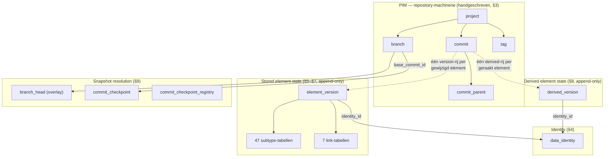

# Het SysML2.NET PostgreSQL-schema — een architectuurgids

> **Voor wie is dit?** Je kent SQL, maar je wilt snappen *waarom* dit schema eruitziet zoals
> het eruitziet — elke tabel, elke index, elke functie, en vooral de redenering erachter.
> Dit document is de uitgebreide tegenhanger van `SysML2.NET.CodeGenerator/SQLSCHEMA.md` (de
> compacte referentie). Waar SQLSCHEMA.md beslissingen simpelweg *opsomt*, legt deze gids uit
> hoe we erop zijn uitgekomen.
>
> **Over de terminologie:** conceptuele termen (derived properties, stored state, fold,
> checkpoint, overlay, impact radius, …) laten we in het Engels staan — het is nu eenmaal het
> vocabulaire van de specificatie, de code en de schemabestanden. Alleen de lopende tekst is
> Nederlands.
>
> **De bestanden waar deze gids over gaat:**
>
> | Bestand | Rol |
> |---|---|
> | `SysML2.NET.CodeGenerator/Sql/schema.golden.sql` | Handgeschreven, geannoteerd referentieontwerp |
> | `SysML2.NET.CodeGenerator/Sql/schema2.generated.sql` | Echte generator-output (ingecheckt ter review) |
> | `SysML2.NET.CodeGenerator/Sql/schema.smoke.sql` | Functionele test met 30 assertions |
> | `SysML2.NET.CodeGenerator/Templates/Uml/core-sql-schema-2.hbs` | De Handlebars-template die het schema genereert |
>
> Sectienummers zoals **§5** verwijzen naar de genummerde banners in de schemabestanden zelf.

---

## Inhoudsopgave

1. [Het probleem dat wordt opgelost](#1-het-probleem-dat-wordt-opgelost)
2. [De twee werelden: element data en PIM-data](#2-de-twee-werelden-element-data-en-pim-data)
3. [De census: waarom 77% van het metamodel geen stored data is](#3-de-census-waarom-77-van-het-metamodel-geen-stored-data-is)
4. [De twee axioma's waar alles uit volgt](#4-de-twee-axiomas-waar-alles-uit-volgt)
5. [Verworpen alternatieven, en waarom](#5-verworpen-alternatieven-en-waarom)
6. [Laag A — het PIM: projects, commits, branches, tags (§3)](#6-laag-a--het-pim-projects-commits-branches-tags-3)
7. [Identity: `data_identity` en de filosofie achter referential integrity (§4)](#7-identity-data_identity-en-de-filosofie-achter-referential-integrity-4)
8. [Laag B — stored element state (§5, §6, §7)](#8-laag-b--stored-element-state-5-6-7)
9. [Laag C — derived element state (§8)](#9-laag-c--derived-element-state-8)
10. [Laag D — snapshot resolution (§9)](#10-laag-d--snapshot-resolution-9)
11. [Het read path (§10)](#11-het-read-path-10)
12. [De metamodel-catalogi en de Query service (§2, §11)](#12-de-metamodel-catalogi-en-de-query-service-2-11)
13. [Partitionering en fysieke tuning (§12)](#13-partitionering-en-fysieke-tuning-12)
14. [De performance-audit: praktijkverhalen met cijfers](#14-de-performance-audit-praktijkverhalen-met-cijfers)
15. [Wat de service-laag het schema nog verschuldigd is](#15-wat-de-service-laag-het-schema-nog-verschuldigd-is)
16. [Uitgewerkte voorbeelden — data volgen door het schema](#16-uitgewerkte-voorbeelden--data-volgen-door-het-schema)
17. [Codegeneratie: wat uit het UML-model wordt gegenereerd en hoe](#17-codegeneratie-wat-uit-het-uml-model-wordt-gegenereerd-en-hoe)
18. [Multi-user en concurrency](#18-multi-user-en-concurrency)
19. [Begrippenlijst](#19-begrippenlijst)

---

## 1. Het probleem dat wordt opgelost

Dit schema is de persistence-laag voor een **SysML v2-modelrepository** die de OMG-specificatie
*Systems Modeling API and Services*, versie 1.0, implementeert. In die ene zin zitten drie
harde eisen verstopt, en elk daarvan drukt een zwaarder stempel op het schema dan welke gewone
CRUD-overweging ook:

**Eis 1 — er worden *modellen* opgeslagen, geen records.** Een SysML v2-model is een graaf van
getypeerde elementen (`PartUsage`, `Membership`, `Specialization`, …) uit een metamodel met
175 metaclasses. Die elementen verwijzen kriskras naar elkaar: ownership-bomen,
type-hiërarchieën, namespace-imports. Een "rij" is hier dus één element uit een
systems-engineering-model — en zo'n model kan er een miljoen bevatten.

**Eis 2 — het is een *versiebeheersysteem*.** De OMG-API is met opzet op Git geënt: projects
bevatten commits, commits vormen een directed acyclic graph (een merge heeft meerdere
parents), branches zijn verschuifbare pointers in die graaf en tags zijn bevroren pointers.
Elke leesactie via de API gebeurt *op* een commit: `GET /projects/{p}/commits/{c}/elements/{e}`.
En commits zijn volgens de specificatie immutable en onverwijderbaar. Daarmee valt de
klassieke aanpak — "tabellen met de actuele stand plus een audit log" — meteen af: historie is
hier geen bijzaak voor de audit, historie *is* het datamodel.

**Eis 3 — antwoorden moeten *derived properties* bevatten.** Dit is de eis die vrijwel
iedereen onderschat, en tegelijk de grootste drijfveer achter dit ontwerp. Het SysML
v2-metamodel definieert het merendeel van zijn properties als **derived**: berekend uit
andere elementen, via traversal-regels in OCL. De `qualifiedName` van een element? Die volgt
uit het aflopen van de ownership chain tot aan de root namespace. De `feature`-set van een
type? Die ontstaat door memberships over de complete specialization-hiërarchie samen te
vouwen. De OMG-API (Clause 2, "Derived Property Conformance") laat een server kiezen uit drie
niveaus:

- *geen conformance* — derived properties worden nooit teruggegeven;
- *passthrough* — de server slaat op wat de client aan derived values aanlevert en geeft dat
  terug, zonder zelf ooit iets te berekenen;
- **full conformance** — elk antwoord bevat correct berekende, actuele derived values, en je
  kunt op derived properties filteren in query's.

Dit schema mikt op **full conformance met precompute op het commit-moment**: derived values
worden één keer berekend — op het moment dat een commit wordt weggeschreven — en een leesactie
hoeft daarna alleen nog bytes terug te geven. Waarom die keuze (en niet compute-on-read), en
wat ze kost, lees je in sectie 9.

Tot slot het schaalprofiel waarvoor dit schema is ontworpen (afgestemd met de
projecteigenaar):

- **~1 miljoen elementen** per project,
- **100–500 tegelijk levende branches** per project, die routinematig worden aangemaakt en
  weer weggegooid,
- **tienduizenden commits** per project (jaren van dagelijks werken),
- **tientallen tot honderden projects** op één PostgreSQL-instantie,
- leesverkeer dat wordt gedomineerd door *branch-head*-reads en queryfilters, met af en toe
  een historische read.

Houd die aantallen in je achterhoofd. Er zijn genoeg ontwerpen die bij 100k elementen en 5
branches prima werken, maar bij dit profiel omvallen — sectie 14 laat de metingen zien.

---

## 2. De twee werelden: element data en PIM-data

De OMG-specificatie knipt haar datamodel in twee niveaus, en het schema volgt die knip.

**Het PIM (Platform-Independent Model)** is de *machinerie van de repository*: `Project`,
`Commit`, `Branch`, `Tag`, `DataVersion`, `DataIdentity`, `Query`. Deze typen staan in Clause
7 van de API-specificatie — niet in het SysML-metamodel. Het zijn er zestien, ze zijn stabiel
(ze veranderen alleen als OMG de API herziet, dus vrijwel nooit) en hun semantiek luistert
nauw: commit-DAG's, merge-invarianten. In het schema zijn ze daarom **handgeschreven** (§3).
Zestien stabiele tabellen door een generator laten maken zou machinerie toevoegen zonder iets
op te leveren — en juist de subtiele stukken (de monotonie-trigger, de verwijderprocedure)
verdienen commentaar van een mens.

**Element data** is de eigenlijke modelinhoud: de 175 metaclasses van KerML + SysML v2. Dat
deel wordt **gegenereerd**, uit dezelfde UML-XMI-bestanden (`Resources/KerML_only_xmi.uml`,
`Resources/SysML_only_xmi.uml`) waar ook de rest van SysML2.NET uit wordt gegenereerd: de
DTO's, de POCO's, de JSON-serializers, noem maar op. Herziet OMG de taal (en dat gebeurt met
enige regelmaat), dan draai je de generator opnieuw en heb je een schema dat exact bij het
nieuwe metamodel past — zonder 167 tabeldefinities met de hand bij te werken. Hoe die
pijplijn werkt staat in sectie 17.

De grens tussen de twee werelden is één begrip: de **DataVersion**. In de specificatie is een
`DataVersion` de verpakking van een element-payload in de context van een commit — "element X
had déze inhoud op commit C". In het schema is dat begrip terug te vinden als de
`element_version`-rij. De PIM-tabellen administreren *welke* versions er bestaan; de
elementtabellen leggen vast *wat* elke version inhield.



---

## 3. De census: waarom 77% van het metamodel geen stored data is

Voordat er ook maar één tabel op papier stond, is eerst het metamodel doorgeteld. Achteraf
was dat de belangrijkste stap van allemaal: de cijfers maken korte metten met de intuïtie
waarmee je anders aan het ontwerpen zou slaan.

Het metamodel, zoals het in de gegenereerde code van deze repository is uitgewerkt, bevat:

| Meting | Aantal |
|---|---|
| Metaclasses | 175 (167 concreet, 8 abstract) |
| Flattened properties over alle concrete classes (eigen + geërfd) | 12.963 |
| …waarvan **stored** (`{ get; set; }` in de DTO's) | 2.698 |
| …waarvan **derived** (`{ get; internal set; }`) | 9.582 |
| …expliciete-interface-redefinition-aliassen (geen opslag) | 683 |
| Afzonderlijke *declaraties* achter die 2.698 stored properties | **97, verdeeld over 49 metaclasses** |
| Afzonderlijke namen van stored properties | ~80 |
| Breedste stored footprint van één metaclass | **24 kolommen** (`FlowUsage` en verwanten) |
| Multi-valued stored reference properties, afzonderlijk | **6** (`ownedRelationship`, `ownedRelatedElement`, `source`, `target`, `client`, `supplier`) plus 1 multi-valued string (`aliasIds`) |
| Enumeraties | 7, met in totaal 19 literals |

Neem die cijfers even goed in je op, want hier draait alles om:

**Eén: het stored oppervlak is verrassend klein.** Twaalfduizend flattened properties klinkt
als een enorme berg — tot je ziet dat er maar zo'n 2.700 van worden opgeslagen, en dat die
terug te voeren zijn op slechts 97 declaraties. De vermenigvuldiging zit hem in de
overerving: `Element` declareert 7 stored properties en alle 167 concrete classes erven die —
goed voor 1.169 van de 2.698 in één klap. De stored kern van het metamodel is dus werkelijk
bescheiden: wat booleans, wat namen, hier en daar een enum, en een handjevol single-valued
references op de relationship-metaclasses.

**Twee: het derived oppervlak is gigantisch, en het is géén franje.** 9.582 flattened derived
properties, zo'n 325 verschillende namen. En dat zijn geen extraatjes — het is het primaire
vocabulaire van de API. `owner`, `qualifiedName`, `ownedElement`, `feature`, `membership`,
`documentation`: allemaal derived, en onder full conformance worden ze allemaal in elke
API-payload verwacht. Het venijnige: juist de belangrijke zijn **recursief**:

- `qualifiedName` loopt de ownership chain af tot aan de root, en kijkt onderweg ook nog naar
  de namen van broertjes en zusjes;
- `Type::feature` en `inheritedMembership` folden over de *complete specialization closure*
  van een type (een breadth-first search over `Specialization`-edges);
- `Namespace::importedMembership` wandelt recursief over imports, en `Import::isRecursive`
  maakt die wandeling onbegrensd;
- `isLibraryElement` klimt via de ownership omhoog om te kijken of er een library-root boven
  hangt.

Geen van deze is in één SQL-`SELECT` uit te rekenen. Je hebt er recursieve CTE's of
gematerialiseerde closures voor nodig — of je rekent ze vooraf uit. Dat laatste is de weg die
hier is gekozen.

**Drie: de typeconflicten in de opslag zijn echt, en ze dwingen structuur af.** Het metamodel
hergebruikt property-namen met *verschillende typen*: `LiteralBoolean::value` is een Boolean,
`LiteralInteger::value` een Integer, `LiteralRational::value` een Real en
`LiteralString::value` een String — vier onverenigbare SQL-typen achter één naam. Hetzelfde
geldt voor `kind`: op `RequirementConstraintMembership`, `StateSubactionMembership`,
`TransitionFeatureMembership` en `TriggerInvocationExpression` is het telkens een *andere*
enum. Elk ontwerp met één gedeelde `value`-kolom is daarmee bij voorbaat kansloos. Dit ene
feit veegt "één brede tabel" van tafel (sectie 5).

**Vier: de overerving is een DAG, geen boom.** 34 metaclasses hebben meer dan één directe
supertype (tot drie aan toe: `FlowUsage` is tegelijk een `ConnectorAsUsage`, een `Flow` én een
`ActionUsage`, en daarmee zowel *Feature* als *Relationship*). Elk ontwerp dat leunt op een
lineaire "join omhoog langs de parent chain" valt dus ook af. De diepste keten telt 11
niveaus.

Alles in de secties 5 tot en met 9 vloeit rechtstreeks uit deze vier feiten voort.

### Twee valkuilen die tijdens de census boven water kwamen

De census legde ook twee eigenaardigheden van de UML-bron bloot waar een argeloze generator
over struikelt. Ze staan hier zwart op wit, omdat ze anders gegarandeerd ooit iemand bijten
die aan de generator werkt:

**Valkuil 1 — association-owned ends.** In UML kan een reference property die bij een
association hoort eigendom zijn van de *association* zelf, niet van de class. En laat dat nu
net gelden voor de dragende reference properties van het hele metamodel:
`Membership::memberElement`, `Specialization::general`, `FeatureTyping::type` — geen van alle
te vinden in `IClass.OwnedAttribute`. Een generator die op `OwnedAttribute` leunt, levert dus
zonder één foutmelding een `membership_version`-tabel af *zonder member-element-kolom*. Dit is
tijdens de ontwikkeling echt gebeurd: 22 van de 47 subtype-tabellen kwamen er in eerste
instantie verkeerd uit. De juiste definitie van "declared door class C" luidt: *de flattened
properties van C, minus alles wat de directe generalizations van C al hebben*. Zie
`SysML2.NET.CodeGenerator/Extensions/SqlSchemaExtensions.cs`, `QueryStoredOwnProperties`.

**Valkuil 2 — twee smaken redefinition.** UML-property-redefinition dekt twee wezenlijk
verschillende situaties. Een *same-name redefinition* (`CollectExpression::operator`
herdefinieert `OperatorExpression::operator`) is niet meer dan een aangescherpte constraint:
zelfde opslagslot, en de DTO's geven er geen eigen veld voor. Daar zijn er precies negen van.
Een *new-name redefinition* (`Membership::memberElement` herdefinieert `Relationship::target`)
is daarentegen een **nieuwe API-property met eigen opslag** — de DTO's bewaren zowel
`memberElement` als de geërfde `target`-lijst, en API-payloads bevatten ze allebei. De
opslagregel die aansluit bij de rest van SysML2.NET is dus: alleen same-name redefinitions
zijn opslagvrij en lossen transitief op naar de kolom van de root property. (Precies dezelfde
onderscheiding die `SysML2.NET.CodeGenerator/HandleBarHelpers/PropertyHelper.cs` voor de
DTO-generator hanteert.)

---

## 4. De twee axioma's waar alles uit volgt

Onthoud je verder niets van dit document, onthoud dan deze twee uitspraken. Elke structurele
keuze in het schema is op één van beide terug te voeren.

### Axioma 1 — References wijzen naar identities, nooit naar versions

Het `@id` van een SysML-element blijft zijn hele leven hetzelfde. Als een `FeatureTyping`
zegt "deze feature is getypeerd door element `4ace3d89-…`", dan bedoelt hij: *dat element,
wat het ook is op de commit waar jij toevallig naar kijkt* — en dus niet "versie 17 van dat
element". Die onafhankelijkheid van versies is precies de bedoeling: je kunt het doelelement
jarenlang hernoemen, hertyperen en verbouwen, en de reference blijft gewoon kloppen.

Voor het schema betekent dat: **elke kolom die van element naar element verwijst is een
foreign key naar `data_identity(id)` — nooit naar `element_version`.** Nergens in het schema
bestaat een FK van de ene element version naar de andere.

Dit bepaalt meteen wat referential integrity hier wél en níét kan betekenen. De FK garandeert
dat de doel-*identity in de database bestaat*. Wat hij niet kan garanderen: dat het doel ook
*bestaat op de commit die je leest*. Een element mag best verwijzen naar iets dat op deze
branch is verwijderd — dat is dan een dangling reference *in het model*, iets wat de service
als validatieprobleem rapporteert, geen schending van database-integriteit. Zou je de
database per-commit-geldigheid van references willen laten afdwingen, dan heb je FK's nodig
naar een virtuele, berekende verzameling — dat kan niet, en het zou ook onjuist zijn: de
specificatie staat uitdrukkelijk toe dat een model tussen commits in een tussentoestand
verkeert.

### Axioma 2 — Een derived value is een functie van (identity, commit), niet van (version)

Deze is subtieler, en de gevolgen reiken verder. Kijk even mee:

```
Package "Old"            <- element P, version p1
  └── PartUsage "wheel"  <- element W, version w1, qualifiedName = "Old::wheel"
```

Nu committen we een hernoeming van het package naar `"New"`. In de change set van die commit
zit **één** element: P (nieuwe version p2). Aan W is niets gebeurd — geen nieuwe version,
`w1` blijft op elke branch de actuele stored state. En tóch is W's `qualifiedName` nu ineens
`"New::wheel"`.

Met andere woorden: de derived state van W is veranderd *zonder dat W zelf veranderde*. Een
derived value is dus geen eigenschap van een version — dezelfde version `w1` heeft op commit 1
`qualifiedName = "Old::wheel"` en op commit 2 `"New::wheel"`. Het is een eigenschap van het
paar **(identity, snapshot)**. De OMG-specificatie zegt het met zoveel woorden (Clause 2):
*"the values of derived properties of a given Element may be affected by commits that do not
directly change that Element."*

Voor het schema betekent dit dat derived state **onmogelijk op `element_version` kan wonen**.
Zou dat wel zo zijn, dan dwingt die ene hernoeming je om voor W — en voor élke andere
afstammeling — een nieuwe `element_version`-rij te schrijven waarvan de *stored* helft
byte-voor-byte gelijk is aan de oude. Je zou elementen versioneren die helemaal niet zijn
veranderd, het begrip "change set" uithollen, en de opslag van stored state laten exploderen
met de impact radius van elke hernoeming.

Daarom heeft het schema **twee parallelle append-only streams**:

- `element_version` — gesleuteld op version; één rij per *(element, commit-die-het-wijzigde)*;
  immutable; het system of record voor stored state.
- `derived_version` — gesleuteld op *(identity, commit)*; één rij per *(element,
  commit-die-zijn-derived-state-wijzigde)*; immutable; het read model voor derived state.

Bij die hernoemingscommit wordt er dus geschreven: **één** nieuwe `element_version`-rij (voor
P) en **N + 1** nieuwe `derived_version`-rijen (voor P plus elk element dat door de
hernoeming werd geraakt — de "impact radius"). De stored state van W blijft onaangeroerd; de
derived state van W krijgt een nieuwe rij.

De smoke-test met zijn 30 assertions (`SysML2.NET.CodeGenerator/Sql/schema.smoke.sql`) heeft
precies dit scenario als eerste en belangrijkste assertion-paar (PASS 2a/2b): na de
hernoeming levert W's `qualifiedName` netjes `"New::wheel"` op, *terwijl W nog steeds naar
zijn oorspronkelijke version-rij verwijst*. Wie dit schema ooit gaat verbouwen: zorg dat die
test groen blijft. Hij is de dragende muur van het ontwerp.

---

## 5. Verworpen alternatieven, en waarom

Er zijn vier voor de hand liggende architecturen overwogen en afgevallen. Als je snapt
waaróm ze afvallen, snap je meteen waarom het uiteindelijke ontwerp eruitziet zoals het
eruitziet.

### 5.1 Eén brede tabel ("God table")

*Eén `element`-tabel met een kolom voor elke stored property van alle metaclasses bij
elkaar.*

Met maar ~80 verschillende stored namen klinkt dat best redelijk — 80 kolommen is niet
absurd. Maar het strandt op de typeconflicten uit de census: `value` zou tegelijk `boolean`,
`integer`, `double precision` én `text` moeten zijn, en `kind` vier verschillende enum-typen.
Dan resten er twee uitwegen, allebei lelijk. Óf je maakt getypeerde kolomfamilies
(`value_bool`, `value_int`, …, `kind_req`, `kind_state`, …) — waarmee je feitelijk
subtype-tabellen ín één tabel hebt nagebouwd, maar dan slechter: vrijwel elke cel NULL en
elke CHECK-constraint afhankelijk van `class_kind`. Óf je maakt alles `text` en strooit met
casts — en dan geef je de typeveiligheid op in precies de laag die haar hoort te leveren.

### 5.2 Tabel-per-metaclass (volledig TPT, de "COMET-vorm")

*Eén tabel per concrete metaclass (167), plus één link-tabel per multi-valued property
(~230); bij het lezen join je de overervingsketen weer aan elkaar.*

Dit is de vorm van het oude `core-sql-schema.hbs`-skelet dat dit project heeft geërfd — een
port van de CDP4-COMET-server, waar deze aanpak voor een ander metamodel prima werkt. Hier
loopt hij om drie redenen spaak:

1. **De overervings-DAG breekt de join-keten.** TPT bouwt een instantie op door de
   parent-tabellen langs de keten te joinen. Maar met 34 meervoudig ervende metaclasses ís er
   geen keten — een `FlowUsage`-read zou langs *twee* takken van een overervingsruit moeten
   joinen. Het kan, maar dan moet elke querygenerator de DAG begrijpen.
2. **De machinerie staat niet in verhouding tot de inhoud.** 167 + ~230 tabellen om welgeteld
   97 property-declaraties te herbergen. Het overgrote deel van die tabellen zou niets anders
   bevatten dan een `iid`-kolom — de meeste metaclasses declareren immers geen eigen stored
   properties; ze bestaan om hun derived semantiek. En de diepste reads worden joins over elf
   tabellen.
3. **De COMET-vorm gaat uit van één versie per element.** Zijn FK's wijzen naar elementrijen
   en zijn `revisionNumber` is een oplopende integer — allebei onverenigbaar met een
   commit-DAG en version-onafhankelijke references (axioma's 1 en 2). Geen verwijt richting
   COMET, overigens: dat domein hééft lineaire revisies en verwijs-naar-actueel-semantiek.
   Dit domein niet.

### 5.3 Zuivere generieke EAV

*Twee tabellen: `element_version(…, value_data jsonb)` en
`element_reference(version_id, property_id, ordinal, target_identity)`.*

Het snelst te genereren, en die ene reference-tabel is oprecht aantrekkelijk voor
graaftraversal: één index beantwoordt elke "wie verwijst er naar X?"-vraag. Toch afgevallen,
omdat EAV het typesysteem platslaat tot data. Geen FK-semantiek per property, geen NOT
NULL- of enum-afdwinging per property, geen kolomstatistieken voor de planner (elke
property-lookup krijgt dezelfde generieke selectiviteit), en garanties als "`isParallel` is
een boolean" worden een kwestie van discipline in de applicatie. Het gekozen ontwerp houdt
wél een *smal* EAV-achtig randje waar dat verdedigbaar is (de 7 link-tabellen, de property
catalog), maar geeft de getypeerde kolommen voor de scalaire kern niet op.

### 5.4 Document store (alleen jsonb)

*Sla elke element version op als één jsonb-document en indexeer met GIN.*

Voor het lezen is dit werkelijk prachtig — sterker nog, het gekozen ontwerp *bevat* deze
aanpak als zijn read path (`stored_json`/`derived_json`). Als *system of record* valt hij
echter af: referential integrity, getypeerde constraints, omgekeerde reference-indexen en
statistieken per kolom verdampen allemaal, en elke integriteitsgarantie van het model
verhuist naar applicatiecode. De les die hieruit is getrokken: **normaliseer om te schrijven
en te bewaken, denormaliseer om te lezen** — en houd allebei bij, in dezelfde rijen, binnen
dezelfde transactie.

### 5.5 Wat het is geworden

**Een element-kern + sparse subtype-tabellen + getypeerde link-tabellen + een tweede stream
voor derived state:**

- één `element_version`-kerntabel met de identity/commit-administratie plus de 7 eigen stored
  properties van `Element` (elk element heeft ze, dus apart zetten zou alleen een join voor
  niets opleveren);
- **47 subtype-tabellen**, één per metaclass die zelf stored scalaire properties *declareert*,
  gesleuteld op `(project_id, version_id)`. Een instantie heeft rijen in precies de
  subtype-tabellen van haar storage-declarerende voorouders — een *verzameling* tabellen, geen
  keten: zo wordt de DAG opgelost via lidmaatschap in plaats van joins;
- **7 link-tabellen** voor de 6 multi-valued reference properties plus `aliasIds`, allemaal
  geordend (`ordinal` zit in de PK — elk van deze properties is `isOrdered` in het metamodel);
- `derived_version` als tweede stream (axioma 2);
- `stored_json` op de version-rij en `derived_json` op de derived-rij als bewuste,
  transactioneel consistente lees-denormalisatie.

Dat het er 47 zijn is overigens geen ontwerpkeuze — het rolt uit de census: 49
storage-declarerende metaclasses, min `Element` (opgenomen in de kerntabel), min `Dependency`
(waarvan de enige stored properties de twee multi-valued zijn, en die worden link-tabellen).

---

## 6. Laag A — het PIM: projects, commits, branches, tags (§3)

### 6.1 De commit-DAG

Eerst de term zelf. **DAG** staat voor *Directed Acyclic Graph*: een gerichte graaf zonder
cycli. Het is de vorm die een commit-historie vanzelf aanneemt zodra je branches en merges
toelaat. Zonder branches zou de historie een simpele **keten** zijn — elke commit precies één
parent:

```
c1 ← c2 ← c3 ← c4        (keten: lineaire historie)
```

Branches laten de historie *splitsen* (twee commits met dezelfde parent), en merges laten
haar weer *samenkomen* (één commit met **twee of meer parents**):

```
        c2 ← c3          (branch "main")
      ↙         ↖
c1                 c5    (merge: c5 heeft TWEE parents, c3 en c4)
      ↖         ↙
        c4               (feature-branch)
```

*Directed*: elke pijl wijst van kind naar parent ("c5 is voortgekomen uit c3 en c4").
*Acyclic*: wie de parent-pijlen volgt, komt nooit terug waar hij begon — een commit kan niet
zijn eigen voorouder zijn, want de parent bestond al toen het kind werd gemaakt. De vraag
"hoe zag het model eruit op c5?" beantwoord je door deze graaf vanaf c5 *terug* te bewandelen
(de recursieve `ancestry`-CTE van §9) en per element de nieuwste onderweg gevonden version te
nemen. Dat is precies hoe Git het doet — en de OMG-spec heeft dat model bewust overgenomen.

```sql
CREATE TABLE sysml2.commit (
    id               uuid        NOT NULL,
    project_id       uuid        NOT NULL REFERENCES sysml2.project (id) ON DELETE CASCADE,
    created          timestamptz NOT NULL DEFAULT now(),
    description      text        NULL,
    model_version_id smallint    NOT NULL REFERENCES sysml2.model_version (id),  -- zie 6.4
    PRIMARY KEY (id)
);

CREATE TABLE sysml2.commit_parent (
    commit_id         uuid     NOT NULL REFERENCES sysml2.commit (id) ON DELETE CASCADE,
    parent_commit_id  uuid     NOT NULL REFERENCES sysml2.commit (id),
    ordinal           smallint NOT NULL,
    PRIMARY KEY (commit_id, parent_commit_id)
);
```

De specificatie zegt onomwonden dat `Commit.previousCommit` een **verzameling** is — een
merge commit heeft twee of meer parents. Vandaar de aparte `commit_parent`-edge-tabel in
plaats van één `previous_commit_id`-kolom. `ordinal` bewaart de volgorde van de parents
("first parent" doet ertoe voor merge-semantiek, net als bij Git). De PK van de commit is de
kale uuid, omdat er van overal naar commits wordt verwezen (branches, versions, checkpoints)
en het project-verband al via `project_id` loopt.

Twee invarianten uit de spec moet je echt paraat hebben, want de *resolvers steunen erop*:

**Immutability.** *"Commits are immutable… Commits are not destructible"* (Clause 7.1.2). Het
schema neemt dat letterlijk: geen enkele bewerking doet ooit een UPDATE op een commit of een
`element_version`-rij. Append-only is hier geen optimalisatie, het is gewoon de semantiek van
de specificatie.

**Monotonie.** *"Version histories must monotonically increase in time: for Commit C, the
value of C.created must be strictly newer than the value of D.created for any commit D in
C.previousCommit."* Het schema *dwingt* dit af, met een trigger:

```sql
CREATE TRIGGER trg_commit_parent_monotonic
    AFTER INSERT ON sysml2.commit_parent
    FOR EACH ROW
    EXECUTE FUNCTION sysml2.assert_commit_monotonic();
```

Waarom afdwingen, en niet gewoon vertrouwen op de service? Omdat de snapshot resolver
(sectie 10) per element de version van de **nieuwste ancestor-commit** kiest — nieuwste
volgens `created`. Glipt er ooit een commit tussendoor met een timestamp ouder dan zijn
parent, dan geeft de resolver zonder ook maar één foutmelding het *verkeerde* snapshot terug.
Bugklassen die stilletjes verkeerde antwoorden geven, verdienen een trigger; bugklassen die
lawaai maken mag je aan de service overlaten. (Smoke-assertion PASS 6 bewijst dat de trigger
echt afgaat.)

En let op wat monotonie *niet* regelt: de volgorde tussen **siblings**. Twee commits op
parallelle branches mogen gerust dezelfde timestamp hebben. Hoe daarmee wordt omgegaan lees
je in sectie 10.4.

**De vier merge-invarianten op een rij.** Een *invariant* is een regel die onder alle
omstandigheden waar moet zijn — en deze vier (Clause 7.1.2) zijn geen formaliteiten: de
correctheid van de snapshot resolver hangt er rechtstreeks van af. Hier alle vier bij elkaar,
met de plek waar elk wordt geregeld:

1. **Monotonie** — een commit is strikt nieuwer dan elk van zijn parents, langs elk pad. Dít
   maakt "nieuwste ancestor wint" tot een deugdelijke resolutieregel. In het schema
   afgedwongen door `trg_commit_parent_monotonic` (smoke PASS 6), omdat een schending
   geruisloos verkeerde snapshots zou opleveren in plaats van fouten.
2. **Conflict-restatement** — een merge moet de oplossing van elk conflict in zijn EIGEN
   change set herhalen. In combinatie met invariant 1 is de merge de nieuwste commit in zijn
   eigen ancestry, dus zijn herformulering wint vanzelf van beide parents (smoke PASS 8a).
   Maar monotonie ordent de *siblings* onderling niet — en dus valt een merge die de
   restatement ten onrechte overslaat terug op de deterministische `id DESC`-tiebreaker
   (§10.4, audit R13, smoke PASS 10a/10b). Het herformuleren zelf is een plicht van de
   service-laag (§15, punt 7).
3. **Een deletie moet iets te verwijderen hebben** — een tombstone (`DataVersion` met null
   payload) is alleen geldig als minstens één parent dat element nog levend in zijn snapshot
   had. Validatie in de service-laag; het schema slaat de tombstone hoe dan ook op.
4. **Eén version per element per commit** — `DataVersion.identity` is uniek binnen
   `Commit.change`. Afgedwongen door `ux_element_version_identity_commit` (§8.1).

Aan deze vier spec-invarianten voegt dit schema er zelf een vijfde toe, voor multi-version
support (sectie 6.4): **release-compatibiliteit** — een commit zit nooit in een oudere
metamodel-release dan een parent, en een merge eist dat alle parents in de release van de
merge zelf zitten. Afgedwongen door `trg_commit_parent_version` (smoke PASS 11c–11e).

In één zin: de commit-DAG is de *vorm* van de historie (splitsen en weer samenvloeien), en de
merge-invarianten zijn de *spelregels* die garanderen dat het teruglezen van die historie —
de fold van §9 — precies één welbepaald, deterministisch antwoord heeft.

### 6.2 Hoe delta's snapshots worden — het algoritme van de spec zelf

De specificatie definieert `Commit.change` (de delta: de DataVersions die deze commit
schreef) als stored, en `Commit.versionedData` (het volledige model-snapshot op deze commit)
als **derived** — met een OCL-algoritme dat de moeite van het lezen waard is, want de
resolver in het schema is er de rechtstreekse vertaling van:

```
let updatedNotDeleted = change->select(payload <> null) in
let updatedIdentities = change.identity in
let retainedWithDuplicates =
    previousCommits.versionedData->select(oldData |
        updatedIdentities->excludes(oldData.identity)) in
let retained = <kies er één per identity uit retainedWithDuplicates> in
versionedData = updatedNotDeleted->union(retained)
```

In gewone taal: het snapshot van een commit bestaat uit *zijn eigen wijzigingen, aangevuld
met alles uit de snapshots van zijn parents dat hij niet zelf heeft overschreven*. De
recursie over `previousCommit` eindigt bij de root. Een deletie is een DataVersion met een
lege `payload` — in het schema terug te zien als `tombstone = true` op de version-rij.

Het algoritme is correct, maar per leesactie uitvoeren is op schaal volstrekt kansloos: het
is een fold over de complete commit-historie. Heel §9 (sectie 10 van deze gids) bestaat om
dat betaalbaar te maken.

### 6.3 Branches en tags

```sql
CREATE TABLE sysml2.branch (
    id              uuid        NOT NULL,
    project_id      uuid        NOT NULL REFERENCES sysml2.project (id) ON DELETE CASCADE,
    name            text        NULL,
    description     text        NULL,
    head_commit_id  uuid        NOT NULL REFERENCES sysml2.commit (id),
    base_commit_id  uuid        NULL REFERENCES sysml2.commit (id),   -- zie sectie 10.2
    created         timestamptz NOT NULL DEFAULT now(),
    deleted         timestamptz NULL,
    PRIMARY KEY (id),
    UNIQUE (project_id, name)
);
```

De mutability-tabel van de spec is helder: branches zijn muteerbaar en verwijderbaar — het
*enige* muteerbare in de hele versioneringskern, want `head_commit_id` schuift bij elke
commit op. Tags zijn immutable maar verwijderbaar; commits geen van beide. `deleted` is een
nullable timestamp en geen harde delete, omdat de spec het verwijderen van een
CommitReference als een vastgelegde gebeurtenis behandelt.

`base_commit_id` is puur een performancestructuur en komt niet uit de spec — hij verankert de
branch-head-*overlay*; sectie 10.2 legt hem volledig uit.

Verder in deze laag: `tag` (zelfde vorm als branch, maar bevroren), `project_usage`
(cross-project-imports: "project A gebruikt project B op commit C", waarbij de
spec-constraint `usedProject = usedProjectCommit.owningProject` bij de service ligt), en
`project` zelf. De `default_branch_id`-FK van project wordt pas ná de branch-tabel toegevoegd
en is `DEFERRABLE INITIALLY DEFERRED`: project en default branch ontstaan in één transactie,
en de circulaire FK (project → branch → project) kan pas op het commit-moment kloppen.

### 6.4 Model-version stamping — meerdere metamodel-releases in één database

Het OMG-metamodel heeft zelf releases (nu Beta 4; latere releases voegen metaclasses toe,
laten ze vervallen en veranderen hun vorm). Dit schema ondersteunt **meerdere releases naast
elkaar in één database**, en het ontwerp volgt uit één observatie: in een append-only store
zitten historische commits onveranderlijk in de release waarin ze zijn geschreven. Welk label
een project of branch ook draagt — wie een oude commit leest, moet de release van *die
commit* kennen om zijn payloads te begrijpen. De stempel per commit is daarom de enige
correcte korrel; al het andere is ervan afgeleid:

- **`model_version`** (§2) registreert elke release waarvoor deze database ooit data heeft
  opgeslagen. Het id is een *ordinal* — hoger is later — dat éénmalig wordt uitgedeeld door
  het ingecheckte register
  (`SysML2.NET.CodeGenerator/Generators/UmlHandleBarsGenerators/ClassKindRegistry.cs`) en
  nooit hernummerd wordt.
- **`commit.model_version_id NOT NULL`** is de waarheid: de release waarin de payloads van
  deze commit zijn geschreven. Een *branch* "is" simpelweg de release van zijn head-commit;
  er staat geen muteerbaar versieveld op `branch` dat met de historie kan gaan liegen.
- **`project.target_model_version_id`** is beleid, geen waarheid: de hoogste release waarin
  nieuwe commits geschreven mogen worden (NULL = onbeperkt). Een beheerder verhoogt hem om
  branches *toe te staan* te upgraden; de stempel legt vast wat elke branch werkelijk deed.

**Upgraden is een commit, geen migratie.** Een branch gaat naar een nieuwere release via een
**conversion commit**: een commit met één parent die de stempel ophoogt en elk element
herformuleert waarvan de vorm tussen de twee releases veranderde (de versie-diff is een
variant van de impact radius — de machinerie van
`SysML2.NET.CodeGenerator/IMPACT-RADIUS.md` is herbruikbaar). De service moet op elke
conversion commit een `commit_checkpoint` afdwingen, zodat folds vrijwel nooit een
releasegrens over hoeven. Elementen waarvan de vorm niet veranderde worden *niet*
geherformuleerd — hun oude rijen blijven onder de nieuwe release gewoon geldig, en precies
daardoor is conversie O(veranderde vormen) in plaats van O(model).

**Het fysieke schema is de superset over alle geregistreerde releases.** Nieuwe metaclasses
worden nieuwe subtype-tabellen; nieuwe properties worden nullable kolommen; een hernoemde of
verplaatste property wordt een *nieuwe* kolom naast de oude (de conversion commit verhuist de
data; de oude kolom blijft oude commits bedienen). Er wordt nooit iets verwijderd. Welke
tabellen en properties in welke release geldig zijn, staat NIET in databasetabellen — dat
reist mee als statische, per-release gegenereerde C# (de model-version *descriptors*,
sectie 12.2).

Drie invarianten houden een historie met gemengde releases gezond, afgedwongen door
`trg_commit_parent_version` (smoke PASS 11b–11e): geen commit zit in een oudere release dan
een parent (downgrades worden niet ondersteund — conversie is achterstevoren lossy); een
commit met één parent mag de release ophogen (dat IS de conversion commit); en een merge eist
**alle parents in de release van de merge zelf** — eerst converteren, dan mergen, nooit
allebei in één commit. Zonder die laatste regel zou een merge geruisloos payload-vormen
mengen.

---

## 7. Identity: `data_identity` en de filosofie achter referential integrity (§4)

```sql
CREATE TABLE sysml2.data_identity (
    id         uuid     NOT NULL,
    project_id uuid     NOT NULL REFERENCES sysml2.project (id),
    class_kind smallint NOT NULL REFERENCES sysml2.class_kind (id),   -- GETYPEERDE identity
    PRIMARY KEY (id),
    UNIQUE (id, class_kind)
);
```

Drie kolommen, meer niet — en toch is dit minitabelletje het anker van axioma 1. Elke
elementreference in het hele schema wijst hiernaartoe: de ~30 single-reference-kolommen op de
subtype-tabellen, de 5 reference-link-tabellen, `element_version.owning_relationship`,
`branch_head.identity_id`, allemaal een foreign key naar `data_identity(id)`.

**De identity is GETYPEERD.** De metaclass van een element verandert nooit over zijn versies
heen — een identity wordt geboren als PartUsage en blijft dat — dus anders dan al het andere
aan een element is het type een eigenschap van de *identity*, en daarmee FK-baar. Twee
afnemers:

- `element_version` draagt een composite FK `(identity_id, class_kind)` →
  `data_identity (id, class_kind)`, waardoor een version die een andere metaclass claimt dan
  zijn identity **onmogelijk** is (smoke PASS 12a);
- de gegenereerde functie `validate_references_at_commit()` (hieronder) controleert het type
  van elke stored reference tegen deze kolom — óók cross-project-doelen, want identities zijn
  getypeerd ongeacht in welk project ze wonen.

Daar hoort één onderhoudsregel bij: een release-conversie (§6.4) die een element hertypeert —
zijn metaclass is vervallen — moet `data_identity.class_kind` in dezelfde transactie
bijwerken (verplichting §15.16).

**Wat FK's niet kunnen controleren, is nu ON DEMAND controleerbaar — in twee lagen.** FK's
bewijzen dat een reference een *bestaande* identity raakt; ze kunnen nooit bewijzen dat het
doelwit *leeft op de gelezen commit* (liveness is een functie van (identity, commit) — er is
geen rij om tegen te FK'en), noch dat zijn metaclass legaal is voor de verwijzende property
(een FK matcht waarden, geen typesets). Beide gaten dekken de gegenereerde functies (§14 van
de schemabestanden), één `UNION ALL`-arm per stored referencekolom (42 stuks), die
`'wrong-type'` rapporteren (via de getypeerde identity, ook voor cross-project-doelen) en
`'dangling'` (een same-project-doel dat niet in het snapshot van de commit zit):

- **`validate_references_at_commit`** — de VOLLEDIGE periodieke audit over het complete
  snapshot van één commit. Hij materialiseert het snapshot eerst in een ge-ANALYZE'de,
  geïndexeerde temp table, zodat de planner de echte kardinaliteit kent en bij diepe
  histories kan overschakelen op snapshot-gedreven PK-probes — de pass is begrensd op
  O(snapshot × log historie), nooit O(historie), hoe groot de append-only tabellen ook
  worden. Gemeten: 2,5–4,3 s op een 1M-snapshot (smoke PASS 12b/12c).
- **`validate_references_in_commit`** — de INCREMENTELE laag per commit, O(change set): de
  uitgaande references van de versions die de commit zelf schreef, PLUS de omgekeerde
  richting die zijn tombstones breken — een levend, *ongewijzigd* element dat naar een
  verwijderde identity blijft wijzen, precies het geval dat naïeve changeset-validatie mist
  (gedreven door de reverse-lookup-indexen, liveness per doelwit via
  `resolve_element_at_commit`). Gemeten: 77–86 ms voor een changeset van 101 rijen tegen een
  1M-project — geschikt voor het synchrone commit-validatiepad (smoke PASS 13a–13c).

Bewust *functies*, geen constraints: de spec staat tijdelijk hangende references toe, en de
liveness van cross-project-doelen hangt af van de used-project-commit (`project_usage`) —
dat is service-resolutie. Het werkprotocol (verplichting §15.6): de incrementele laag bij
elke commit, de volledige audit periodiek als vangnet.

Drie keuzes méér zijn hier heel bewust gemaakt:

**De PK is de kale uuid, niet `(project_id, id)`.** Via `ProjectUsage` mag een element in
project A verwijzen naar een element in project B. Met een samengestelde PK zou zo'n
cross-project-reference niet meer als FK kunnen bestaan. Het bewaken van projectgrenzen is
daarom een taak van de service (via `project_usage`), geen FK. De keerzijde: `data_identity`
kan niet, zoals de rest, per project worden gepartitioneerd. De audit (sectie 14, bevinding
R12) heeft nagerekend of dat bij 10⁸ rijen pijn doet — en dat doet het niet: twee
uuid-kolommen geven een heap van ~7 GB met een btree waarvan de bovenste niveaus gewoon in
het geheugen blijven; elke probe kost 3–4 gecachte page reads. Een read-mostly FK-doel schaalt
prima zonder partitionering.

**`element_id` (de KerML-property) is `text`, geen `uuid`.** Let op het verschil: het `@id`
van de *API* is een UUID en hoort bij `data_identity.id`. Maar KerML declareert
`Element::elementId` als `String`, en alleen elementen uit de standaard-*library* moeten
normatief een name-based (v5) UUID hebben — voor gebruikersmodellen geldt helemaal geen
formaateis. Een `uuid`-kolom zou dus data weigeren die volgens de spec gewoon geldig is.
Daarom is `element_version.element_id` van het type `text`, en beheert de API-laag de uuid in
de identity-rij.

**Verwijderen gebeurt expliciet, nooit via cascades.** In het oorspronkelijke ontwerp stonden
de identity-FK's op `ON DELETE CASCADE` — project weg, alles weg. De performance-audit heeft
daar een streep door gezet, om een mechanische reden die je makkelijk onthoudt: **een cascade
voert per rij een delete uit die alléén op de FK-kolom filtert** — `DELETE FROM
element_version WHERE identity_id = $1` — en er is in dit schema *geen enkele index die met
een kale identity-kolom begint* (alles begint met `project_id`, voor partitielokaliteit).
Elke gecascadeerde identity zou dus een sequential scan over de grootste tabellen betekenen —
maal een miljoen bij het verwijderen van een project. In plaats daarvan staat er nu een
gedocumenteerde procedure bij de `data_identity`-DDL: projectverwijdering is een *geordende,
gebatchte* reeks `DELETE … WHERE project_id = $1`-statements per tabel (elk pruned naar één
partitie en gebruikt een PK-prefix), afgesloten met `data_identity` en `project`. De
overgebleven `NO ACTION`-FK's zijn het vangnet: wie in de verkeerde volgorde verwijdert,
loopt luidkeels tegen een fout aan in plaats van stilletjes tegen een tablescan. Die ruil —
expliciete procedure plus luide bewaking, in plaats van gemak plus rampspoed — is meteen de
FK-filosofie van het hele schema.

---

## 8. Laag B — stored element state (§5, §6, §7)

### 8.1 De kern: `element_version` (§5)

```sql
CREATE TABLE sysml2.element_version (
    project_id           uuid       NOT NULL,
    version_id           uuid       NOT NULL,      -- DataVersion.id uit de spec
    identity_id          uuid       NOT NULL,      -- composite typed-identity-FK hieronder (§7)
    commit_id            uuid       NOT NULL REFERENCES sysml2.commit (id),
    class_kind           smallint   NOT NULL REFERENCES sysml2.class_kind (id),
    tombstone            boolean    NOT NULL DEFAULT false,

    -- de eigen stored properties van Element, hier opgenomen:
    element_id           text       NULL,
    declared_name        text       NULL,
    declared_short_name  text       NULL,
    is_implied_included  boolean    NULL,
    owning_relationship  uuid       NULL REFERENCES sysml2.data_identity (id),

    stored_json          jsonb      NULL,

    PRIMARY KEY (project_id, version_id),
    FOREIGN KEY (identity_id, class_kind)
        REFERENCES sysml2.data_identity (id, class_kind),   -- typed identity (§7)
    CONSTRAINT element_version_tombstone_empty
        CHECK (NOT tombstone OR (stored_json IS NULL AND element_id IS NULL)),
    CONSTRAINT element_version_payload_present
        CHECK (tombstone OR (stored_json IS NOT NULL AND element_id IS NOT NULL
                             AND is_implied_included IS NOT NULL))
) PARTITION BY HASH (project_id);

CREATE UNIQUE INDEX ux_element_version_identity_commit
    ON sysml2.element_version (project_id, identity_id, commit_id);
```

De ontwerpkeuzes, kolom voor kolom:

- **`project_id` staat voorop in elke sleutel.** Alle elementtabellen zijn met dezelfde
  modulus op `project_id` gehash-partitioneerd (sectie 13), en hun PK's beginnen ermee.
  Daardoor blijft elke onderlinge join *binnen één partitie*, en kan elke projectgebonden
  query al bij het plannen naar één partitie prunen. Daar hoort wel discipline bij:
  **filter deze tabellen nooit op een kale uuid zonder `project_id` erbij.** Hoe belangrijk
  dat is, bleek pas echt tijdens de audit — zie sectie 14, bevinding R2.
- **`version_id` is de eigen identiteit van de rij** (het `DataVersion.id` uit de spec). Hij
  wordt aan de applicatiekant gegenereerd, en de audit adviseert UUIDv7 (tijdgeordend), zodat
  de inserts van een project netjes rechts in de btree aanhaken in plaats van kriskras door
  de index te spatten (bevinding R8).
- **`class_kind` is een `smallint`, geen naam.** De 175 metaclass-namen zijn geïnterneerd in
  de `class_kind`-catalogus (sectie 12). Op de heetste en grootste tabel van de database
  scheelt dat 2 bytes tegenover ~15 bytes tekst — maal honderden miljoenen rijen, maal het
  aantal indexen waar de kolom in zit.
- **`tombstone` markeert een deletie** — de directe vertaling van "een DataVersion met een
  null payload is een deletie" uit de spec. Deleties zijn hier *rijen*, want in een
  append-only commit store is een deletie een gebeurtenis in de historie, niet het ontbreken
  van data. De twee CHECK-constraints houden tombstones en payload-rijen strikt gescheiden:
  een tombstone moet leeg zijn, een gewone rij compleet. Goedkopere verzekering tegen een
  service die halve rijen schrijft bestaat er niet.
- **De vijf Element-kolommen zitten in de kerntabel**, niet in een aparte
  Element-subtype-tabel. Simpele reden: *elk* element heeft ze (het zijn Elements eigen
  declaraties, en alles is een Element), dus een aparte tabel zou elke read een join kosten
  zonder ook maar iets aan opslag te winnen. Bovendien is `declared_name` de stored kolom
  waar het meest op wordt gefilterd — op de kerntabel kan het queryplan die join helemaal
  overslaan.
- **`stored_json` is de denormalisatie voor het lezen** — de stored helft van het element,
  alvast geserialiseerd in exact de JSON-vorm van de API. De genormaliseerde kolommen en
  link-tabellen (met alle FK's en constraints) blijven het system of record; `stored_json`
  bestaat zodat het serveren van een element nooit een reconstructie uit zes subtype- en
  drie link-tabellen vergt. Hij wordt in dezelfde transactie geschreven als de
  genormaliseerde rijen, dus uit de pas lopen kan niet. De prijs: `element_version` wordt er
  grofweg twee keer zo groot van (lz4 dempt dat — sectie 13). PASS 4 van de smoke-test
  controleert dat het samengevoegde read path een complete payload oplevert.
- **`ux_element_version_identity_commit`** dwingt de spec-invariant af — *"DataVersion.identity
  is unique among records listed in Commit.change"*, oftewel één version per element per
  commit — en fungeert meteen als de index achter "geef me de rij van element X op commit C",
  waar de single-element-resolver zwaar op leunt.

### 8.2 De link-tabellen (§6)

De census vond in het hele metamodel welgeteld zes multi-valued stored reference properties,
plus één multi-valued string. Elk krijgt een eigen tabel, allemaal geordend:

```sql
CREATE TABLE sysml2.element_owned_relationship (
    project_id      uuid NOT NULL,
    version_id      uuid NOT NULL,
    ordinal         int  NOT NULL,
    target_identity uuid NOT NULL REFERENCES sysml2.data_identity (id),
    PRIMARY KEY (project_id, version_id, ordinal),
    FOREIGN KEY (project_id, version_id)
        REFERENCES sysml2.element_version (project_id, version_id) ON DELETE CASCADE
) PARTITION BY HASH (project_id);

CREATE INDEX ix_element_owned_relationship_target
    ON sysml2.element_owned_relationship (project_id, target_identity);
```

(idem voor `relationship_owned_related_element`, `relationship_source`,
`relationship_target`, `dependency_client`, `dependency_supplier`, en `element_alias_ids` —
die laatste met een `text`-waardekolom in plaats van een reference.)

- `ordinal` zit in de PK omdat elk van deze properties in het metamodel `isOrdered = true`
  is — de volgorde is modelinhoud, geen toevalligheid.
- De rijen hangen aan een **version**, niet aan een identity: de collectie hoort bij de
  stored state van het element, dus een nieuwe version brengt zijn eigen collectierijen mee.
  (Dit is meteen de enige plek waar de audit echte write amplification aantrof: een nieuwe
  version van een package met 100k kinderen schrijft die 100k rijen opnieuw, ook als alleen
  de naam is veranderd. Bevinding R7 in sectie 14 beschrijft de content-addressed oplossing —
  ontworpen, maar bewust in de la gelegd tot benchmarks erom vragen.)
- De reverse-lookup-index op `target_identity` beantwoordt "wie verwijst er naar element X?"
  — de bouwsteen onder omgekeerde navigatie, het opsporen van dangling references en de
  impactanalyse van derived state.
- De FK terug naar `element_version` is *samengesteld* op `(project_id, version_id)`, en dit
  is de ene cascade die in deze laag mocht blijven: verwijdert de expliciete
  projectverwijderprocedure een version-rij, dan gaan de collectierijen vanzelf mee — en
  omdat de samengestelde FK aan beide kanten een PK-prefix is, loopt die cascade netjes via
  de index.

### 8.3 De subtype-tabellen (§7)

Eén tabel per storage-declarerende metaclass — 47 in totaal, allemaal volgens hetzelfde
stramien:

```sql
CREATE TABLE sysml2.feature_version (
    project_id   uuid    NOT NULL,
    version_id   uuid    NOT NULL,
    direction    sysml2.feature_direction_kind NULL,
    is_composite boolean NOT NULL DEFAULT false,
    is_constant  boolean NOT NULL DEFAULT false,
    is_derived   boolean NOT NULL DEFAULT false,
    is_end       boolean NOT NULL DEFAULT false,
    is_ordered   boolean NOT NULL DEFAULT false,
    is_portion   boolean NOT NULL DEFAULT false,
    is_unique    boolean NOT NULL DEFAULT true,
    is_variable  boolean NOT NULL DEFAULT false,
    PRIMARY KEY (project_id, version_id),
    FOREIGN KEY (project_id, version_id)
        REFERENCES sysml2.element_version (project_id, version_id) ON DELETE CASCADE
) PARTITION BY HASH (project_id);
```

**Over het `_version`-achtervoegsel:** deze tabellen bevatten het *version-gebonden* deel van
een metaclass — `feature_version` draagt de door Feature gedeclareerde kolommen van één
element**version**, gesleuteld op `(project_id, version_id)` en opgehangen aan
`element_version`. Het achtervoegsel sluit bewust aan bij `element_version` en
`derived_version`: samen lezen de drie namen als één familie van per-version-state. (De
naamgevingshistorie: een eerdere versie gebruikte voor deze tabellen het kortere `_v`, terwijl
de views van §12.3 een `v_`-voorvoegsel droegen — `v_part_usage` naast `part_usage_v`,
dezelfde letter met twee betekenissen, vragen om ongelukken. Allebei hernoemd: de tabellen
naar `_version`, de views naar `vw_` — zie §12.3.)

Hoe een instantie over de tabellen verdeeld raakt: een `PartUsage`-version heeft rijen in
`element_version` + `type_version` + `feature_version` + `usage_version` + `occurrence_usage_version` — precies de
subtype-tabellen van haar storage-declarerende voorouders. Een `FlowUsage`-version zit in
**zes** tabellen, waaronder *zowel* `feature_version` als `relationship_version`, want een `Connector` is
nu eenmaal Feature en Relationship tegelijk. Zo wordt de overervings-DAG gerepresenteerd:
als **lidmaatschap van een verzameling tabellen**, niet als een keten van joins. Welke
verzameling dat per metaclass is, staat kant-en-klaar in de per-release gegenereerde
descriptors (sectie 12.2) — generieke code hoeft het nooit zelf uit te puzzelen.

Een paar details die de bedoeling verraden:

- **NOT NULL volgt de lower bounds van het metamodel.** Een `[1..1]`-property is NOT NULL,
  een `[0..1]`-property (`direction`, `member_name`, `portion_kind`) mag NULL zijn. Dat kan
  alleen maar eerlijk, *omdat* een tabel uitsluitend rijen bevat voor instanties waarvan de
  class de property echt declareert — het sparse ontwerp maakt oprechte NOT NULL's überhaupt
  mogelijk (vergelijk de God table, waar noodgedwongen alles nullable is).
- **De DEFAULT's komen uit de XMI.** De generator zet een `DEFAULT` neer voor elke property
  die er in de UML-declaratie één heeft: de Feature-booleans default false (`is_unique`
  true), `Membership::visibility DEFAULT 'public'`, en — makkelijk fout te gokken —
  `Import::visibility DEFAULT 'private'`: imports zijn in KerML standaard privé, anders dan
  memberships, en een top-level import *moet* zelfs privé zijn. Deze defaults zijn tijdens de
  review nagelopen tegen de metamodel-kennisbank.
- **Reference-kolommen FK'en naar `data_identity`** (axioma 1), en elk krijgt een
  reverse-lookup-index `ix_{tabel}_{kolom}`. Twee daarvan verdienen het om even uit te
  lichten: `ix_specialization_version_general` en `ix_specialization_version_specific` indexeren de
  *specialization-graaf* — de edges waar derived properties als `Type::feature` overheen
  folden. Als de service straks de impact radius van "een supertype kreeg er een feature bij"
  moet bepalen, zijn déze twee indexen wat "vind alle transitieve specializations" betaalbaar
  maakt.
- **De vier `kind`-tabellen en de vier `literal_*`-tabellen** zijn de typeconflicten uit de
  census in het echt: `requirement_constraint_membership_version.kind` is een
  `sysml2.requirement_constraint_kind`, terwijl `state_subaction_membership_version.kind` een
  `sysml2.state_subaction_kind` is; `literal_boolean_version.value` is `boolean`, maar
  `literal_rational_version.value` is `double precision`. In één brede tabel past dit gewoon niet.
- **Redefinitions hebben geen kolommen.** `CollectExpression` heeft zelfs helemaal geen
  subtype-tabel: zijn enige stored property is de same-name redefinition van `operator`, en
  die woont in `operator_expression_version` — de tabel van de voorouder. De property catalog legt
  die verwijzing vast, zodat querycode er niets van hoeft te weten.

### 8.4 De enum-typen (§1)

```sql
CREATE TYPE sysml2.visibility_kind AS ENUM ('private', 'protected', 'public');
```

Zeven native enum-typen, één per metamodel-enumeratie. Native enums (in plaats van text +
CHECK) kosten 4 bytes, valideren bij het schrijven en sorteren in declaratievolgorde. Dat de
**labels in kleine letters** staan is geen stijlkeuze: ze komen byte-voor-byte overeen met het
JSON-wire-formaat — de gegenereerde serializers schrijven
`Direction.Value.ToString().ToLower()` (zie
`SysML2.NET.Serializer.Json/Core/AutoGenSerializer/FeatureSerializer.cs`). Een waarde kan
daardoor van API-payload naar enum-kolom en weer terug zonder dat er ergens een laag
hoofdletters hoeft om te zetten.

---

## 9. Laag C — derived element state (§8)

```sql
CREATE TABLE sysml2.derived_version (
    project_id         uuid    NOT NULL,
    derived_id         uuid    NOT NULL,
    identity_id        uuid    NOT NULL REFERENCES sysml2.data_identity (id),
    commit_id          uuid    NOT NULL REFERENCES sysml2.commit (id),

    -- promoted hot derived properties (gedeclareerd door Element
    -- => aanwezig op alle 167 metaclasses)
    owner              uuid    NULL REFERENCES sysml2.data_identity (id),
    owning_namespace   uuid    NULL REFERENCES sysml2.data_identity (id),
    qualified_name     text    NULL,
    name               text    NULL,
    short_name         text    NULL,
    is_library_element boolean NOT NULL DEFAULT false,

    derived_json       jsonb   NOT NULL,   -- de rest: ~325 verschillende derived namen

    PRIMARY KEY (project_id, derived_id)
) PARTITION BY HASH (project_id);

CREATE UNIQUE INDEX ux_derived_version_identity_commit
    ON sysml2.derived_version (project_id, identity_id, commit_id);
CREATE INDEX ix_derived_version_owner          ON sysml2.derived_version (project_id, owner);
CREATE INDEX ix_derived_version_qualified_name ON sysml2.derived_version (project_id, qualified_name);
CREATE INDEX ix_derived_version_json
    ON sysml2.derived_version USING gin (derived_json jsonb_path_ops);
```

### 9.1 Waarom eigenlijk precompute op het commit-moment?

Voor full derived-property conformance lagen er drie strategieën op tafel:

**Compute-on-read.** Geen schrijfkosten, geen invalidatielogica — klinkt aanlokkelijk. Maar
dan betaalt elke element-read de recursieve wandelingen (`qualifiedName` = ownership chain,
`feature` = specialization closure), betaalt elke *collectie*-read ze per element, en — dat
geeft de doorslag — moet de Query service kunnen filteren en sorteren op derived properties
(`WHERE qualifiedName LIKE 'Vehicle::%' ORDER BY name`). Dat betekent recursieve CTE's
evalueren per kandidaatrij, of alsnog per property gaan materialiseren. Bij een
read-gedomineerde workload (en dat is deze, volgens het profiel) betaal je de rekensom dan
telkens opnieuw op het heetste pad, voor waarden die zelden veranderen.

**Passthrough.** Gewoon opslaan wat de client aan derived values meestuurt. Verreweg het
goedkoopst om te bouwen (de DTO-laag round-tript derived values nu al). Maar als *einddoel*
afgewezen: derived values worden dan data die je van de client moet geloven, en die
geruisloos van het model kan gaan afwijken. Prima als tussenstation, corrosief als
architectuur.

**Precompute bij de commit.** De schrijfkant betaalt — voor het uitrekenen van de impact
radius van de change set; de leeskant betaalt niets; query's filteren op echte kolommen. De
rekenmachine bestaat al: de 366 geïmplementeerde `Compute*`-methoden in `SysML2.NET/Extend/`
weten precies hoe elke OCL-derivatie tegen een in-memory-model moet worden geëvalueerd. De
service hoeft ze op het commit-moment alleen voor de geraakte elementen aan te roepen en de
uitkomsten hier weg te schrijven. Met een read-gedomineerd profiel en de query-eis erbij is
dit de enige strategie waarbij het dure werk één keer gebeurt, en dan nog buiten het hete pad
ook.

Wel eerlijk blijven over de prijs: **in het slechtste geval is de impact radius onbegrensd.**
Hernoem een namespace vlak onder de root en de `qualifiedName` van vrijwel het hele model is
ongeldig → ~1M `derived_version`-rijen in één commit. Dat ligt niet aan dit ontwerp maar aan
de semantiek van de spec zelf (die derived values zijn ook echt allemaal veranderd); het
schema kan alleen zorgen dat zo'n bulk write te overleven valt (lz4-compressie,
GIN-pending-list-tuning, een append-only vorm die zich goed asynchroon laat verwerken). De
audit behandelt hem dan ook als bulkoperatie (sectie 14, bevinding R5).

### 9.2 De sleutel: waarom (identity, commit), en waarom sparse

De sleutel is axioma 2 in tabelvorm: er worden **alleen `derived_version`-rijen geschreven
voor elementen waarvan de derived values op die commit echt zijn veranderd**. Een
blad-bewerking: één rij. De hernoeming: de hele subtree. Voor onaangeraakte elementen wordt
niets herschreven — de resolutie (sectie 10) zoekt per element gewoon de *nieuwste derived-rij
op of vóór de gelezen commit*, exact zoals bij stored versions. Beide streams lossen op via
dezelfde fold, en dat houdt het ontwerp bij elkaar: één resolutie-algoritme, twee
payload-helften.

Dat er een aparte `derived_id` bestaat (in plaats van `(identity_id, commit_id)` als PK) is
zodat `branch_head` en `commit_checkpoint` met één enkele uuid naar een derived-rij kunnen
wijzen — dat houdt die hete tabellen lekker smal.

### 9.3 De zes uitverkorenen, en de jsonb-staart

Zes derived properties krijgen een echte kolom; de overige ~319 wonen in `derived_json`. Die
zes zijn niet uit de lucht gegrepen: ze zijn gedeclareerd door `Element` — en bestaan dus voor
alle 167 metaclasses, waardoor de kolommen altijd gevuld zijn en nooit verspilde ruimte — en
het zijn precies de properties waar een Query service onophoudelijk op filtert en sorteert:
`owner` (containment-query's), `qualifiedName` (padopzoeking), `name` (zoeken en sorteren),
`owning_namespace`, `short_name` en `is_library_element` (library-inhoud buiten
gebruikersquery's houden). Echte kolommen betekenen echte btree-indexen en echte statistieken
per kolom.

De staart blijft jsonb, met een GIN-index (`jsonb_path_ops`) erachter: de Query service van
de spec staat een `PrimitiveConstraint` op *elke* property toe, en 319 expression-indexen
voorbouwen voor properties waar misschien nooit op gefilterd wordt is slechter dan één
containment-index. De audit is eerlijk over de zwakke plekken (sectie 14, R5): GIN-insertie
is de grootste write amplifier bij bulk-derived-writes, en de index kent geen
`project_id`-component, dus een probe op een gedeelde partitie krijgt ook kandidaten van
buurprojecten te herchecken. De vuistregel is daarom: eerst de promoted columns, GIN als
vangnet — en blijkt uit productietelemetrie dat er maar op een handjevol properties wordt
gefilterd, vervang de hele-document-GIN dan door gerichte expression-indexen.

### 9.4 De andere twee conformance-niveaus

Full conformance is waar het schema voor is *geoptimaliseerd* — maar het schema zelf trekt
zich van het conformance-niveau niets aan. Het niveau uit Clause 2 is puur een
**write-path-policy**: wie schrijft de `derived_version`-rijen, en wanneer. In de DDL
verandert er tussen de niveaus helemaal niets.

**Passthrough conformance krijg je bijna cadeau.** De client stuurt payloads *inclusief*
derived values (de DTO/serializer-laag van SysML2.NET round-tript ze). De service knipt de
binnenkomende payload in tweeën: de stored helft → `element_version` plus de genormaliseerde
kolommen; de derived helft → een `derived_version`-rij op die commit, waarbij de promoted
columns simpelweg uit de payload worden *overgenomen* in plaats van berekend. Leesacties
geven exact terug wat de client stuurde — de faithful-reproduction-garantie, byte voor byte —
en query's op derived properties werken gewoon, wat Clause 2 van passthrough-providers ook
expliciet eist. Het enige verschil met full: derived-rijen bestaan **alleen voor de elementen
in de change set** (er draait immers geen impact-radius-analyse), dus een onaangeraakt
element houdt de derived values die de client er het laatst voor instuurde — hoe verouderd of
fout ook. En dat is precies wat passthrough betekent. De `(identity, commit)`-fold maalt er
niet om *wie* een waarde heeft uitgerekend; de smoke-test schrijft zijn derived-rijen zelf
trouwens ook passthrough-stijl — met de hand, nooit berekend.

**Geen conformance is al helemaal simpel**, want derived state is met opzet structureel
optioneel gemaakt: schrijf gewoon nooit `derived_version`-rijen. Elke leesfunctie doet een
`LEFT JOIN` op `derived_version` en een `COALESCE` van `derived_json` naar `'{}'`, dus
antwoorden bevatten dan vanzelf alleen stored properties. `branch_head.derived_id` en
`commit_checkpoint.derived_id` zijn niet voor niets nullable, en de `derived_version`-tabel
mét zijn GIN-index — de grootste write amplifier — blijft gewoon leeg. De Query-vertaler moet
dan wel `PrimitiveConstraint`s afwijzen waarvan de descriptor-entry (sectie 12.2) naar
derived opslag routeert — netjes in lijn met het geclaimde niveau.

**Van niveau wisselen is een backfill, geen migratie.** Doordat `derived_version` een eigen
append-only stream is met sleutel `(identity, commit)`, kun je later alsnog op full
conformance overstappen: bereken de derived state van het hele model en schrijf die weg *op
één commit* (bijvoorbeeld elke branch-head). Leesacties op of ná die commit pikken de nieuwe
rijen via de gewone fold op; alles daarvóór blijft zoals het was. Eén aandachtspunt:
checkpoints van vóór de backfill dragen nog null- of verouderde `derived_id`s — herbouw ze,
of accepteer dat tot het volgende cadence-checkpoint. En let op een granulariteitsverschil:
de spec declareert conformance per Service Provider, maar mechanisch zou het schema per
project een ander beleid aankunnen (derived-rijen zijn net als al het andere
project-gebonden). Handig bij een gefaseerde uitrol — zolang de publieke claim maar het
zwakste niveau weerspiegelt dat je daadwerkelijk serveert.

De afweging in één regel: *geen conformance* is het goedkoopst met de dunste API;
*passthrough* geeft volledige payloads en derived-query's voor bijna niets, maar de derived
values zijn client-vertrouwd en kunnen stilletjes gaan afwijken; *full* is correct per
constructie en rekent daarvoor af op het commit-moment, met de impact-radius-machinerie — het
enige niveau waar echt engineeringrisico in zit.

---

## 10. Laag D — snapshot resolution (§9)

Deze laag beantwoordt één vraag: **"hoe ziet het model eruit op commit C, of op de head van
branch B?"** — en wel goedkoop, op de schaal van het profiel. Hier wint of verliest het
schema zijn performance. De laag is tijdens de audit één keer grondig herontworpen (de
overlay) en één keer empirisch gerepareerd (de registry). Het eindresultaat bestaat uit vier
delen.

### 10.1 `commit_checkpoint` — volledig gematerialiseerde folds

```sql
CREATE TABLE sysml2.commit_checkpoint (
    project_id  uuid NOT NULL,
    commit_id   uuid NOT NULL REFERENCES sysml2.commit (id) ON DELETE CASCADE,
    identity_id uuid NOT NULL REFERENCES sysml2.data_identity (id),
    version_id  uuid NOT NULL,
    derived_id  uuid NULL,
    PRIMARY KEY (project_id, commit_id, identity_id)
) PARTITION BY HASH (project_id);
```

Een checkpoint is de `versionedData`-fold uit de spec, één keer volledig uitgerekend en
opgeslagen voor één commit: per levend element één rij, van identity naar (version,
derived-rij). `build_commit_checkpoint()` bouwt hem idempotent op via de algemene resolver.
Checkpoints begrenzen hoe ver een resolver ooit hoeft te lopen, en ze zijn de *bases* waar de
branch-overlays van afwijken.

Elk checkpoint is O(model) — zo'n 1M rijen, in de orde van 100 MB — en dat dicteert het
**cadence-beleid** (vastgelegd in de §9-banner, uitgevoerd door de service): maak een
checkpoint zodra er op die lijn ≥200 commits zijn verstreken sinds het dichtstbijzijnde
gecheckpointe voorouderpunt, óf zodra de opgetelde change-set-omvang sindsdien boven ~25% van
het model uitkomt — en altijd op branch-fork-bases. Churn-gebaseerd dus, niet domweg op
aantal: met alleen "elke N commits" stapel je op een druk project terabytes aan vrijwel
identieke checkpoints op. Retentie: een checkpoint waar geen enkele branch meer op baseert en
dat niet nodig is voor de historische ladder gaat weg — eerst de registry-rij, dan de rijen;
allebei PK-geprefixte, index-gedekte deletes.

`build_commit_checkpoint` deed er bij 200k elementen 2,5 s over; doorgerekend is dat ~12–15 s
bij 1M. Vandaar dat de banner het in feite in vetgedrukte letters zegt: **draai dit
asynchroon, nooit op het commit-pad.**

### 10.2 `branch_head` — de sparse overlay

De voor de hand liggende materialisatie — per branch, per element één rij
`(branch, identity) → version` — wás het oorspronkelijke ontwerp. De audit hoefde alleen de
rekensom te maken: 500 branches × 1M elementen = **500M rijen (~85 GB) per project**; een
branch aanmaken = een miljoen rijen kopiëren naar een btree die dan al miljarden entries
groot is; een branch weggooien = een miljoen deletes plus de vacuum-nasleep. Voor honderden
branches die dagelijks komen en gaan is dat geen kwestie van tuning meer — het is de
verkeerde datastructuur. De meting (sectie 14) spreekt boekdelen: branch aanmaken kostte
2.964 ms met de volledige kopie, tegenover **1,8 ms** met de overlay — en dat op maar een
vijfde van de doelschaal.

De overlay draait de representatie om: een branch bewaart alleen zijn **afwijking** ten
opzichte van een base checkpoint.

```sql
CREATE TABLE sysml2.branch_head (
    project_id   uuid    NOT NULL,
    branch_id    uuid    NOT NULL REFERENCES sysml2.branch (id) ON DELETE CASCADE,
    identity_id  uuid    NOT NULL REFERENCES sysml2.data_identity (id),
    version_id   uuid    NOT NULL,
    derived_id   uuid    NULL,
    is_tombstone boolean NOT NULL DEFAULT false,
    PRIMARY KEY (project_id, branch_id, identity_id)
) PARTITION BY HASH (project_id);

CREATE INDEX ix_branch_head_branch ON sysml2.branch_head (branch_id);
```

De semantiek, op een rijtje:

- `branch.base_commit_id` wijst naar een **gecheckpointe** commit (een invariant die de
  service bewaakt — en meteen de reden dat het cadence-beleid fork-bases checkpoint).
- De head state van een element op de branch is: **de overlay-rij als die er is, anders de
  rij uit het base checkpoint.**
- Een rij met `is_tombstone = true` betekent "op deze branch verwijderd ten opzichte van de
  base" — hij *maskeert* de checkpoint-rij. (De rij wijst nog wel naar de
  tombstone-`element_version`; de vlag is een denormalisatie van
  `element_version.tombstone`, zodat set-reads gemaskeerde identities kunnen wegfilteren
  zonder `element_version` erbij te halen.)
- `base_commit_id IS NULL` betekent: de overlay ís de volledige head state — de
  bootstrapstand voor een kersvers project dat nog geen checkpoint heeft.

Wat de levensloop van een branch dan kost:

| Operatie | Werk |
|---|---|
| Branch aanmaken op een gecheckpointe commit | één `branch`-rij invoegen — **nul** overlay-rijen |
| Branch aanmaken op een niet-gecheckpointe commit | base = dichtstbijzijnde gecheckpointe voorouder; de delta (checkpoint → fork) in de overlay schrijven — O(delta) |
| Commit op de branch | de change-set-rijen in de overlay upserten (`INSERT … ON CONFLICT (project_id, branch_id, identity_id) DO UPDATE`) — O(changeset) |
| Branch verwijderen | de cascade ruimt alleen de overlay-rijen op — O(divergentie), via `ix_branch_head_branch` |
| Compaction (service-beleid) | groeit een overlay boven ~10% van het model of ~100k rijen: checkpoint de branch-head, verzet `base_commit_id`, maak de overlay leeg |

En checkpoints worden vanzelf **gedeeld**: de honderden branches die vlak bij de head van
main worden afgetakt, baseren allemaal op dezelfde paar checkpoints. Dát is wat de
opslag-rekensom weer gezond maakt — de totale snapshot-opslag wordt bepaald door de
checkpoint-cadence, niet door het aantal branches.

Eén ding om hier hardop te zeggen: de bovenstaande drempels (en de cadence van §10.1) zijn
geen ontwerpcommentaar — het zijn **operationele contracten die actief bewaakt moeten
worden**, met alarmen die afgaan *vóórdat* de grenzen worden bereikt. Elk ervan is uit het
schema zelf te bevragen; de concrete signalen, probes en alarmgrenzen staan in verplichting
§15.15.

`ix_branch_head_branch` heeft één heel precieze bestaansreden: de `ON DELETE CASCADE` vanaf
`branch` filtert op alléén `branch_id`, terwijl de PK met `project_id` begint. Zonder deze
index zou elke branchverwijdering dus alle partities sequentieel doorploegen
(auditbevinding R3 — mechanisch dezelfde valkuil als bij de identity-cascades van sectie 7,
alleen hier andersom opgelost: ná de overlay is de tabel klein genoeg om die extra index
goedkoop te maken).

De reeks PASS 9a–9f van de smoke-test doorloopt de complete overlay-levensloop:
checkpoint-opbouw, O(1)-branchcreatie, doorlezen naar de base, tombstone-maskering, de
samengevoegde set-read, en tot slot een verwijdering die alleen de overlay raakt.

### 10.3 `commit_checkpoint_registry` — een lesje over de planner

```sql
CREATE TABLE sysml2.commit_checkpoint_registry (
    project_id uuid        NOT NULL,
    commit_id  uuid        NOT NULL REFERENCES sysml2.commit (id),
    created    timestamptz NOT NULL DEFAULT now(),
    PRIMARY KEY (project_id, commit_id)
);
```

Eén rij per checkpoint — niet per identity. Deze tabel dankt zijn bestaan aan een gemeten
plannerfout die je het best in algemene termen onthoudt.

De resolvers wandelen door de commit-DAG en vragen bij elke stap: *"is deze commit
gecheckpoint?"*. Aanvankelijk was die probe een `EXISTS (SELECT 1 FROM commit_checkpoint
WHERE project_id = … AND commit_id = …)` — een PK-prefix-probe, op het oog perfect
index-vriendelijk. Maar: alle ~200k rijen van een checkpoint delen **één en dezelfde**
`(project_id, commit_id)`-waarde. De statistieken zeggen dan `n_distinct(commit_id) ≈ 1`, het
selectiviteitsmodel concludeert "een commit_id-lookup levert zo ongeveer de hele tabel op",
de index-scan wordt gekosteneerd alsof hij 200k rijen teruggeeft — en de planner kiest een
sequential scan. Bij élke recursiestap opnieuw. Gemeten: een wandeling van 500 commits
filterde 100 miljoen rijen (500 × 200k) en raakte 1,33 miljoen buffers aan; de "goedkope"
historische read van één element duurde 3,5 seconde.

De structurele oplossing wint het van elk gepruts aan de planner: laat de probe een tabel
raken waarvan de *vorm bij de vraag past*. "Is deze commit gecheckpoint?" is een vraag over
commits — dus de registry heeft één rij per gecheckpointe commit, en de probe wordt een
één-rij-PK-lookup waar geen statistiekmodel zich op kan verslikken. Na de ingreep: diezelfde
read in **1,8–4 ms** (zo'n 1.900× sneller), en de volledige model-fold van 4.012 ms naar
185 ms.

De algemene les, om in te lijsten: *een EXISTS-probe op een tabel die fijner gesleuteld is
dan de vraag die je stelt, is een statistiekval.* Een registry- of markertabel is dan
goedkope verzekering.

### 10.4 De resolvers

Drie SQL-functies implementeren de fold uit de spec. De algemene:

```sql
CREATE FUNCTION sysml2.resolve_commit_state(p_project_id uuid, p_commit_id uuid)
RETURNS TABLE (identity_id uuid, version_id uuid, derived_id uuid) ...
```

Zijn interne CTE-pijplijn, stap voor stap in gewone woorden:

1. **`checkpoint`** — is de gevraagde commit zelf al gecheckpoint? (registry-probe)
2. **`ancestry`** — recursieve wandeling over `commit_parent` vanaf de gevraagde commit.
   Elke bereikte commit wordt via de registry gemarkeerd als `at_checkpoint`, en de recursie
   **stopt bij gecheckpointe commits** (`WHERE NOT a.at_checkpoint`). Het venster dat wordt
   belopen is daarmee begrensd door het cadence-beleid — pakweg 200 commits, nooit de
   volledige historie.
3. **`folded`** — join het venster met `element_version` en neem
   `DISTINCT ON (identity_id) … ORDER BY identity_id, created DESC, id DESC`: voor elk
   element dat *binnen het venster* is gewijzigd wint de nieuwste version.
4. **`checkpoint_state` / `checkpointed`** — elk element dat *niet* in het venster is
   gewijzigd, krijgt zijn rij uit het grens-checkpoint.
5. **`resolved`** — de vereniging van 3 en 4, minus de tombstones.
6. **`derived_folded`** — exact dezelfde fold, maar dan over `derived_version` en met
   hetzelfde venster; voor een element waarvan de derived-rij ouder is dan het venster geldt
   de `derived_id` uit het checkpoint als terugval. (Die terugval is geen detail: zonder hem
   zou derived state van vóór het checkpoint stilletjes naar NULL oplossen.)

De correctheid steunt op de twee commit-invarianten uit sectie 6.1:

- **"Nieuwste ancestor wint" klopt dankzij de monotonie** — een commit is strikt nieuwer dan
  alles wat hij kan bereiken. Voor een merge die zijn conflictoplossingen herformuleert
  (verplicht volgens de spec) betekent dat: de eigen rijen van de merge zijn de nieuwste, dus
  die winnen. Smoke PASS 8a–8c toetsen het merge-geval, inclusief de controle dat een deletie
  op een branch die géén voorouder is het merge-snapshot ongemoeid laat.
- **De `id DESC`-tiebreaker (auditbevinding R13) vangt op wat monotonie openlaat**: siblings
  mogen een timestamp delen, en als een merge ten onrechte nalaat een conflict te
  herformuleren, zou `created DESC` alleen maar lukraak tussen de siblings kiezen — met
  mogelijk per read, per plan of per replica een ander antwoord. `id DESC` is willekeurig
  maar *stabiel*: bij een onreglementaire invoer liever een deterministisch min-of-meer-fout
  antwoord dan een wisselvallig antwoord, want het eerste is testbaar, cachebaar en
  consistent. Smoke PASS 10a/10b bouwen de gelijkstand na en controleren de winnaar twee
  keer, via beide resolvers.

De variant voor één element, `resolve_element_at_commit(project, commit, identity)`, bestaat
omdat `GET /projects/{p}/commits/{c}/elements/{e}` anders het *complete model* zou moeten
folden voor één antwoord (auditbevinding R6). Zelfde ancestry-wandeling, maar beide
fold-armen gefilterd op één identity — `ux_element_version_identity_commit` en zijn
derived-evenknie maken van elke probe een indextreffer, waarmee de kosten O(belopen ancestry)
worden: gemeten 1,8–4 ms op 500 commits afstand van het checkpoint.

En `build_commit_checkpoint(project, commit)`: een `INSERT … SELECT FROM
resolve_commit_state` plus de registry-rij, in één statement zodat beide tegelijk zichtbaar
worden, en met `ON CONFLICT DO NOTHING` zodat je hem gerust nog een keer mag draaien.

---

## 11. Het read path (§10)

Dit zijn de functies die de API-laag daadwerkelijk aanroept. Het ontwerpdoel: **een element
serveren is een jsonb-concatenatie plus een handjevol PK-probes** — geen joins over
subtype-tabellen per read, geen recursie, geen derived-rekenwerk.

```sql
-- de heetste query van het systeem
CREATE FUNCTION sysml2.get_element_at_branch_head(p_branch_id uuid, p_identity_id uuid)
RETURNS jsonb ... AS $$
    SELECT ev.stored_json || COALESCE(dv.derived_json, '{}'::jsonb)
    FROM sysml2.branch b
    LEFT JOIN sysml2.branch_head bh
      ON bh.project_id = b.project_id AND bh.branch_id = b.id AND bh.identity_id = p_identity_id
    LEFT JOIN sysml2.commit_checkpoint cc
      ON cc.project_id = b.project_id AND cc.commit_id = b.base_commit_id
     AND cc.identity_id = p_identity_id AND bh.identity_id IS NULL
    JOIN sysml2.element_version ev
      ON ev.project_id = b.project_id AND ev.version_id = COALESCE(bh.version_id, cc.version_id)
    LEFT JOIN sysml2.derived_version dv
      ON dv.project_id = b.project_id AND dv.derived_id = COALESCE(bh.derived_id, cc.derived_id)
    WHERE b.id = p_branch_id
      AND bh.is_tombstone IS NOT TRUE
      AND NOT ev.tombstone;
$$;
```

Hoe je hem leest: begin bij de kleine `branch`-tabel (die levert het `project_id` — zie
hieronder waarom dat zo belangrijk is), probeer de overlay; is daar geen rij
(`bh.identity_id IS NULL` bewaakt de tweede join), val terug op het base checkpoint; de
winnaar levert de version- en derived-pointers; plak de twee jsonb-helften aan elkaar. Een
getombstonede overlay-rij sneuvelt in de WHERE — en maskeert zo de base. Elke stap is een
PK-probe binnen één partitie.

**De `project_id`-discipline — met schade en schande geleerd (auditbevinding R2):** de eerste
versie van deze functie filterde `branch_head` op alleen `(branch_id, identity_id)`. De
gevolgen op PG16/17: geen partition pruning (zonder de hash-sleutel in het predicaat worden
alle 16 leaves bezocht) én geen PK-gebruik (`branch_id` is de *tweede* kolom van de PK, en
een btree skip scan bestaat pas vanaf PG18). En let op: ook óp PG18 blijft de regel staan —
skip scan verzacht hooguit de indexkant; partition pruning heeft het `project_id`-predicaat
nog steeds nodig. Kortom: de heetste query van het systeem was
ongemerkt de slechtste. De oplossing — via `branch` joinen zodat `project_id` beschikbaar
komt — laat runtime-pruning via de joinparameter zijn werk doen. In het gemeten plan staan 15
van de 16 partities op "(never executed)" en duurt de uitvoering 0,061 ms. De vuistregel die
hieruit volgt geldt voor elk toegangspunt: **een query op een gepartitioneerde tabel met
alleen kale uuid's als sleutel is in dit schema per definitie kapot.**

De overige functies: `get_elements_at_branch_head` (de set-read: het base checkpoint minus de
ge-overlayde identities via een anti-join, met daarbovenop `UNION ALL` de levende overlay —
gemeten 1,24 s voor een merge van 200k), en `get_elements_at_commit` /
`get_element_at_commit` (de historische varianten, bovenop de resolvers).

---

## 12. De metamodel-catalogi en de Query service (§2, §11)

### 12.1 `model_version` en `class_kind` — het append-only register

```sql
CREATE TABLE sysml2.model_version (
    id                 smallint NOT NULL,   -- ordinal: hoger id == latere release
    name               text     NOT NULL,   -- leesbaar label, bv. 'sysml-2.0-beta-4'
    source_fingerprint text     NOT NULL,   -- root-package-fingerprint van de generatorinput
    PRIMARY KEY (id), UNIQUE (name)
);

CREATE TABLE sysml2.class_kind (
    id            smallint NOT NULL,
    name          text     NOT NULL,   -- het API-@type, bv. 'PartUsage'
    is_abstract   boolean  NOT NULL,
    introduced_in smallint NOT NULL REFERENCES sysml2.model_version (id),
    removed_in    smallint NULL     REFERENCES sysml2.model_version (id),  -- eerste release ZONDER de class
    PRIMARY KEY (id), UNIQUE (name)
);
```

`class_kind` interneert de 175 metaclass-namen naar een smallint. De ids zijn **niet
positioneel**: ze komen uit het ingecheckte, append-only register
(`SysML2.NET.CodeGenerator/Generators/UmlHandleBarsGenerators/ClassKindRegistry.cs`), dat de
bron van waarheid is waaruit de seeds worden geproduceerd — het UML-model *valideert* er
alleen tegen. Een id wordt éénmalig uitgedeeld, wanneer de metaclass voor het eerst in een
geregistreerde release verschijnt, en staat daarna voor altijd vast; een nieuwe release
appendt zijn nieuwkomers ná het hoogste bestaande id (onderling alfabetisch); een vervallen
metaclass houdt zijn rij, afgesloten met `removed_in`. De generator **faalt luid** op elke
drift — een niet-geregistreerde class (de foutmelding drukt de exacte registerregels af om
toe te voegen), een registratie die het model niet meer bevat, een abstractheidsverschil, of
een `source_fingerprint` die niet meer bij de nieuwste geregistreerde release past. Stil
hernummeren — dé valkuil van het eerdere positionele ontwerp — is per constructie onmogelijk;
precies daarom zijn de seed-`INSERT`s ook idempotent (`ON CONFLICT (id) DO NOTHING`, smoke
PASS 11a) en veilig opnieuw toe te passen op een gevulde database.

**Het contract voor elke afnemer:** de canonieke identiteit van een metaclass is nog steeds
zijn **naam** (het API-`@type`); de smallint is de interning daarvan door het register.
Onderhoud nooit met de hand een C#-enum die deze ids naspiegelt — de geplande
`ClassKind`-enum wordt *uit hetzelfde register gegenereerd*, waardoor de waarden per
constructie stabiel zijn over releases heen, plus een startup-assertie in de service die de
gecompileerde constanten vergelijkt met de `class_kind`-tabel en bij drift weigert te starten
(genoteerd, nog niet gebouwd).

Het eerdere ontwerp had hier ook een `class_kind_table`-catalogus (de platgeslagen
overervings-DAG: welke subtype-tabellen elke concrete metaclass joint). Die is uit de
database verdwenen — niets in het schema las hem ooit, en de tabeldeelname per release hoort
nu bij de gegenereerde descriptors van sectie 12.2.

### 12.2 De model-version descriptors — de brug tussen API en opslag

Eerdere ontwerpen hadden hier een `property_catalog`-tabel: 12.113 gegenereerde rijen die
elke combinatie van concrete metaclass en API-property naar haar opslaglocatie wezen. Die is
bewust **uit de database verdwenen**, om drie redenen die elkaar versterken:

- **Niets in het schema leest hem.** Elke view, resolver en index is bij generatie al per
  metaclass gespecialiseerd; de catalogus was passieve data met nul inkomende referenties,
  puur voor een externe afnemer.
- **De service-laag wordt óók gegenereerd.** Dezelfde generator die dit schema produceert,
  produceert de data-access van de service; statische per-metaclass C# (de vaste
  performance-boven-reflectie-regel van deze codebase) beantwoordt de routeringsvraag zonder
  databaserondje.
- **Een tabel beschrijft één release; descriptors beschrijven ze allemaal.** Met meerdere
  metamodel-releases in één database (sectie 6.4) is de property→opslag-routering *per
  release*. Eén catalogustabel kan niet zeggen "in release 1 woonde dit hier, in release 2
  daar" zonder het register opnieuw uit te vinden — geversioneerde gegenereerde code draagt
  precies dat, op natuurlijke wijze.

De vervanger is de **model-version descriptor**: per geregistreerde release gegenereerde C#
die de metaclasses van die release opsomt, per metaclass de subtype-tabellenset (wat
`class_kind_table` vroeger vastlegde), en per API-property de opslagroutering (wat
`property_catalog` vroeger vastlegde) — plus de multiplicity- en ordeningsmetadata die de
Query-vertaler nodig heeft om constraint-vormen te valideren. De descriptors worden uit
dezelfde XMI + register-inputs geproduceerd als het schema en lopen er dus per constructie
mee in lockstep. (Hier geschetst als ontwerp; de descriptor-generator landt samen met de
service-laag.)

Wat de descriptor implementeerbaar maakt is onveranderd: de **Query service** van OMG. Het
querymodel uit de spec:

```
Query { select: [String], where: Constraint, orderBy: [String], scope: [...] }
Constraint = PrimitiveConstraint { property, operator, value, inverse }
           | CompositeConstraint { constraint: [Constraint], operator: and|or }
```

Een `PrimitiveConstraint.property` is een *naam* op API-niveau. De queryvertaler zoekt die
naam op in de descriptor van de release van de commit en weet dan meteen waar hij moet zijn:

| De descriptor-entry zegt | De vertaler maakt ervan |
|---|---|
| `('PartUsage', 'declaredName', 'column', 'element_version', 'declared_name', …)` | `ev.declared_name = $v` |
| `('PartUsage', 'isVariation', 'column', 'usage_version', 'is_variation', …)` | join `usage_version`, `u.is_variation = $v` |
| `('PartUsage', 'qualifiedName', 'derived', 'derived_version', 'qualified_name', …)` | join `derived_version`, `dv.qualified_name = $v` — een geïndexeerde kolom |
| `('PartUsage', 'featuringType', 'derived', 'derived_version', NULL, json_key='featuringType', …)` | `dv.derived_json @> '{"featuringType": …}'` — het GIN-vangnet |
| `('PartUsage', 'ownedRelationship', 'link_table', 'element_owned_relationship', …)` | `EXISTS (SELECT 1 FROM element_owned_relationship …)` |
| `('CollectExpression', 'operator', 'column', 'operator_expression_version', 'operator', …)` | de redefinition, al doorverwezen naar haar storage-root — de vertaler hoeft geen UML-redefinitionregels te kennen |

Merk op dat derived properties hier volwaardige querydoelen zijn — exact wat full conformance
in Clause 2 verlangt ("derived properties can be used in Query structures as
PrimitiveConstraint properties … query execution will consider the correctly computed and
up-to-date values"). Dat deze rijbron goedkoop is, is de verdienste van de
precompute-op-commit-strategie.

Multiplicity- en ordeningsmetadata reizen mee in de descriptor, zodat de vertaler ook de vorm
van een constraint kan valideren en metadata-endpoints van de API properties kunnen
beschrijven zonder het .NET-reflectiemodel te laden.

### 12.3 De flattening views (§11)

Per concrete metaclass wordt één view gegenereerd die de rijvorm van de DTO reconstrueert:

```sql
CREATE VIEW sysml2.vw_part_usage AS
    SELECT ev.project_id, ev.version_id, ev.identity_id, ev.commit_id,
           ev.element_id, ev.declared_name, ev.declared_short_name,
           ev.is_implied_included, ev.owning_relationship,
           type_version.is_abstract, type_version.is_sufficient,
           feature_version.direction, feature_version.is_composite, /* … */
           usage_version.is_variation,
           occurrence_usage_version.is_individual, occurrence_usage_version.portion_kind
    FROM sysml2.element_version ev
    JOIN sysml2.type_version             USING (project_id, version_id)
    JOIN sysml2.feature_version          USING (project_id, version_id)
    JOIN sysml2.usage_version            USING (project_id, version_id)
    JOIN sysml2.occurrence_usage_version USING (project_id, version_id)
    WHERE ev.class_kind = 120 AND NOT ev.tombstone;   -- 120 = het bevroren register-id van PartUsage
```

Over de naam: het voorvoegsel `vw_` staat voor **view** — bewust gekozen boven het gangbaardere
losse `v_`, juist zodat het nooit als *version* gelezen kan worden, de betekenis van het
`_version`-achtervoegsel op de subtype-tabellen (§8.3). Twee onmiskenbaar verschillende
schrijfwijzen voor twee verschillende begrippen.

Deze views zijn er voor de Query service en voor mensen die willen rondneuzen — de gewone
API-element-read komt er nooit langs (die serveert `stored_json`). Het zijn doorgeefviews: ze
tonen `project_id`, en de `WHERE project_id = $1` van de aanroeper sijpelt via de
equivalentieklassen van de USING-joins door naar elke gejoinde gepartitioneerde tabel, zodat
er netjes wordt gepruned. De ops-checklist uit de audit (R10) hoort hierbij: controleer dat
hete plannen daadwerkelijk prunen; houd de 6-join-views in de gaten voor
generic-plan-omslagen (`plan_cache_mode = force_custom_plan` is dan de knop); en kies bij
voorkeur PG18 waar beschikbaar (btree skip scan, AIO, `NOT VALID`-FK's op gepartitioneerde
tabellen, native `uuidv7()`), en anders PG17, waar de fast-path-lockslots meegroeien met
`max_locks_per_transaction` — een
query die zes gepartitioneerde relaties plus indexen aanraakt kan onder hoge druk anders in
de gedeelde lock manager belanden.

---

## 13. Partitionering en fysieke tuning (§12)

**Hash-partitionering op `project_id`, 16-voudig, over alle 58 elementtabellen op dezelfde
manier.** Het profiel spreekt van tientallen tot honderden projects per instantie:
hash-op-project verdeelt ze over de partities en houdt tegelijk alles van één project *bij
elkaar*. Elke projectgebonden query pruned naar één partitie, en elke
`(project_id, version_id)`-join tussen elementtabellen blijft binnen die partitie. (Wordt een
deployment gedomineerd door één reusachtig project, dan is de partitionering daarvoor
neutraal — dat project past in zijn geheel in één partitie. Het ontwerp heeft partitionering
ook niet nodig voor single-project-performance, alleen voor de spreiding over tenants. De
modulus is een instelknop per deployment.)

**Versiebeleid.** De vloer is PostgreSQL **16** — een deployability-keuze, geen technische:
niets in het schema heeft iets nieuwers nodig, en de vloer op de nieuwste major leggen zou
het gros van de echte enterprise-installaties uitsluiten voor nul functionele winst. Alle
verificatie in deze repository draaide op **17** (dat bovendien de fast-path-lockslots laat
meegroeien met `max_locks_per_transaction` — relevant met 928 leaf-partities). **Prefereer 18
waar beschikbaar**: dat brengt vier concrete voordelen voor precies dit schema — btree skip
scan (verzacht de R2-faalmodus, al blijft de `project_id`-regel staan: pruning heeft het
predicaat nog steeds nodig), `NOT VALID` + `VALIDATE`-FK's op gepartitioneerde tabellen (het
nette R11-bulk-importpad), native `uuidv7()` (de R8-aanbeveling, nu ook database-zijdig), en
asynchrone I/O (versnelt juist de O(model)-operaties: checkpoint-builds, set-reads, vacuum op
de grote leaves).

Het schema benut 18 automatisch waar dat kan; de rest is deployment-advies:

- **Zelf-activerende `uuidv7()`-defaults** (geïmplementeerd, §12): een versie-gegarde
  `DO`-block zet `DEFAULT uuidv7()` op elke server-gemunte sleutel (`version_id`,
  `derived_id` en de PIM-record-ids) zodra `server_version_num >= 180000` — geverifieerd een
  no-op op de 16/17-vloer. `Guid.CreateVersion7()` in de service blijft de primaire bron (de
  service heeft de ids vóór de insert nodig); de defaults zijn het vangnet dat ook ad-hoc-
  en tooling-inserts tijdgeordend houdt. `data_identity.id` is bewust uitgezonderd — het
  spec-zichtbare `@id` moet worden aangeleverd, nooit stilletjes gemunt.
- **AIO-tuning**: de standaard `io_method = worker` helpt de O(model)-operaties al; overweeg
  op Linux `io_method = io_uring` en verhoog `io_workers` tijdens checkpoint-build- en
  bulk-importvensters.
- **Bulk import op 18**: kies het nette pad — de FK's van het importdoel als `NOT VALID`
  aanmaken, laden, dan `VALIDATE CONSTRAINT` (vrijwel niet-blokkerend) — boven de
  vertrouw-me-truc `session_replication_role = replica` uit R11.
- **Parallelle GIN-builds**: het herbouwen van `ix_derived_version_json` na een bulk derived
  write (het R5-pad) parallelliseert op 18 — plan onderhoudsvensters daarop in.
- **`pg_upgrade` behoudt plannerstatistieken** op 18 — met 928 leaf-partities verdwijnt de
  ANALYZE-storm na een major-upgrade daarmee volledig.

De fysieke keuzes die uit de audit zijn gerold:

- **`max_locks_per_transaction = 4096` is een keiharde deployment-eis.** 58 gepartitioneerde
  tabellen × 16 leaves = 928 relaties, en PostgreSQL kopieert elke FK naar elk leaf (ruim
  2.600 constraints). Schema-brede DDL — installatie, migratie, `pg_dump --schema-only` —
  pakt per object een lock en loopt op de default van 64 stuk met `ERROR: out of shared
  memory`. Dit is proefondervindelijk vastgesteld: zonder deze instelling installeert het
  schema niet eens. Het hete pad merkt er niets van (dat pruned naar een handvol relaties).
- **Autovacuum afgestemd op het schrijfprofiel.** De lus die de partities aanmaakt geeft ze
  verschillende storage-parameters mee. De `branch_head`-leaves — als enige upsert-zwaar:
  overlay-rijen worden bij elke commit bijgewerkt en verdwijnen bij compaction — krijgen
  `fillfactor = 90` (ruimte voor HOT-updates) en het gewone dead-tuple-gedreven vacuum. De
  append-only leaves (`element_version`, `derived_version`, subtype, link) krijgen juist
  *insert*-gedreven vacuum (`autovacuum_vacuum_insert_threshold = 100000`, zodat de
  visibility map bijblijft voor index-only scans) en analyze pas bij 50k rijen — het
  oorspronkelijke vlakke "analyze om de 5000 rijen" zou een leaf van 60M rijen tijdens een
  import onafgebroken aan het bemonsteren houden.
- **lz4 voor de jsonb-kolommen**, ingesteld op de parents *vóórdat* de partitielus draait,
  zodat de leaves het overerven (gecontroleerd in `pg_attribute`). Bij dit schrijfvolume is
  het compressiewerk van pglz op elke commit merkbaar; lz4 is hier gewoon in alles beter.
- **UUIDv7 voor app-gegenereerde sleutels** (`version_id`, `derived_id`): met tijdgeordende
  uuid's haken de inserts van een project rechts in de btree aan, in plaats van als hagel
  over de index. Eén regel in .NET (`Guid.CreateVersion7()`), geen schemawijziging.
  `identity_id` blijft zoals hij binnenkomt — dat is het spec-zichtbare `@id`, en
  library-elementen zijn normatief v5.
- **Bulk import**: de ~3 FK-probes per rij tegen een `data_identity` van 10⁸ rijen zijn reëel
  maar overzichtelijk. Wordt het volgens metingen toch te veel, dan is het importpad
  `SET session_replication_role = replica` met validatiequery's achteraf. Twee verleidelijke
  alternatieven zijn in de audit uitdrukkelijk *afgewezen*: `DEFERRABLE`-FK's (die schuiven
  exact hetzelfde werk per rij door naar commit-tijd en laten de triggerwachtrij opzwellen —
  geen bulk-load-instrument) en `NOT VALID` + `VALIDATE` (op gepartitioneerde tabellen pas
  vanaf PostgreSQL 18).

---

## 14. De performance-audit: praktijkverhalen met cijfers

Het schema is tegen het schaalprofiel geauditeerd en daarna ook echt *gemeten*: een
vormgetrouwe synthetische dataset (200k elementen, 2.000 commits, checkpoint op 1.500, 100
overlay-branches en één ouderwets volledig gematerialiseerde branch ter vergelijking) op
PostgreSQL 17 in Docker. Drie bevindingen bleken regelrechte bugs die de ontwerpreview
gewoon hadden overleefd — ze kwamen pas boven bij adversariële audit plus echte runs. Dat is
meteen de moraal van deze sectie.

**De meettabel:**

| Operatie | Legacy-ontwerp | Gehard schema |
|---|---|---|
| Branch aanmaken | 2.964 ms (200k rijen kopiëren) | **1,8 ms** (overlay) |
| Branch verwijderen | ongeïndexeerd → seq scans | 34 ms (overlay); 100 ms zelfs bij 200k rijen (geïndexeerde cascade) |
| Single-element-head-read | alle 16 partities gescand | **0,061 ms**; 15/16 partities "(never executed)" |
| Single-element-historische-read (500 commits van checkpoint) | 3.466 ms | **1,8–4 ms** |
| Volledige-model-fold (500 commits van checkpoint) | 4.012 ms | **185 ms** |
| Branch-head-set-read (200k-overlay-merge) | — | 1.242 ms |
| `build_commit_checkpoint` (fold van 1.500 commits × 200k) | — | 2.488 ms (async-budget) |

**De bevindingen in het kort** (de volledige tabel staat in
`SysML2.NET.CodeGenerator/SQLSCHEMA.md`):

- **R1 (SEV-1)** — de gematerialiseerde `branch_head` was O(branches × elementen). Opgelost
  met de overlay (sectie 10.2). Dit was de enige echt *architecturale* verbouwing.
- **R2 (SEV-1, bug)** — de heetste leesfunctie filterde op kale uuid's → geen pruning, geen
  PK. Opgelost door via `branch` te joinen (sectie 11). Aan de SQL was niets verdachts te
  zien; alleen de planvorm verraadde het.
- **R3 (SEV-1, bug)** — elke `ON DELETE CASCADE` miste een index op de cascadekolom.
  Opgelost met één index plus het terugbrengen van de groot-tabel-cascades naar expliciete
  procedures (secties 7 en 10.2).
- **R-registry (SEV-1, alleen door draaien gevonden)** — de checkpoint-bestaansprobe deed per
  recursiestap een seq scan, omdat `n_distinct = 1`-statistieken de index onderuithalen.
  Structureel opgelost (sectie 10.3). *Deze klasse problemen vang je niet met een
  ontwerpreview — alleen met `EXPLAIN (ANALYZE, BUFFERS)` op realistische data.*
- **R4 (SEV-2)** — checkpoint-cadence is een ontworpen beleid met een opslag-tegenwicht, geen
  vrije knop (sectie 10.1).
- **R5 (SEV-2)** — de worst-case derived burst × GIN-write-amplification: als bulkoperatie
  gebudgetteerd; lz4 doorgevoerd; GIN-strategie gedocumenteerd (sectie 9.3).
- **R6 (SEV-2)** — historische reads van één element verdienden een eigen resolver (sectie
  10.4).
- **R7 (SEV-3, geparkeerd)** — write amplification in de link-tabellen bij enorme collecties;
  het content-addressed ontwerp (digest-gesleutelde gedeelde collectierijen die bij
  ongewijzigde inhoud via een pointer worden hergebruikt) staat uitgewerkt in SQLSCHEMA.md en
  wacht op benchmarkbewijs — het hervormt gegenereerde tabellen en raakt de generator.
- **R8/R9/R10/R11 (SEV-3)** — UUIDv7, autovacuum-differentiatie, de
  plan-cache/lock-manager-checklist en het bulk-importpad (sectie 13).
- **R12 (weerlegd)** — `data_identity` ongepartitioneerd op 10⁸ rijen kan prima (sectie 7).
- **R13 (SEV-4, stille-bugklasse)** — fold-determinisme bij timestamp-gelijkstanden tussen
  siblings (sectie 10.4).

De poort die vóór productie nog genomen moet worden (hier bewust niet gebouwd): het volledige
.NET-benchmarkharnas — drie projecten van 1M elementen met authentieke serializer-payloads op
gedeelde partities, een replay van 20k commits, 500 branches, de root-hernoemingsburst
gemeten *terwijl* de leeslatentie wordt bewaakt, een A/B van UUIDv4 tegen v7, en
levensduurcontroles (`pgstattuple`-bloat, wait events, WAL per commit).

---

## 15. Wat de service-laag het schema nog verschuldigd is

Het schema is met opzet niet zelfrijdend. De volgende verantwoordelijkheden liggen erboven,
en het ontwerp rekent erop dat ze worden ingevuld:

1. **De impact-radius-analyse** (de moeilijkste). Bepaal bij elke commit welke elementen hun
   derived values kwijtraken door de change set, reken ze opnieuw uit (de
   `SysML2.NET/Extend/*.Compute*`-methoden tegen het in-memory-model) en schrijf de
   `derived_version`-rijen. Een blad-bewerking raakt één element; een namespace-hernoeming
   zijn hele subtree (`qualifiedName` van alle leden); een feature toevoegen aan een
   supertype raakt de complete specialization-afstammelingen-closure (`feature`,
   `membership`, `inheritedMembership`). De reverse-lookup-indexen (`ix_*_target`, de
   specialization-indexen) bestaan precies om die closures betaalbaar te maken. Hier gaan de
   correctheidsbugs van het hele systeem wonen — dit stuk verdient de beste tests van het
   project. Een volledige ontwerpschets voor deze engine — de vijf voortplantingssoorten, de
   `derived_dependency`-catalogus, early cutoff en het differentiële test-orakel — staat in
   `SysML2.NET.CodeGenerator/IMPACT-RADIUS.md`.
2. **Checkpoint-cadence, retentie en overlay-compaction** — het beleid van secties 10.1 en
   10.2, asynchroon uitgevoerd.
3. **De discipline van de committransactie**: één transactie schrijft `commit` +
   `commit_parent` (de trigger valideert), de `element_version`- + subtype- + link-rijen,
   `stored_json`, de `derived_version`-rijen en de `branch_head`-overlay-upserts, en verzet
   daarna `branch.head_commit_id`. Dankzij append-only is dat een zuivere insert-transactie
   plus één update op de branch-rij.
4. **De base-commit-invariant**: laat `branch.base_commit_id` nooit wijzen naar een commit
   zonder checkpoint.
5. **Projectverwijdering** via de geordende expliciete procedure (sectie 7) — en dus nooit
   door eerst `data_identity`-rijen weg te gooien. Controleer bovendien eerst
   `project_usage`: identities waar *andere* projecten naar verwijzen blokkeren de procedure
   (terecht, en luidruchtig) via de NO ACTION-FK's — ruim die usages eerst op of migreer ze.
6. **Referencevalidatie op modelniveau** (dangling én wrong-type references op een commit):
   nadrukkelijk een *validatie*, geen FK (axioma 1). De gegenereerde two-tier functies (§7)
   zijn er de kant-en-klare implementatie van: draai `validate_references_in_commit` bij
   elke commit (O(change set), goedkoop genoeg om acceptatie op te poorten), plan
   `validate_references_at_commit` als periodieke volledige audit, resolve
   cross-project-doelen via `project_usage`, en presenteer de bevindingen.
7. **Merge-conflictherformulering** — de spec eist dat een merge conflicterende elementen in
   zijn eigen change set herformuleert; de tiebreaker maakt overtredingen hooguit
   deterministisch, niet correct.

De volgende verplichtingen komen allemaal voort uit één onderliggend feit: **één logische
gebruikersactie raakt doorgaans méér elementen dan de gebruiker denkt.** Het schoolvoorbeeld:
"voeg kind B toe aan A" schrijft een nieuwe B, een nieuwe Membership, *én een nieuwe version
van A* — A's `ownedRelationship`-lijst is immers stored, geordende state (§8.2). Aan de
API-oppervlakte zie je deze koppelingen niet, maar ze bepalen wel of gelijktijdig werken
soepel aanvoelt of om gek van te worden is:

8. **Three-way collection merge, met een ordeningsbeleid.** Twee gebruikers die een kind aan
   dezelfde container hangen, maken allebei een nieuwe version van die container — formeel
   een same-element-conflict bij elke rebase (§18.2) en elke merge. Additieve, disjuncte
   collectiewijzigingen (basis `[…]`, de mijne `[…, M_B]`, de jouwe `[…, M_C]`) MOETEN
   automatisch worden samengevoegd (`[…, M_B, M_C]`) met een deterministisch ordeningsbeleid
   (bv. wie het eerst commitde staat voorop) — anders wordt elke populaire container een
   conflictmagneet. Alleen echt onverenigbare combinaties (herordenen-tegen-herordenen,
   verwijderen-tegen-verwijzen) gaan naar een mens — en valideer het samengevoegde resultaat
   altijd op modelniveau (zie punt 12): een structureel nette union kan alsnog dubbele namen
   opleveren.
9. **Coherentie van het ownership-quadruple.** Eén eigendomsfeit ("B hoort bij A via M")
   staat op VIER plekken opgeslagen: A's `ownedRelationship`-lijst, M's
   `owning_related_element`, M's `ownedRelatedElement`-lijst en B's
   `owning_relationship`-terugverwijzing — plus de endpoint-spiegels van de new-name
   redefinitions (bv. `memberElement` naast `target`). Elke write moet ze binnen de change
   set alle vier kloppend houden; het schema kan elke pointer afzonderlijk FK-checken, maar
   hun onderlinge overeenstemming niet.
10. **Containment-bewuste conflictdetectie.** Naïeve detectie (snijd de twee change sets op
    identity) MIST het geval verwijderen-tegen-afstammeling-bewerken: gebruiker 1 tombstonet
    package A terwijl gebruiker 2 diep daaronder element D bewerkt — disjuncte identities,
    maar een echt conflict. De detectie moet een getombstoned element laten conflicteren met
    élke wijziging *onder* zijn subtree (en met verplaatsingen erin).
11. **Volledigheid van subtree-deletes.** Een element verwijderen betekent: zijn complete
    owned closure tombstonen — het element, zijn memberships en alle transitieve kinderen —
    in ÉÉN change set. Het schema slaat een half verwijderde boom zonder morren op (axioma
    1: FK's toetsen bestaan, niet levendheid); alleen de service kan de closure garanderen.
12. **Semantische validatie ná de merge, inclusief cyclusbewaking.** Twee elk-voor-zich
    geldige branches kunnen samen een ongeldig model opleveren: dubbele namen in één
    namespace, en — erger — cycli die op geen van beide branches bestonden (gebruiker 1: B
    specialiseert C; gebruiker 2: C specialiseert B; of twee verplaatsingen die A onder B én
    B onder A hangen). Ownership-cycli breken bovendien de derived-berekeningen
    (`qualifiedName` zou nooit stoppen met wandelen), dus de impact-radius-engine heeft
    expliciete cyclusbewaking nodig, en een merge-commit wordt pas geaccepteerd na validatie.
13. **De merge-impact-radius draait op de SAMENGEVOEGDE toestand.** Derived values voor een
    merge herberekenen door de resultaten van de twee branches te verenigen is fout:
    kruisinteracties (de ene branch voegt een Specialization toe, de andere een feature op
    het doel ervan) veroorzaken derived wijzigingen die geen van beide branches ooit heeft
    gezien. Reken tegen het samengevoegde snapshot.
14. **Behandel de `class_kind`-mapping als registerdata — nooit met de hand bijhouden.** Laad
    de naam↔id-mapping bij het opstarten uit de `class_kind`-tabel (of gebruik de
    gegenereerde `ClassKind`-enum, geproduceerd uit hetzelfde register). De ids liggen vast
    door het append-only register (§12.1), dus seeds opnieuw toepassen is veilig en upgrades
    hernummeren nooit — maar de registerdiscipline zelf (nieuwkomers appenden, vervallen
    classes afsluiten met `removed_in`, nooit hernummeren) is een onderhoudsplicht voor wie
    het schema regenereert.
15. **Bewaak de performance-drempels en alarmeer VOORDAT ze pijn doen.** Het beleid van
    §10.1/§10.2 degradeert geruisloos wanneer het wordt verwaarloosd — reads worden gewoon
    langzamer. Elke drempel is uit het schema zelf te bevragen, dus meten is goedkoop; de
    verplichting is om de probes in de monitoring te hangen en operators (en, waar het hun
    ervaring verklaart, gebruikers) te waarschuwen zodra een trend de verkeerde kant op
    gaat. De signaalset:

    | Signaal | Probe | Alarm bij | Wat er anders degradeert |
    |---|---|---|---|
    | Overlay-grootte per branch | `SELECT branch_id, count(*) FROM branch_head GROUP BY 1` versus het rijaantal van het base checkpoint | ≥ 50% van de compaction-drempel (~10% van het model / ~100k rijen) | set-reads en de anti-join groeien; compaction is achterstallig |
    | Checkpoint-afstand per branch | commits tussen `head_commit_id` en `base_commit_id` (wandel `commit_parent`) | > 2× het cadence-doel (~400 commits) | resolver-wandelingen en historische reads worden langer |
    | Branches met `base_commit_id IS NULL` | `SELECT count(*) FROM branch WHERE base_commit_id IS NULL AND deleted IS NULL` | > 0 buiten project-bootstrap | het O(model)-full-overlay-gedrag van vroeger is stilletjes terug |
    | Checkpoint-retentiebacklog | checkpoints waar geen branch op baseert en die buiten de historische ladder vallen | aanhoudende groei | opslag groeit met ~0,2 GB per achtergebleven 1M-element-checkpoint |
    | Impact radius per commit | `derived_version`-rijen per `commit_id` | > enkele % van de modelgrootte | derived bursts hebben het R5-bulkpad nodig (GIN-pending-list-tuning) |
    | CAS-conflict- + auto-merge-ratio | service-metrics: 409's en collection-merge-rebases per branch | stijgende trend | hot-container-contentie (§18.3.6) holt de gebruikerservaring uit |
    | Seq-scan-tellers op elementtabellen | `pg_stat_user_tables.seq_scan`-delta's op de gepartitioneerde leaves | klimt boven ~0 in stabiele toestand | een planner-regressie van de R2/R3-klasse is terug — de stille faalmodus van §14 |

16. **Release-conversie (§6.4).** Het schema dwingt de release-invarianten op de commit-DAG
    af (`trg_commit_parent_version`), maar de conversion commit zelf is servicewerk: bouw de
    versie-diff tussen de twee releases (welke metaclasses/properties van vorm veranderden),
    herformuleer exact de geraakte elementen tegen de descriptors van de nieuwe release,
    dwing een `commit_checkpoint` af op de conversion commit, honoreer
    `project.target_model_version_id` vóór je de upgrade accepteert, en wijs cross-release
    merges af met een duidelijke "eerst converteren"-fout in plaats van de exception van de
    trigger rauw door te geven. Hertypeert de conversie een element (zijn metaclass is door
    de nieuwe release vervallen), werk dan `data_identity.class_kind` in dezelfde transactie
    bij — de typed identity (§7) moet blijven kloppen met de geherformuleerde versions.

---

## 16. Uitgewerkte voorbeelden — data volgen door het schema

Deze voorbeelden lopen gelijk op met de smoke-test. `schema.smoke.sql` draaien en de uitvoer
naast deze sectie leggen is dan ook de snelste manier om het ontwerp echt in de vingers te
krijgen.

### 16.1 Een hernoeming golft door de derived state (axioma 2 in actie)

De opstelling: Package **P** ("Old") bezit PartUsage **W** ("wheel"). Commit **c1** maakt ze
allebei aan.

| Tabel | Rijen na c1 |
|---|---|
| `element_version` | (P, p1, c1, "Old"), (W, w1, c1, "wheel") |
| `derived_version` | (P, c1, qn="Old"), (W, c1, qn="Old::wheel") |

Commit **c2** hernoemt P naar "New". In de change set zit **één element**:

| Tabel | Nieuwe rijen op c2 |
|---|---|
| `element_version` | (P, p2, c2, "New") — *niets voor W* |
| `derived_version` | (P, c2, qn="New"), **(W, c2, qn="New::wheel")** — W zit in de impact radius |

Lees W op c2: de stored fold vindt w1 (ongewijzigd sinds c1), de derived fold vindt de
c2-rij van W. De payload wordt `w1.stored_json || derived(c2).derived_json` →
`"New::wheel"`, met de oorspronkelijke stored inhoud. (PASS 2a/2b.)

### 16.2 Een merge, en waarom "nieuwste wint" klopt

De historie: c1 → c2 (P wordt "New") op main; c1 → c4 (P wordt "Other") op een zijbranch;
c5 = merge(c2, c4), die P *in zijn eigen change set* op "Merged" zet. En ondertussen heeft c3
(een kind van c2, **géén** voorouder van c5) element W verwijderd.

Resolutie van c5: de ancestry is {c5, c2, c4, c1}. Voor P zijn de kandidaten p1@c1, p2@c2,
p_zij@c4 en p_merge@c5 — dankzij de monotonie is c5 de nieuwste, dus "Merged" wint
(PASS 8a). Voor W staat alleen w1@c1 in de ancestry: de deletie op c3 is onzichtbaar, want c3
is geen voorouder (PASS 8b). Dit is niets anders dan de OCL-fold van sectie 6.2, uitgevoerd
via indexen.

### 16.3 Het leven van een branch onder de overlay

1. `build_commit_checkpoint(project, c2)` → 2 checkpoint-rijen + 1 registry-rij (PASS 9a).
2. Maak branch b2 aan met `base_commit_id = c2` → **nul** overlay-rijen; wie W op b2 leest,
   krijgt de checkpoint-rij (PASS 9b/9c).
3. Verwijder W *alleen op b2*: er komt een overlay-rij (b2, W, → tombstone-version,
   `is_tombstone = true`). W lezen op b2 levert nu niets meer op — de overlay maskeert de
   base (PASS 9d) — en de set-read telt nog 1 element (PASS 9e). Op main is er met W niets
   gebeurd.
4. Gooi b2 weg: de cascade ruimt alleen de overlay-rij op; het checkpoint — gedeeld met elke
   andere branch die op c2 baseert — blijft onaangetast (PASS 9f).

### 16.4 Een query vertaald

*"Alle PartUsages onder `Vehicle` waarvan `isVariation` waar is, gesorteerd op naam"* — als
spec-Query: `where = and(PrimitiveConstraint(qualifiedName, like, 'Vehicle::%'),
PrimitiveConstraint(isVariation, =, true))`, `orderBy = [name]`. De vertaler zoekt elke
property op in de descriptor van de release (sectie 12.2) en produceert, over de
branch-head-toestand:

```sql
SELECT h.identity_id
FROM sysml2.get_elements_at_branch_head($branch) h          -- of de overlay-merge inline
JOIN sysml2.element_version   ev USING (project_id, version_id)
JOIN sysml2.usage_version           u  USING (project_id, version_id)   -- catalogus: isVariation -> usage_version
JOIN sysml2.derived_version   dv ON dv.project_id = ev.project_id AND dv.derived_id = h.derived_id
WHERE ev.class_kind = 94                                          -- catalogus: PartUsage
  AND dv.qualified_name LIKE 'Vehicle::%'                         -- catalogus: derived, promoted column
  AND u.is_variation
ORDER BY dv.name;
```

Elk predicaat komt terecht op een echte, geïndexeerde kolom met eigen statistieken — en dat
is precies de winst van promoted derived columns plus de catalogus.

---

## 17. Codegeneratie: wat uit het UML-model wordt gegenereerd en hoe

De verdeling volgt de veranderlijkheid: **handgeschreven waar de semantiek subtiel en
stabiel is (PIM, versionering, resolvers), gegenereerd waar het metamodel groot is en met de
spec meebeweegt** (alles wat de vorm van een metaclass heeft).

| Gegenereerde sectie | Bron van waarheid | Emitterende helper |
|---|---|---|
| §1 enum-typen | UML-enumeraties | `WriteEnumTypes` |
| §2 register-seeds (1 release + 175 class kinds) | ClassKindRegistry (gevalideerd tegen het UML-model) | `WriteMetamodelCatalogRows` |
| §6 link-tabellen | multi-valued stored properties | `WriteLinkTables` |
| §7 subtype-tabellen (47) | scalaire stored declaraties, bounds, XMI-defaults | `WriteSubtypeTables` |
| §11 views (167) | storage-ancestor-verzamelingen | `WriteFlatteningViews` |
| §12 partitielijst, §13 modelversie | tabelinventaris, root package | `WritePartitionedTableArray`, `WriteModelVersion` |
| §14 referencevalidatie, twee lagen (42 bronnen; volledig + incrementeel) | stored referencekolommen + toegestane doeltypen per declared type | `WriteReferenceValidation` |

De pijplijn: `SysML2.NET.CodeGenerator/Generators/UmlHandleBarsGenerators/SQLSchemaGenerator.cs`
leest de XMI via uml4net en rendert `core-sql-schema-2.hbs` (waarvan de handgeschreven
secties byte-voor-byte gelijk worden gehouden aan `schema.golden.sql`). De census-logica zit
in `SysML2.NET.CodeGenerator/Extensions/SqlSchemaExtensions.cs` (snake_casing, typemapping,
en het bepalen van declared properties volgens de twee valkuilen van sectie 3); de emitters
in `SysML2.NET.CodeGenerator/HandleBarHelpers/SqlSchemaHelpers.cs`. De generator wordt
aangestuurd vanuit
`SysML2.NET.CodeGenerator.Tests/Generators/UmlHandleBarsGenerators/SQLSchemaGeneratorTestFixture.cs`.

De verificatielus, van begin tot eind: draai de fixture → zet `schema2.generated.sql` op een
PostgreSQL 18 (`max_locks_per_transaction=4096`; beide schema's zijn geverifieerd op 17 én
18.6, het recept volgt het prefereer-18-versiebeleid van §13) → draai `schema.smoke.sql`
(30 assertions) → en zowel het golden als het gegenereerde schema moet daar identiek doorheen
komen.

---

## 18. Multi-user en concurrency

De korte versie: **het schema is voor readers uitgesproken concurrency-vriendelijk, bundelt
alle schrijfcontentie in precies één rij per branch, en legt vijf echte
multi-user-verantwoordelijkheden bij de service-laag.** Deze sectie maakt elk van die drie
beweringen concreet — inclusief het ene protocol dat het schema wél *vereist* maar niet zelf
kan *afdwingen*.

### 18.1 Wat het ontwerp uit zichzelf al oplost

**Append-only is hier de concurrency-strategie, niet alleen de versioneringsstrategie.**
`element_version`, `derived_version`, `commit`, `commit_parent` en `commit_checkpoint`
krijgen in de normale gang van zaken nooit een UPDATE of DELETE te zien. Onder PostgreSQL's
MVCC heeft dat een krachtig gevolg: readers blokkeren nooit writers, writers blokkeren nooit
readers, en twee writers kunnen elkaar alleen in de weg zitten als ze *dezelfde rij* willen
schrijven — en immutable rijen zijn nooit dezelfde rij. Wie een model op commit C leest,
leest data die *niet meer kan veranderen*: dat beeld is zonder ook maar één lock herhaalbaar,
onbeperkt te cachen, en blijft kloppen ook als een collega midden in je leesactie commit.

**Alle muteerbare state is bewust op twee plekken geconcentreerd:** `branch.head_commit_id`
(plus `base_commit_id`) en de `branch_head`-overlay-rijen van die branch. Al het overige dat
een commit schrijft is een kale insert. Daarmee is het *totale* schrijfconflict-oppervlak van
een project: **één `branch`-rij per branch**. Twee committers op *verschillende* branches
raken disjuncte muteerbare rijen en kunnen elkaar per definitie niet raken; twee committers
op *dezelfde* branch botsen op precies één rij — en dat hoort ook zo, want een branch is per
definitie een seriële geschiedenis. De contentie in de database weerspiegelt exact de
semantiek van het domein.

**Single-statement reads kunnen niet scheuren.** De leesfuncties van §10 joinen
`branch → overlay → checkpoint` in *één* SQL-statement, en één statement onder READ COMMITTED
ziet één consistente snapshot — een reader kan dus nooit halverwege een compaction "nieuwe
base-pointer met oude overlay" te zien krijgen. Deze eigenschap is dragend: knipt de service
die read ooit op in twee rondgangen (eerst de branch-rij ophalen, dan de overlay bevragen),
dan is de garantie geruisloos weg. Houd zulke reads in één statement, of draai ze onder
REPEATABLE READ.

**Checkpoint-opbouw verdraagt alles naast zich.** `build_commit_checkpoint()` leest
uitsluitend immutable historie op een vaste commit en schrijft met `ON CONFLICT DO NOTHING`.
Bouwen twee workers per ongeluk hetzelfde checkpoint, dan is dat hooguit wat verspilde
moeite; wordt er gecommit terwijl een checkpoint in aanbouw is, dan kijkt die bouw naar een
bevroren verleden waar nieuwe commits niets aan kunnen veranderen. Precies daarom kan het
cadence-beleid volledig asynchroon draaien, zonder enige coördinatie.

**Gewoon READ COMMITTED volstaat — SERIALIZABLE is nergens nodig.** Dat is rechtstreekse
winst van append-only plus de één-muteerbare-rij-trechter, en iets om te koesteren wanneer de
service wordt gebouwd.

### 18.2 Het verplichte commit-protocol (normatief voor de service-laag)

**Gelijktijdige commits op dezelfde branch zijn een lost-update-bug in wording, tenzij de
service compare-and-swap op de head toepast.** Het faalscenario: gebruikers A en B lezen
allebei `head = c5`, bouwen allebei een commit met parent c5, en schrijven allebei weg. De
head verschuift twee keer, en de commit van één van beiden bungelt onbereikbaar buiten de
branch — zonder dat iemand iets merkt. Het schema kán dit niet voorkomen, want "de parent
waar ik tegenaan heb gebouwd" is applicatiestate. Het protocol (het Git-model; dat de
OMG-`createCommit` een `previousCommit` meekrijgt zegt het eigenlijk al):

```sql
BEGIN;
-- Optie A (optimistisch, aanbevolen): CAS op de head
UPDATE sysml2.branch
   SET head_commit_id = :new_commit
 WHERE id = :branch AND head_commit_id = :expected_parent;
-- rowcount 0  =>  iemand anders was je voor: ROLLBACK, geef 409, client rebased

-- Optie B (pessimistisch): SELECT ... FOR UPDATE op de branch-rij aan het begin
-- van de transactie; committers op die branch staan dan netjes in de rij.
-- Eenvoudiger; blokkeert in plaats van te falen.

-- daarna, allemaal conflictvrije kale inserts:
--   commit + commit_parent (de trigger valideert de monotonie),
--   element_version + subtype- + link-rijen + stored_json,
--   derived_version-rijen (de impact radius),
--   branch_head-overlay-upserts.
COMMIT;
```

De branch-rij als **eerste** aanraken heeft nog een prettige bijvangst: elke writer hanteert
dan dezelfde lock-volgorde, en deadlockpreventie krijg je er gratis bij. **Ook compaction
(§10.2) moet diezelfde branch-lock nemen**: als het verzetten van `base_commit_id` en het
legen van de overlay dwars door de overlay-upserts van een commit heen lopen, beschrijft de
overlay daarna zijn afwijking ten opzichte van de verkeerde base.

**Stempel `commit.created` met `clock_timestamp()`, nooit met het transactie-start-`now()`.**
Onder concurrency zou een transactie die begon *vóórdat* de transactie van de huidige head
committe, haar commit een timestamp geven die VROEGER is dan die van haar parent — en dan
weigert `trg_commit_parent_monotonic`. Een `clock_timestamp()` genomen ná het lezen van de
verwachte head is altijd strikt later dan de stempel van die head. (Boven water gekomen door
de concurrency-suite hieronder.)

**Dit protocol is onder echte gelijktijdigheid geverifieerd** door de ingecheckte
pgbench-suite (`SysML2.NET.CodeGenerator/Sql/schema.concurrency.*.sql` — setup,
hot-branch-race, spread, reader-onder-schrijfstorm, en een invariantenverificatie C1–C5).
Gemeten op PG18 met 16 racende clients op ÉÉN branch: ~1.000 pogingen/s, exact één winnaar
per head-waarde, verliezers schrijven niets (83% CAS-conflictrate bij vol hameren — het
§15.15-signaal in zijn slechtste geval), heads strikt lineair, nul deadlocks; dezelfde
clients gespreid over 16 branches: ~2.200 commits/s bij 0% conflicten — contentie is
branch-lokaal, zoals ontworpen. Reads bleven op ~1,2 ms (vanaf 0,8 ms in rust) terwijl de
schrijfstorm liep: de MVCC-belofte van §18.1, gemeten.

### 18.3 Nadelen en open keuzes

1. **Het derived-rekenvenster rekt de kritieke sectie op.** Derived values moeten worden
   berekend tegen exact de parent-snapshot. Binnen de branch-lock is dat vanzelf correct —
   maar een hernoeming bij de root betekent ~1M waarden uitrekenen, minutenlang de lock
   vasthouden en elke andere committer op die branch laten wachten. Het betere patroon is
   optimistisch: reken *vóór* het locken, doe dan de CAS, en als de head intussen is
   verschoven: reken het (meestal kleine) verschil bij en probeer opnieuw. Meer code — en de
   plek waar de subtiele bugs zullen zitten. Tussen branches onderling speelt dit niet:
   derived-rijen zijn gesleuteld op `(identity, commit)`, en verschillende branches maken
   verschillende commits.
2. **Pagineren op HEAD is een klassieke multi-user-valkuil.** Serveer pagina 1 op head = c5,
   laat een collega committen, en "lees de head opnieuw" geeft voor pagina 2 een gescheurde
   verzameling terug. De remedie: los branch → commit één keer op, stop het `commitId` in het
   page token, en pagineer tegen de immutable commit. Het schema is er klaar voor — daar zíjn
   commits voor — maar de service moet het wel echt zo doen.
3. **De kale-uuid-PK van `data_identity` maakt `@id`s globaal per instantie, niet per
   project** — de bewust betaalde prijs voor FK-bare cross-project-references (sectie 7).
   Gevolg: twee projecten kunnen niet allebei een element met hetzelfde `@id` hebben. Voor
   random v4-ids maakt dat niets uit; voor *door de client aangeleverde* ids (kpar-imports,
   klonen tussen projecten, deterministische v5-ids) is het reëel — de tweede insert knalt op
   de PK. De service moet bij klonen over projectgrenzen dus verse `@id`s uitgeven, en de
   PK-schending vertalen naar een nette 409 Conflict.
4. **De monotonie-trigger kan legitieme snelle commits afkeuren.** `created` moet *strikt*
   nieuwer zijn dan elke parent; twee commits binnen dezelfde microseconde op één lijn
   (burst-automatisering) worden geweigerd — luidruchtig, en dat is de bedoeling. De service
   heeft dus een herstempel-en-opnieuw nodig, en bij meerdere app-servers laat je `created`
   bij voorkeur door de database zetten (de `DEFAULT now()`) in plaats van te vertrouwen op
   klokken die uit de pas lopen.
5. **Geen row-level security.** Wie project X mag zien is vandaag volledig een zaak van de
   service — een keuze, geen vergissing. PostgreSQL-RLS op `project_id` past naadloos op dit
   schema (elke elementtabel heeft de kolom) en is de logische verhardingsstap zodra de
   database ooit aan minder vertrouwde componenten wordt blootgesteld.
6. **Populaire containers zijn natuurlijke botspunten.** Omdat de kindlijst van een
   container stored state is, levert *elke* kind-toevoeging een nieuwe version van de parent
   op (§15, punt 8) — twee gebruikers die kinderen aan hetzelfde package hangen botsen dus
   altijd, en veelgebruikte containers (root-packages, library-mappen) botsen aan de lopende
   band. De three-way collection merge van §15.8 is wat dit werkbaar houdt; zonder die
   auto-merge verwordt gelijktijdig werken tot om-de-beurt werken op precies de containers
   die iedereen deelt. (Dezelfde koppeling is ook de R7-write-amplification-hotspot: elke
   nieuwe container-version herschrijft zijn volledige collectierijen.)
7. **De kleine lettertjes.** `UNIQUE (project_id, name)` maakt van twee gelijktijdige
   branches met dezelfde naam een constraint-fout (vertaal naar 409, klaar). De
   GIN-pending-list-flushes op `derived_version` kunnen gelijktijdige derived-zware commits
   op een gedeelde partitie heel even serialiseren (auditbevinding R5). En `fillfactor = 90`
   op `branch_head` is er precies om de overlay-churn van veel tegelijk actieve branches op
   te vangen zonder dat de index opzwelt.

---

## 19. Begrippenlijst

Bijlage: elke vakterm die in deze gids voorkomt, met de kortst mogelijke maar duidelijke
omschrijving en — waar de gids de term verder uitlegt — de sectie om te lezen. De nummers in
de *Zie*-kolom zijn **gidssecties** (niet de §-banners van de schemabestanden); "—" betekent
dat de term alleen terloops voorkomt.

| Term | Omschrijving | Zie |
|---|---|---|
| **@id / @type** | De twee JSON-sleutels op elk API-record: de stabiele identity van het element (uuid) en zijn metaclass-naam. | 7, 12.1 |
| **Anti-join** | "Rijen in A zonder match in B" (`NOT EXISTS`); zo trekt de set-read de ge-overlayde identities van het checkpoint af. | 11 |
| **Append-only** | Tabellen waar alleen ooit INSERT's in gaan; tegelijk het historiemodel en de concurrency-strategie. | 4, 18.1 |
| **Association-owned end** | Een UML-reference-property die eigendom is van de association in plaats van de class; onzichtbaar in `OwnedAttribute` (generatorvalkuil 1). | 3 |
| **Autovacuum** | PostgreSQL's achtergrondproces voor opruimen en statistieken; per schrijfprofiel getuned in de partitielus. | 13 |
| **Base commit** | De gecheckpointe commit waar de overlay van een branch van afwijkt (`branch.base_commit_id`). | 10.2 |
| **Branch** | Een muteerbare, benoemde pointer naar een head commit — het enige muteerbare object in de versioneringskern. | 6.3 |
| **btree** | PostgreSQL's standaard geordende indextype; elke PK en lookup-index hier. | — |
| **Cadence** | Het churn-gebaseerde servicebeleid dat bepaalt welke commits een checkpoint krijgen. | 10.1 |
| **CAS (compare-and-swap)** | De branch-head alleen atomair bijwerken als hij nog de verwachte waarde heeft; het normatieve commit-protocol. | 18.2 |
| **Census** | De kwantitatieve telling van het metamodel (stored vs derived, typen, overerving) waar elke ontwerpkeuze op is gebaseerd. | 3 |
| **Change set** | De DataVersions die één commit schrijft (`Commit.change`) — de delta. | 6.2 |
| **CHECK constraint** | Een geldigheidregel op rijniveau (bv. de elkaar uitsluitende tombstone/payload-vormen). | 8.1 |
| **Checkpoint** | Een volledig gematerialiseerde fold van één commit (`commit_checkpoint`); begrenst resolver-wandelingen en fundeert overlays. | 10.1 |
| **class_kind (interning)** | Het smallint-id per metaclass — interning van de canonieke NAAM, met ids die voor altijd vastliggen door het append-only register; afnemers laden de mapping at runtime of gebruiken de uit het register gegenereerde enum. | 12.1, 15 |
| **Class-kind register** | De ingecheckte, append-only bron van waarheid (`ClassKindRegistry.cs`) die class_kind-ids en model_version-ordinals over releases heen bevriest; de generator valideert het UML-model ertegen en faalt bij drift. | 12.1 |
| **Commit** | Een immutable vastlegging van de wijzigingen op één moment; een knoop in de commit-DAG. | 6.1 |
| **Commit-DAG** | De directed acyclic graph die commits vormen zodra branchen en mergen mag. | 6.1 |
| **CommitReference** | De abstracte spec-basis van Branch en Tag: een benoemde verwijzing naar een commit. | 6.3 |
| **Compaction** | Een uitgegroeide overlay opnieuw funderen op een vers checkpoint op de branch-head. | 10.2 |
| **Conformance (Derived Property)** | De drie spec-niveaus — none / passthrough / full — hier gerealiseerd als write-path-policies op één en hetzelfde schema. | 1, 9.4 |
| **Conversion commit** | Een commit met één parent die de model-version-stempel ophoogt en elk element herformuleert waarvan de vorm tussen twee releases veranderde; de enige manier waarop een branch upgradet. | 6.4 |
| **CTE (recursief)** | Een `WITH`-query die naar zichzelf verwijst; de ancestry-wandeling van de resolvers. | 10.4 |
| **Dangling reference** | Een verwijzing in het model naar een element dat op de gelezen commit niet bestaat; een validatiekwestie, nooit een FK-schending (axioma 1). | 4 |
| **data_identity** | De driekoloms tabel die de stabiele element-identity verankert (uuid, project, onveranderlijke class_kind); het FK-doel van elke element-reference. | 7 |
| **DataIdentity / DataVersion** | Spec-typen: de version-onafhankelijke identity van data / de payload-verpakking per commit (≈ `element_version`-rij). | 2, 6.2 |
| **Derived property** | Een metamodel-property die uit andere elementen wordt berekend (77% van het metamodel); woont in `derived_version`, gesleuteld op (identity, commit) — axioma 2. | 3, 9 |
| **derived_json / stored_json** | De voorgeserialiseerde helften van een element-payload; bij het lezen aan elkaar geplakt. | 8.1, 9 |
| **DISTINCT ON** | PostgreSQL's eerste-rij-per-groep-selectie; zo werkt "nieuwste version wint" in de fold. | 10.4 |
| **EAV** | Entity-attribute-value-modellering (generieke property-rijen); afgevallen als system of record, smal behouden (link-tabellen). | 5.3 |
| **element_version** | De centrale append-only tabel met stored element state; één rij per (element, commit-die-het-wijzigde). | 8.1 |
| **EXPLAIN (ANALYZE, BUFFERS)** | Plan- én uitvoeringsmeting; het enige gereedschap dat bugs van de planner-klasse vangt. | 14 |
| **Fillfactor** | Vrije ruimte die per pagina wordt gereserveerd voor in-page (HOT-)updates; 90 op `branch_head`. | 13 |
| **Flattened property** | De eigen en geërfde properties van een metaclass bij elkaar (12.963 over het hele metamodel). | 3 |
| **Flattening view (`vw_`-prefix)** | Per concrete metaclass één gegenereerde view (bv. `vw_part_usage`) die de DTO-rijvorm reconstrueert; `vw_` staat voor *view* — bewust anders gespeld dan het `_version`-tabelachtervoegsel. | 12.3 |
| **Fold** | De `versionedData`-berekening uit de spec: de eigen wijzigingen van een commit plus alles wat hij uit de snapshots van zijn parents erft. | 6.2 |
| **Foreign key (FK)** | Een referentiële constraint; voor element-references altijd → `data_identity`, nooit → een version. | 7 |
| **Full conformance** | Derived values berekend en actueel in elk antwoord, en querybaar; het ontwerpdoel. | 9.1, 9.4 |
| **GIN-index** | Een inverted index over jsonb-sleutels en -waarden; bedient containment-probes op niet-gepromote derived properties. | 9.3 |
| **Hash-partitionering** | Elke tabel opknippen in N stukken via `hash(project_id)`; over alle elementtabellen gelijk. | 13 |
| **HOT update** | Een heap-only update die de indexen ongemoeid laat; vraagt om fillfactor-ruimte. | 13 |
| **Identity** | Het stabiele `@id` van een element, zijn leven lang; een `data_identity`-rij; het enige waar references naar wijzen (axioma 1). | 4, 7 |
| **Impact radius** | De verzameling elementen waarvan een change set de derived values ongeldig maakt; bepaalt welke `derived_version`-rijen een commit schrijft. | 9.2, 15 |
| **Index-only scan** | Een query beantwoorden vanuit alleen de index; vraagt om een bijgewerkte visibility map (vandaar insert-gedreven vacuum). | 13 |
| **Invariant** | Een regel die altijd waar moet zijn; de vier merge-invarianten schragen de resolver. | 6.1 |
| **jsonb** | PostgreSQL's binaire JSON-kolomtype. | — |
| **KerML** | Kernel Modeling Language — de fundamentlaag onder SysML v2. | 1 |
| **Link-tabel** | Een geordende `(version, ordinal, target)`-tabel voor een multi-valued stored property; er zijn er 7. | 8.2 |
| **lz4** | Snelle compressie voor geTOASTe waarden; toegepast op beide jsonb-kolommen. | 13 |
| **max_locks_per_transaction** | De maat van de locktabel; ≥ 4096 is een deployment-eis voor schema-brede DDL. | 13 |
| **Merge (commit)** | Een commit met twee of meer parents, waar branches samenkomen. | 6.1 |
| **Merge-invarianten** | De vier regels uit Clause 7.1.2 (monotonie, restatement, deletiegeldigheid, uniciteit) waar de resolver op steunt, plus de eigen vijfde van dit schema: release-compatibiliteit. | 6.1, 6.4 |
| **Metaclass / metamodel** | Een type in de modelleertaal (175 stuks) / het geheel daarvan. | 1, 3 |
| **Model version** | Een geregistreerde metamodel-release (`model_version`-tabel); elke commit draagt de stempel van de release waarin zijn payloads zijn geschreven — die stempel, niet de branch of het project, is de waarheid. | 6.4, 12.1 |
| **Model-version descriptor** | Per-release gegenereerde C# die draagt wat de vervallen catalogustabellen vastlegden: de metaclasses van elke release, hun subtype-tabellensets en de property→opslag-routering voor de Query-vertaler. | 12.2 |
| **Monotonie** | Een commit is strikt nieuwer dan elk van zijn parents; met een trigger afgedwongen, omdat schendingen snapshots geruisloos corrumperen. | 6.1 |
| **MVCC** | Multi-version concurrency control: readers zien consistente snapshots en blokkeren writers nooit. | 18.1 |
| **n_distinct** | De distinct-waarden-statistiek van de planner; dat die op checkpoint-rijen naar 1 klapt, leidde tot het registry-herontwerp. | 10.3 |
| **OCL** | Object Constraint Language — de formele derivatie- en constraint-formules van de spec. | 3, 6.2 |
| **Overlay** | De sparse inhoud van `branch_head`: alleen de identities waarop een branch afwijkt van zijn base checkpoint. | 10.2 |
| **Ownership chain** | Het containment-pad van een element omhoog tot zijn root namespace (de wandeling achter `qualifiedName`). | 3 |
| **Ownership quadruple** | De vier opslagplekken die samen één eigendomsfeit vastleggen (parents `ownedRelationship`, memberships `owning_related_element` + `ownedRelatedElement`, kinds `owning_relationship`); de service moet ze samenhangend schrijven — het schema kan ze niet onderling controleren. | 15 |
| **Partition pruning** | De planner die irrelevante partities links laat liggen; vereist een `project_id`-predicaat — de les van R2. | 11, 13 |
| **Passthrough** | Door de client aangeleverde derived values opslaan en getrouw teruggeven, zonder zelf te rekenen; door hetzelfde schema gedragen. | 9.4 |
| **PIM** | Platform-Independent Model: de repository-machinerie van de spec (Project, Commit, Branch, …); de handgeschreven laag. | 2, 6 |
| **Promoted column** | Eén van de zes derived properties met een echte geïndexeerde kolom (`owner`, `qualified_name`, `name`, `short_name`, `owning_namespace`, `is_library_element`). | 9.3 |
| **Property catalog** | De voormalige databasetabel die elke API-property-naam naar zijn fysieke opslag wees; vervallen ten gunste van de per-release model-version descriptors. | 12.2 |
| **READ COMMITTED** | PostgreSQL's standaard isolatieniveau — hier overal toereikend, en dat is geen toeval. | 18.1 |
| **Redefinition (same-name / new-name)** | Same-name redefinitions zijn opslagvrij (ze wijzen door naar de kolom van de root); new-name redefinitions krijgen eigen opslag (generatorvalkuil 2). | 3 |
| **Referencevalidatie (gegenereerd, two-tier)** | `validate_references_in_commit()` per commit (O(change set), inclusief de omgekeerde richting die tombstones breken) + `validate_references_at_commit()` als periodieke volledige audit (O(snapshot × log historie)); wrong-type via de typed identity, dangling via het snapshot; bewust functies, nooit constraints. | 7 |
| **Registry** | `commit_checkpoint_registry` — één rij per checkpoint, zodat bestaansprobes een tabel raken waarvan de korrel bij de vraag past. | 10.3 |
| **Resolver** | Een SQL-functie die een indirecte verwijzing ("commit C", "head van branch B") omzet in het concrete snapshot: per element de mapping identity → (version_id, derived_id), via de fold begrensd door checkpoints. Er zijn er drie: `resolve_commit_state`, `resolve_element_at_commit`, en het branch-head-leespad als hun voorgematerialiseerde vorm. | 10.4 |
| **RLS** | Row-level security; bewust afwezig, en de logische verhardingsstap zodra die nodig wordt. | 18.3 |
| **Sequential scan** | Een hele tabel doorlezen; de stille faalmodus achter de bevindingen R2, R3 en de registry. | 14 |
| **Sibling commits** | Commits op parallelle branches met dezelfde parent; mogen legaal een timestamp delen — vandaar de tiebreaker. | 6.1, 10.4 |
| **Skip scan** | Een btree-scan op een niet-leidende indexkolom; bestaat pas vanaf PG18, en ook dáár heeft partition pruning nog steeds `project_id` nodig — de regel blijft dus staan. | 11 |
| **Snapshot** | De volledige modeltoestand op één commit (`versionedData`); opgelost via checkpoint + fold. | 6.2, 10 |
| **Specialization closure** | De transitieve verzameling super-/subtypen van een type; waar `Type::feature` overheen foldt. | 3 |
| **Stored property** | Een niet-derived metamodel-property die echt wordt opgeslagen, in kolommen of link-tabellen (2.698 flattened; 97 declaraties). | 3 |
| **Storage-declarerende metaclass** | Een metaclass die ≥ 1 eigen stored scalar declareert → krijgt een subtype-tabel (47 stuks). | 8.3 |
| **Subtype-tabel** | De tabel per storage-declarerende metaclass, gesleuteld op `(project_id, version_id)`; de DAG geregeld via lidmaatschap, niet via joins. | 8.3 |
| **Superset schema** | Het fysieke-schema-beleid voor multi-version support: tabellen en kolommen zijn de unie over alle geregistreerde releases; er wordt nooit iets verwijderd, hernoemingen worden nieuwe kolommen. | 6.4 |
| **System of record** | De gezaghebbende genormaliseerde kolommen en link-tabellen, tegenover het jsonb-leesmodel. | 5.4, 8.1 |
| **Tag** | Een immutable maar verwijderbare benoemde verwijzing naar een commit. | 6.3 |
| **Three-way collection merge** | Twee gewijzigde versies van een geordende collectie samenvoegen tegen hun gemeenschappelijke basis; additieve disjuncte wijzigingen lossen automatisch op, herordeningen/verwijderingen gaan naar een mens. | 15, 18.3 |
| **Tiebreaker (`id DESC`)** | De deterministische ordening voor als sibling commits een timestamp delen. | 10.4 |
| **Tombstone** | Een version-rij die een deletie op een commit markeert (`payload = null` in spec-termen). | 8.1 |
| **TPT (table-per-type)** | Eén tabel per class, samengevoegd langs de overerving; afgevallen — de DAG breekt de keten. | 5.2 |
| **Typed identity** | `data_identity.class_kind`: de onveranderlijke metaclass van het element op de identity-rij, waardoor het type FK-baar wordt waar versions dat nooit zijn — op elke version afgedwongen via een composite FK. | 7 |
| **Upsert (`ON CONFLICT`)** | Invoegen-of-bijwerken in één statement; zo houden commits de overlay bij. | 10.2, 18.2 |
| **UUID v4 / v5 / v7** | Random / name-based / tijdgeordende uuid's; v7 aanbevolen voor app-gegenereerde sleutels (op PG18 zelf-geactiveerd als `DEFAULT uuidv7()`), v5 normatief voor library-elementIds. | 7, 13 |
| **Version** | De stored state van één element per één commit; een `element_version`-rij; immutable. | 4, 8.1 |
| **WAL** | PostgreSQL's write-ahead log — de duurzaamheidsprijs van elke write. | 14 |
| **XMI** | XML Metadata Interchange — de UML-bestanden die voor de generatie de bron van waarheid van het metamodel zijn. | 2, 17 |

---

*Verwante documenten: `SysML2.NET.CodeGenerator/SQLSCHEMA.md` (compacte referentie,
gerangschikte audittabel, benchmarkpoort); de §-genummerde banners in
`SysML2.NET.CodeGenerator/Sql/schema.golden.sql` (rationale per object, ter plekke);
`SysML2.NET.CodeGenerator/Sql/schema.smoke.sql` (de uitvoerbare vorm van secties 4, 10 en 16).
De Engelstalige versie van deze gids: `SysML2.NET.CodeGenerator/SQLSCHEMA-GUIDE.md`.*
